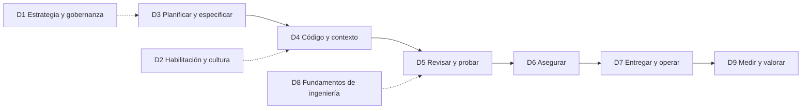

# Evaluación de madurez del SDLC asistido por IA: Banco de preguntas v2.0.2

🌐 [English](AI-Maturity-Form-Questions_v2.md) · [Português (Brasil)](AI-Maturity-Form-Questions_v2.pt-br.md) · Español

> Banco de preguntas para Microsoft Forms para evaluar qué tan madura es una organización en el uso de IA, y agentes de IA, en todo el ciclo de vida de desarrollo de software (SDLC).
> Esta versión reemplaza el banco de preguntas v1 (158 preguntas), que sigue disponible para comparación histórica en [v1/question-bank.es.md](v1/question-bank.es.md) y en [framework.json](../framework.json). La fuente legible por máquina para v2 es [framework.v2.json](../framework.v2.json), generada desde este archivo por `scripts/spec_to_framework_v2.py`.

| Campo | Valor |
| --- | --- |
| Versión | 2.0.2 |
| Fecha | 2026-09-29 |
| Estado | Aprobado para uso en el kit |
| Reemplaza | Banco de preguntas v1 (3 pilares, 28 capacidades, 158 preguntas) |
| Alcance | Ingeniería de software asistida por IA y agentic: planificar, codificar, revisar, probar, asegurar, entregar, operar, medir |
| Estructura | 1 sección de perfil de la persona que responde (5 preguntas no puntuadas) + 9 dimensiones puntuadas (61 preguntas) |
| Escala de respuesta | `L0` a `L4` + `NA` (mismos prefijos que v1, anclas redefinidas, sin brechas de cobertura) |
| Base de evidencia | Microsoft, GitHub, Anthropic, Gartner, DORA, OWASP, NIST e investigación revisada por pares o pre-print, incluidos 14 estudios pre-print de 2026 y la publicación revisada por pares de 2026 de Cui et al. (ver [Referencias](#referencias)) |

## Contenido

- [1. Qué cambió desde v1](#1-qué-cambió-desde-v1)
- [2. Base de investigación](#2-base-de-investigación)
  - [2.1 Actualización de investigación de 2026](#21-actualización-de-investigación-de-2026)
- [3. Diseño del modelo](#3-diseño-del-modelo)
- [4. Escala de respuesta](#4-escala-de-respuesta)
- [5. Cómo armar el formulario](#5-cómo-armar-el-formulario)
- [6. Sección 0: Perfil de la persona que responde](#6-sección-0-perfil-de-la-persona-que-responde)
- [7. Banco de preguntas puntuadas](#7-banco-de-preguntas-puntuadas)
- [8. Puntuación e informes](#8-puntuación-e-informes)
- [9. Trazabilidad de v1 a v2](#9-trazabilidad-de-v1-a-v2)
- [10. Compatibilidad de importación y herramientas](#10-compatibilidad-de-importación-y-herramientas)
- [11. Supuestos y limitaciones](#11-supuestos-y-limitaciones)
- [Registro de cambios](#registro-de-cambios)
- [Referencias](#referencias)

---

## 1. Qué cambió desde v1

| # | Problema de v1 | Cambio en v2 |
| --- | --- | --- |
| 1 | Solo unas 23 de 158 preguntas eran específicas de IA; el resto medía adopción genérica de DevOps. | Ahora cada pregunta puntuada pregunta sobre uso de IA, gobernanza de IA o un fundamento que la investigación muestra que amplifica los resultados de IA (DORA AI Capabilities Model [1]). |
| 2 | Brecha de escala: L2 = 25-50% y L3 = >75%, por lo que 51-75% no tenía respuesta. | Bandas de cobertura contiguas: ≤25%, 26-50%, 51-90%, >90% (ver [sección 4](#4-escala-de-respuesta)). |
| 3 | Cada opción mezclaba cobertura con "tiene métricas", por lo que las respuestas eran ambiguas. | Cada nivel tiene un descriptor genérico, y cada pregunta tiene sus propias anclas de calibración L3/L4. |
| 4 | Duplicados (por ejemplo revisión de código con IA en P1-C1-Q2 y P1-C4-Q1; devcontainers en P1-C2-Q2, P1-C5-Q1 y P1-C9-Q1; SLSA en P2-C8-Q3 y P2-C10-Q3). | Consolidados en preguntas únicas; ver [sección 9](#9-trazabilidad-de-v1-a-v2). |
| 5 | Métricas redactadas como prácticas ("deployment frequency been adopted"). | Las métricas se movieron a D9 y se redactaron como "se mide y se usa". |
| 6 | Sin cobertura de SDLC agentic (agentes de codificación, revisión por agentes, MCP, instrucciones personalizadas, identidad de agente). | Nuevas dimensiones D4 (código e ingeniería de contexto) y D6 (seguridad de agentes), además de elementos de gobernanza de agentes en D1, D5 y D7. |
| 7 | Sin preguntas sobre planificación/especificación, costo de IA ni medición controlada. | Nuevas D3 (planificar y especificar) y D9 (medición, valor y FinOps). |
| 8 | 158 preguntas + 158 campos de evidencia causaban fatiga en las personas encuestadas. | 61 preguntas puntuadas + 5 preguntas de perfil (61 campos opcionales de evidencia). |
| 9 | Sin segmentación de personas encuestadas. | La Sección 0 captura rol, alcance y herramientas para que los resultados puedan dividirse por persona. |

---

## 2. Base de investigación

Cada fila indica un hallazgo publicado y la decisión de diseño que impulsa. Los elementos de Gartner son pronósticos, no hechos medidos.

| Fuente | Hallazgo | Implicación de diseño |
| --- | --- | --- |
| DORA 2025 [3] | 90% de las personas encuestadas reportan usar IA en el trabajo; más de 80% cree que aumentó su productividad; 30% reporta poca o ninguna confianza en el código generado por IA. | La adopción por sí sola ya no separa a las organizaciones. Las preguntas miden profundidad, gobernanza y resultados. |
| DORA 2025 [3], [4] | La IA es un "amplificador" de fortalezas y debilidades existentes. "Sin sistemas de control robustos, como pruebas automatizadas sólidas, prácticas maduras de control de versiones y ciclos rápidos de feedback, un aumento en el volumen de cambios lleva a inestabilidad." | D8 (fundamentos de ingeniería) y D5 (quality gates) se puntúan como parte de la madurez en IA. |
| DORA 2024 [5], DORA 2025 [3] | En 2024, un aumento de 25% en la adopción de IA se asoció con una disminución estimada de 1.5% en throughput de entrega y una reducción de 7.2% en estabilidad de entrega. En 2025 DORA encontró una relación positiva entre adopción de IA y throughput, mientras que "la adopción de IA sí sigue teniendo una relación negativa con la estabilidad de entrega de software" [3]. | D5-Q4 (lotes pequeños) y D7-Q2 (entrega progresiva, rollback). |
| DORA AI Capabilities Model [1], [2] | Siete capacidades amplifican los beneficios de IA: postura de IA clara y comunicada, ecosistemas de datos saludables, datos internos accesibles para IA, prácticas sólidas de control de versiones, trabajo en lotes pequeños, foco centrado en el usuario, plataforma interna de calidad. | Cada capacidad se mapea a al menos una pregunta (D1-Q1, D1-Q2, D3-Q5, D4-Q7, D5-Q4, D8-Q1, D8-Q3, D8-Q4). |
| GitHub Copilot usage metrics [6] | Los usuarios se agrupan en cohortes de adopción: Passive, Phase 1 "Code first", Phase 2 "Agent first" (una superficie de agente de GitHub como cloud agent, code review o CLI), Phase 3 "Multi-agent". Las métricas del ciclo de vida de pull requests incluyen conteos de merge y mediana de tiempo hasta merge. | Las anclas de D4-Q1 siguen el modelo de cohortes; D9-Q1 y D9-Q3 usan estas fuentes de telemetría. |
| GitHub cloud agent risks and mitigations [7] | El agente hace push solo a una rama (una nueva rama `copilot/`, o la rama del pull request que se le pidió actualizar); los draft PRs "deben ser revisados y mergeados por una persona"; los workflows esperan "Approve and run workflows"; la persona solicitante no puede aprobar el PR del agente; el acceso a internet está protegido por firewall; los caracteres ocultos se filtran para reducir prompt injection. | D5-Q2 (human-in-the-loop) y D6-Q3/Q4 (prompt injection, privilegio mínimo) preguntan si estos controles se mantienen, no si se omiten. |
| GitHub MCP governance [9], [10] | Las enterprises pueden definir una allowlist de servidores MCP o restringir el acceso a un registro personalizado. | D4-Q6 (gobernanza de MCP). |
| Peng et al. 2023 [33] | Experimento controlado: los desarrolladores con GitHub Copilot completaron una tarea de servidor HTTP 55.8% más rápido que el grupo de control. | Las ganancias de productividad son reales en tareas acotadas, pero ver las dos filas siguientes. |
| Cui et al. [34] | En tres experimentos de campo con 4,867 desarrolladores: aumento de 26.08% (SE 10.3%) en tareas completadas. Revisado por pares en _Management Science_ (online 2026-02-27). | La evidencia de campo respalda medir throughput (D9-Q3). |
| METR 2025 [35] | RCT con 16 desarrolladores open-source experimentados: con herramientas de IA tardaron 19% más; esperaban un aumento de velocidad de 24% y después seguían creyendo que la IA los había acelerado 20%. METR ahora marca estos resultados de inicios de 2025 como desactualizados: dice que su experimento de seguimiento da una señal no confiable y que probablemente las herramientas de IA estén acelerando más a los desarrolladores a inicios de 2026 [36]. | La productividad autorreportada no es suficiente. D9-Q5 pide medición controlada o basada en cohortes. |
| Stack Overflow 2025 [37] | 46% de los desarrolladores desconfía de la precisión de las herramientas de IA frente a 33% que confía en ella; 87% está preocupado por la precisión de agentes de IA. | D5-Q6 (cultura de verificación y confianza calibrada). |
| Anthropic Economic Index [23] | 79% de las conversaciones de Claude Code fueron "automation" frente a 49% en Claude.ai; los patrones de "Feedback Loop" fueron 35.8% en Claude Code frente a 21.3% en Claude.ai. | Las herramientas agentic desplazan el trabajo de escribir a dirigir y validar: D3 (especificar) y D5 (revisar). |
| Anthropic, Claude Code in practice [24] | "En una sesión típica, las personas toman la mayoría de las decisiones de planificación (qué hacer) y Claude toma la mayoría de las decisiones de ejecución (cómo hacerlo)." | D3 se enfoca en planes, especificaciones y descomposición de tareas de alta calidad. |
| Anthropic, context engineering [25] | "El contexto, por lo tanto, debe tratarse como un recurso finito con retornos marginales decrecientes." | D4-Q4, D4-Q5 y D2-Q4 (instrucciones curadas, bibliotecas de prompts/skills, capacitación en skills). |
| Gartner, Jun 2026 [32] | Predice que para 2028 los costos de AI coding superarán el salario promedio de un desarrollador. Recomienda definir "niveles de autonomía para cada tarea" (este banco los parafrasea como liderada por desarrollador, desarrollador con agente y totalmente liderada por agente); model routing por complejidad de tarea; ingeniería de contexto obligatoria; umbrales de tokens; revisiones de tokens en retrospectivas de sprint. | D1-Q5 (clasificación de autonomía), D4-Q8 (model routing), D9-Q6 (AI FinOps). |
| Gartner, May 2026 [31] | Predice que para 2027 más de 65% de los equipos de ingeniería que usan agentic coding tratarán los IDEs como opcionales, "desplazando el control, la gobernanza y la validación a plataformas automatizadas". | La gobernanza debe vivir en la plataforma y el pipeline (D5-Q3, D8-Q3), no solo en el IDE. |
| Gartner, Jul 2025 [29] | Predice que para 2028, 90% de los ingenieros de software enterprise usarán asistentes de código con IA, desde menos de 14% a inicios de 2024. | Planifica para acceso casi universal; la madurez trata sobre cómo, no sobre si se usa. |
| Gartner, Oct 2024 [30] | Hasta 2027, GenAI requerirá que 80% de la fuerza laboral de ingeniería se capacite en nuevas habilidades; en la "era nativa en IA", los ingenieros de software se "enfocarán principalmente en dirigir agentes de IA hacia el contexto y las restricciones más relevantes para una tarea dada". | D2 (habilitación, habilidades y roles). |
| Microsoft CAF, govern and secure AI agents [19] | "Todo agente debe ser observable, gobernado y seguro." Mantener un registro de agentes; exigir una identidad única para cada agente; aplicar políticas de forma consistente; observar la actividad de agentes. | D1-Q7 (registro e identidad), D6-Q7 (rastro de auditoría), D7-Q4 (observabilidad de agentes). |
| Microsoft Agentic DevOps [16], [17] | Los agentes de IA "trabajan junto a tu equipo durante todo el ciclo de vida de desarrollo de software" [17]; "todo el ciclo de vida de desarrollo de software se está reimaginando mediante agentes inteligentes" [16]. | El modelo cubre cada fase del SDLC, no solo la codificación. |
| OWASP LLM Top 10 2025 [38] and Agentic Top 10 2026 [39] | Los riesgos incluyen LLM01:2025 Prompt Injection, LLM03:2025 Supply Chain, LLM06:2025 Excessive Agency, LLM10:2025 Unbounded Consumption y ASI01 Agent Goal Hijack. Los IDs de LLM son de la edición 2025; la edición 2026 renumera algunos de ellos. | D4-Q6, D5-Q2, D6 y D9-Q6 referencian estos IDs de riesgo. |
| NIST SP 800-218A [40] | Perfil comunitario de SSDF que agrega prácticas específicas para desarrollo de modelos de IA en todo el SDLC, para productores y adquirentes de modelos de IA y sistemas de IA. | D6-Q5 y D6-Q6. |

### 2.1 Actualización de investigación de 2026

Catorce estudios publicados en arXiv entre enero y septiembre de 2026. Son pre-prints y no necesariamente han sido revisados por pares; la publicación revisada por pares de 2026 de Cui et al. [34] está cubierta en la tabla anterior. La mayoría extrae datos del dataset público AIDev de pull requests creados por agentes en repositorios open-source de GitHub, por lo que los resultados enterprise pueden diferir.

| Estudio | Datos | Hallazgo | Implicación de diseño |
| --- | --- | --- | --- |
| Denisov-Blanch et al., RAMP [47] | 441 repositorios | Propone RAMP (Repository AI Maturity Profile), un modelo de madurez de cuatro niveles basado en configuración de IA comprometida en el repositorio. Los agentes trajeron 28-38% más commits en cada nivel de madurez. Entre los repositorios agent-first, aquellos sin configuración de IA comprometida mostraron aproximadamente el doble de aumento en complejidad cognitiva (+53% vs +27%) y 1.7x el aumento en advertencias de análisis estático. 73.8% de los artefactos de configuración de IA se comprometieron una vez y nunca se modificaron. Los autores llaman a los resultados observacionales y generadores de hipótesis. | D4-Q4 y D4-Q5 piden instrucciones que se mantengan actualizadas, no que se definan una vez y se olviden. RAMP puede servir como verificación cruzada objetiva de la autoevaluación de D4 (ver [sección 8](#8-puntuación-e-informes)). |
| Arabat and Sayagh [46] | 15,549 PRs agentic, 148 proyectos | Agregar archivos de instrucciones no necesariamente mejora los PRs de agentes: 27.7% de los proyectos elevó su tasa de merge al menos 20%, mientras que 26.35% la vio disminuir (la disminución se reporta sin umbral). Los proyectos que mejoraron tenían archivos de instrucciones más largos y bien estructurados. | D4-Q4 trata los archivos de instrucciones como artefactos de ingeniería ("instructions as code") cuyo efecto se mide. |
| Pinna et al. [49] | 7,156 PRs de cinco agentes de codificación | El tipo de tarea impulsa la aceptación más que la elección del agente para la mayoría de las tareas: documentación 82.1% frente a nuevas features 66.1%. Ningún agente fue el mejor en todos los tipos de tareas. | D1-Q5, D3-Q3 y D4-Q3 establecen reglas de delegación por tipo de tarea; D1-Q3 evalúa herramientas por tipo de tarea. |
| Takerngsaksiri et al. [50] | 6,774 PRs de agentes mergeados vs 5,044 PRs humanos | Los PRs de agentes mergeados atrajeron fixes de seguimiento verificados con 1.62 veces las probabilidades de los PRs humanos en los mismos repositorios; 69.6% de esos fixes vinieron del mismo agente. | D9-Q3 agrega la tasa de fixes post-merge para PRs de agentes; D5-Q3 mantiene quality gates iguales. |
| Sawada et al. [51] | 1,000+ archivos, cerca de 3,200 cambios, 100 repositorios | Los archivos generados por IA se mantuvieron con menos frecuencia que el código humano; las personas hicieron la mayor parte del mantenimiento que sí ocurrió. | D5-Q7 exige una persona responsable nombrada y monitoreo de salud para el código generado por IA. |
| Sakib et al. [52] | 4,022 PRs de agentes, 16,112 cambios de archivo | 38.9% de los PRs de agentes tenía al menos un security smell; los problemas de integridad de cadena de suministro fueron 82.3% de los smells; las credenciales hard-coded fueron 99.6% de los smells críticos. Las personas introdujeron 67.6% de los secretos genuinamente filtrados, y la revisión no detectó 81.1% de esas credenciales antes de la integración. | D6-Q1 (push protection para cada commit, humano o de agente), D6-Q5 (supply chain) y D5-Q6 (vigilancia de revisores). |
| Siddiq et al. [57] | 33,000+ PRs de agentes, 1,293 relacionados con seguridad | Cerca de 4% de los PRs de agentes estaban relacionados con seguridad, principalmente hardening (pruebas, configuración, manejo de errores). Tenían tasas de merge más bajas y revisiones más largas; el rechazo se vinculó más con la complejidad y verbosidad del PR que con temas de seguridad. | D5-Q4 (PRs pequeños y enfocados) y D6-Q2 (remediación con IA revisada). |
| Nachuma and Zibran [53] | PRs de agentes de AIDev, análisis de regresión | La participación de revisores tuvo la correlación más fuerte con merge; los cambios más grandes y los force pushes redujeron la probabilidad de mergear. | D5-Q2 (revisión humana activa) y D5-Q4 (lotes pequeños). |
| Selvanayagam and Ghaleb [54] | 248,641 PRs creados por IA con revisión de IA | La revisión IA-a-IA entre productos fue alrededor de 1.6% de los PRs de agentes, pero creció más de dos órdenes de magnitud de 2025-Q1 a 2025-Q3. | D5-Q1 trata la revisión con IA como una capa y rastrea dónde IA revisa IA sin una persona. |
| Stolze and Strässle [55] | Entrevistas con 5 practitioners | La supervisión se está moviendo de centrada en revisión a estratificada: guardrails preventivos (intención y convenciones en forma legible por máquina), guardrails ejecutables (lint, pruebas, CI/CD), y supervisión humana enfocada en arquitectura y mantenibilidad. | D4-Q4 (preventiva), D5-Q3 (ejecutable) y D5-Q1/Q2 (supervisión humana) puntúan las tres capas. Muestra pequeña. |
| Shen and Tamkin (Anthropic) [48] | Experimentos aleatorizados con desarrolladores que aprendían una biblioteca nueva | El uso de IA perjudicó la comprensión conceptual, la lectura de código y la depuración, sin ganancia de eficiencia promedio significativa. La delegación completa mejoró la velocidad a costa del aprendizaje. Tres de seis patrones de interacción preservaron el aprendizaje. | D2-Q1 y D2-Q6 piden uso de IA que preserve el aprendizaje, especialmente para ingenieros al inicio de carrera. |
| Liu et al. [45] | Trazas de GitHub Copilot, junio de 2026: 3.2M usuarios, 13M sesiones, 761M llamadas a LLM, 95T tokens | Las sesiones agentic son turnos de usuario dispersos que se despliegan en loops autónomos de llamadas a LLM y ejecución de herramientas; el consumo de tokens tiene cola larga. | D7-Q4 (observabilidad de agentes) y D9-Q6 (gobernanza de costos para uso de cola larga). |
| Farrag [58] | Revisión multivocal de 67 fuentes más un piloto de 4 meses (un solo autor) | Enmarca la evidencia contradictoria de productividad como una "Productivity-Reliability Paradox" y concluye que "la disciplina de especificación, no la capacidad del modelo, es la restricción vinculante para la confiabilidad del software asistido por IA". | Respalda D3-Q2 (especificación antes de implementación). |
| Monperrus [56] | Position paper | Sostiene que los agentes de codificación vuelven innecesaria la revisión humana obligatoria de código. | Una visión contrastante. v2 mantiene la aprobación humana para PRs de agentes, consistente con los defaults de GitHub [7], pero D1-Q5 y D5-Q2 permiten niveles de aprobación basados en riesgo. |

---

## 3. Diseño del modelo

Nueve dimensiones. D3 a D7 siguen el flujo del SDLC; D1, D2 y D8 son habilitadores; D9 cierra el loop con medición.

| ID | Dimensión | Preguntas | Base principal |
| --- | --- | --- | --- |
| D1 | Estrategia, política y gobernanza de IA | 7 | Postura de IA clara de DORA [1]; Microsoft CAF [18], [19], [20]; Gartner [32] |
| D2 | Habilitación, habilidades y cultura | 6 | DORA [2]; Gartner [30]; Anthropic [25]; Shen and Tamkin [48] |
| D3 | Planificar, especificar y diseñar | 6 | Anthropic [24], [27]; GitHub [8]; foco centrado en el usuario de DORA [1]; Pinna et al. [49]; Farrag [58] |
| D4 | Código e ingeniería de contexto | 8 | GitHub [6], [8], [9], [11]; Anthropic [25]; Gartner [32]; RAMP [47]; Arabat and Sayagh [46] |
| D5 | Revisión, calidad y pruebas | 7 | GitHub [7], [12]; DORA [3], [5]; Stack Overflow [37]; estudios de PRs de agentes de 2026 [50], [51], [53], [54], [55] |
| D6 | Seguridad y cadena de suministro de IA | 7 | OWASP [38], [39]; NIST [40]; GitHub [7], [13]; Microsoft CAF [19]; Sakib et al. [52]; Siddiq et al. [57] |
| D7 | Entregar y operar | 6 | DORA [3]; Microsoft [19], [22]; Liu et al. [45] |
| D8 | Fundamentos de ingeniería (amplificadores de IA) | 7 | DORA AI Capabilities Model [1], [2] |
| D9 | Medición, valor y AI FinOps | 7 | GitHub [6]; DORA [2]; METR [35]; Cui et al. [34]; Gartner [28], [32]; Takerngsaksiri et al. [50] |
| | **Total puntuado** | **61** | |

---

## 4. Escala de respuesta

Usa estas seis opciones, en este orden, para cada pregunta puntuada (D1 a D9). Mantén el prefijo `L0`...`L4`/`NA` al inicio de cada opción: el importador mapea los prefijos a valores 0-4 o null.

- **L0 - No iniciado: Aún no hay práctica, o IA no está permitida para esta actividad**
- **L1 - Explorando: Uso individual o ad hoc, sin orientación acordada (más de 0% y hasta 25% de los equipos)**
- **L2 - Adoptando: Práctica a nivel de equipo con orientación escrita (26-50% de los equipos)**
- **L3 - Escalando: Estándar de la organización, gobernado y medido (51-90% de los equipos)**
- **L4 - Nativo en IA: Universal (>90%), evaluado y mejorado continuamente, vinculado a resultados**
- **NA - No sé / No aplica**

L0 versus NA: elige `L0` cuando la práctica podría aplicar pero aún no existe, incluso cuando IA no está permitida. Elige `NA` solo cuando no sabes la respuesta, o cuando la actividad no existe en tu alcance (por ejemplo, tus equipos no administran infraestructura).

Cómo leer la escala:

| Nivel | Cobertura | Gobernanza | Medición | Señal agentic típica (cohortes de GitHub [6]) |
| --- | --- | --- | --- | --- |
| L0 | Ninguna | Ninguna o prohibida | Ninguna | Sin uso de IA |
| L1 | ≤25% de los equipos | Informal | Anecdótica | Usuarios Passive u ocasionales de "Code first" |
| L2 | 26-50% | Orientación escrita de equipo | Métricas de actividad (uso) | La mayoría de los usuarios "Code first" |
| L3 | 51-90% | Política de la organización, aplicada por controles de plataforma | Métricas de resultado (entrega, calidad) revisadas regularmente | Muchos usuarios "Agent first" |
| L4 | >90% | Policy as code, auditada continuamente | Comparaciones controladas, costo y valor rastreados, práctica ajustada desde datos | El uso "Multi-agent" es normal y gobernado |

Si cobertura, gobernanza, medición y la señal agentic apuntan a niveles distintos, elige el **menor** de ellos. Cada pregunta agrega anclas **L3 se ve así** y **L4 se ve así** para calibrar respuestas.

Lee cada pregunta como "¿en qué medida esto es cierto?": las opciones miden qué tan implementada está la práctica, no sí o no. Dos reglas más mantienen las respuestas comparables:

- **Cada parte debe ser cierta.** Algunas preguntas nombran varias condiciones (por ejemplo "patrocinada, con objetivos explícitos y comunicada"). Responde en el nivel más alto donde **todas** las condiciones nombradas se cumplan. Una estrategia que existe pero no se comunica no es L3.
- **Unidad de cobertura.** Cada pregunta en [framework.v2.json](../framework.v2.json) tiene una `unit`. Para `teams`, `repositories`, `services` o `engineers`, lee los porcentajes contra esa unidad. Para preguntas de `organization` (una práctica única de toda la organización, como una estrategia o una política), ignora los porcentajes y usa las columnas de gobernanza y medición: L1 informal, L2 escrita, L3 aplicada y medida, L4 mejorada continuamente a partir de datos.

---

## 5. Cómo armar el formulario

1. Ve a <https://forms.office.com> y crea un formulario en blanco.
2. Título sugerido: `AI-Assisted SDLC Maturity Assessment v2 - <Nombre de la organización>`.
3. Agrega **10 secciones** con `+ Add new` → `Section`: Sección 0 (perfil) y una por dimensión (D1 a D9).
4. Sección 0: agrega las cinco preguntas de perfil como **Choice** con las opciones listadas en [sección 6](#6-sección-0-perfil-de-la-persona-que-responde), cada título comenzando con su ID (por ejemplo `R-Q1: ¿Qué opción describe mejor tu rol principal?`). `R-Q3` permite varias respuestas. No puntúan. Agrega el aviso de privacidad de `collection/FORMS-INSTRUCTIONS.md` a la descripción del formulario.
5. Para cada pregunta puntuada, agrega dos elementos:
   - **Choice** (respuesta única). Comienza el título con el ID de la pregunta y dos puntos, luego el texto de la pregunta en negrita debajo, por ejemplo `D4-Q3: ¿Se asignan issues a coding agents (por ejemplo Copilot cloud agent) ...`. El importador encuentra cada columna por este ID, así que el prefijo es obligatorio. Usa las seis opciones de la [sección 4](#4-escala-de-respuesta).
   - **Long Text** (opcional) etiquetado `Evidence (<ID>)`, por ejemplo `Evidence (D4-Q3)`, con el placeholder `Herramienta, % de cobertura, métrica, período, enlace`.
6. Agrega las anclas de calibración (**L3 se ve así**, **L4 se ve así**) y, cuando haya una, la **nota de alcance** al subtítulo de la pregunta para que las personas encuestadas las vean.
7. `Settings` → `Anyone can respond` si compartes por link, o restringe a la organización.
8. Opcional, para reducir la fatiga en roles no técnicos: usa `Branching` en Forms para que las personas que elijan "Ejecutivo(a) (CTO, VP, Director(a))" o "Gerente de producto / programa" en `R-Q1` puedan saltar D4 a D7. Sus preguntas saltadas cuentan como no respondidas, no como `NA`.
9. Comparte el link. Recomendado: al menos 3 personas encuestadas por persona (ver pregunta de perfil `R-Q1`) para reducir el sesgo de una sola persona encuestada.
10. Cuando las respuestas estén listas: `Responses` → `Open in Excel` y descarga el `.xlsx`, luego ejecuta `make import XLSX=<archivo>`.

Conteo de elementos: 5 de perfil + 61 puntuados + 61 campos opcionales de evidencia = 127 elementos (v1 tenía cerca de 324).

---

## 6. Sección 0: Perfil de la persona que responde

No puntúa. Sirve para segmentar los resultados. Las opciones son propias de cada pregunta (no la escala L0 a L4).

### Pregunta `R-Q1`: Rol principal

> **¿Qué opción describe mejor tu rol principal?**

- Ingeniero(a) de software / desarrollador(a)
- Gerente de ingeniería / tech lead
- Arquitecto(a)
- Ingeniero(a) de plataforma / DevOps / SRE
- Seguridad / AppSec
- Ingeniero(a) de QA / pruebas
- Gerente de producto / programa
- Ejecutivo(a) (CTO, VP, Director(a))
- Otro

### Pregunta `R-Q2`: Alcance de tus respuestas

> **¿En qué alcance se basan tus respuestas?**

- Un solo equipo
- Varios equipos en una unidad de negocio
- Una unidad de negocio
- Toda la organización

### Pregunta `R-Q3`: Herramientas principales de IA para código

> **¿Qué herramientas de IA usas al menos semanalmente para trabajo de software? (múltiples respuestas)**

_Tipo: Choice (múltiples respuestas)._

- GitHub Copilot en el IDE (autocompletado, chat, modo agente)
- GitHub Copilot cloud agent / code review / CLI
- Claude Code o Claude en otros clientes
- Herramientas internas basadas en Microsoft Foundry / Azure OpenAI
- Otras herramientas comerciales de IA para código
- Modelos internos o autoalojados
- Ninguna

### Pregunta `R-Q4`: Experiencia profesional

> **¿Cuántos años de experiencia profesional en software tienes?**

- Menos de 2
- 2-5
- 6-10
- Más de 10

### Pregunta `R-Q5`: Tiempo práctico (hands-on)

> **En una semana típica, ¿cuánto de tu tiempo es práctico, construyendo (código, configuración, pruebas)?**

- Menos de 20%
- 20-50%
- 51-80%
- Más de 80%

---

## 7. Banco de preguntas puntuadas

Toda pregunta puntuada usa las seis opciones de la [sección 4](#4-escala-de-respuesta) y va seguida de un campo opcional Long Text `Evidence (<ID>)`. Los números entre corchetes remiten a las [Referencias](#referencias). **Linaje v1** lista los IDs de las preguntas v1 que esta pregunta reemplaza o consolida; `Nueva` significa sin equivalente en v1.

### D1: Estrategia, política y gobernanza de IA

_7 preguntas. Por qué importa: DORA identifica una "postura de IA clara y comunicada" como amplificadora de los beneficios de la IA [1], [2]; Microsoft CAF afirma que "todo agente debe ser observable, gobernado y seguro" [19]._

#### `D1-Q1`: Estrategia de IA para ingeniería de software

> **¿Existe una estrategia documentada de IA para ingeniería de software, patrocinada por liderazgo, que declare objetivos explícitos y se comunique a todos los equipos de ingeniería?**

- **L3 se ve así:** Estrategia publicada y revisada al menos anualmente; los objetivos (por ejemplo entrega, calidad, developer experience) tienen responsables; la mayoría de los ingenieros puede decir dónde encontrarla.
- **L4 se ve así:** La estrategia se revisa a partir de resultados medidos (D9) y se vincula a OKRs de negocio; el progreso se informa al liderazgo con una cadencia fija.
- **Ejemplos de evidencia:** Documento de estrategia, comunicación de liderazgo, entradas de OKR.
- **Base:** [1], [2], [18]
- **Linaje v1:** Nueva

#### `D1-Q2`: Política de uso aceptable

> **¿Está claro para los ingenieros cómo pueden y no pueden usar IA en el trabajo, incluidos qué datos pueden compartirse con herramientas de IA?**

- **L3 se ve así:** La política escrita de uso aceptable cubre code, datos de clientes, secretos e IP de terceros; es parte del onboarding; las excepciones tienen un responsable.
- **L4 se ve así:** La política se aplica mediante controles técnicos (por ejemplo content exclusion, prevención de pérdida de datos, allowlists) y se audita; las violaciones disparan alertas automatizadas.
- **Ejemplos de evidencia:** Enlace de la política, checklist de onboarding, configuración de controles.
- **Base:** [1], [2], [20], [21]
- **Linaje v1:** P1-C1-Q5 (parcial)

#### `D1-Q3`: Herramientas y modelos aprobados

> **¿Existe un catálogo mantenido de herramientas, funciones y modelos de IA aprobados para desarrollo de software, gestionado mediante políticas enterprise o de la organización?**

- **L3 se ve así:** Las políticas enterprise/de la organización habilitan solo funciones y modelos aprobados; el catálogo lista responsable, manejo de datos y fecha de revisión para cada herramienta.
- **L4 se ve así:** Los nuevos modelos y herramientas pasan por una evaluación definida por tipo de tarea (calidad, costo, seguridad) antes de habilitarse; los retirados se eliminan según cronograma.
- **Ejemplos de evidencia:** Configuraciones de política de Copilot, catálogo de herramientas, registros de evaluación de modelos.
- **Base:** [2], [15], [32], [49]
- **Linaje v1:** Nueva

#### `D1-Q4`: Protección de datos, IP y residencia

> **¿Los requisitos de residencia, retención, propiedad intelectual y privacidad de datos están definidos y aplicados a las herramientas y agentes de IA usados en el SDLC?**

- **L3 se ve así:** Los requisitos se documentan por herramienta; repositorios o archivos sensibles se excluyen del contexto de IA; la retención de logs y memoria sigue la política.
- **L4 se ve así:** El cumplimiento se evalúa continuamente (por ejemplo con un compliance manager) y se mapea a regulaciones como el EU AI Act cuando aplica.
- **Ejemplos de evidencia:** Registros de procesamiento de datos, configuraciones de exclusión, política de retención.
- **Base:** [19], [20]
- **Linaje v1:** P1-C1-Q5 (parcial)

#### `D1-Q5`: Niveles de autonomía para trabajo con IA

> **¿La organización definió qué tareas son lideradas por desarrollador, realizadas por desarrollador con agente, o totalmente lideradas por agente, y los controles requeridos para cada nivel?**

- **Nota de alcance:** Mide la política que define niveles de autonomía. Cómo se escriben las tareas para agentes es D3-Q3; con qué frecuencia se delega el trabajo es D4-Q3.
- **L3 se ve así:** Una matriz publicada mapea tipos de tarea (por ejemplo upgrades de dependencias, generación de pruebas, trabajo de feature, cambios en producción) a niveles de autonomía y aprobaciones requeridas.
- **L4 se ve así:** La matriz se aplica mediante reglas de plataforma (por ejemplo branch protection, revisores requeridos por ruta) y se actualiza a partir de datos de incidentes y calidad.
- **Ejemplos de evidencia:** Matriz de autonomía, rulesets de repositorio, registros de cambios.
- **Base:** [32], [7], [26], [49] (contrapunto: [56])
- **Linaje v1:** Nueva

#### `D1-Q6`: IA responsable y framework de riesgo

> **¿El uso de IA en ingeniería de software está gobernado por un estándar de IA responsable y un framework de riesgo reconocido (por ejemplo Microsoft Responsible AI Standard, NIST AI RMF, ISO/IEC 42001)?**

- **L3 se ve así:** Se adopta un framework nombrado; los riesgos relacionados con IA están en el registro de riesgos con responsables y revisiones.
- **L4 se ve así:** Los controles del framework se auditan interna o externamente; los resultados retroalimentan política y tooling.
- **Ejemplos de evidencia:** Mapeo del framework, entradas del registro de riesgos, informes de auditoría.
- **Base:** [20], [21], [41], [42]
- **Linaje v1:** P3-C3-Q5 (parcial)

#### `D1-Q7`: Registro e identidad de agentes

> **¿Todo agente de IA usado en el SDLC (coding agents, review agents, custom agents, pipeline agents) está registrado con un responsable, un propósito, una identidad distinta y un alcance de acceso definido?**

- **L3 se ve así:** Un único inventario lista todos los agentes con responsable, plataforma y permisos; cada agente se ejecuta bajo su propia identidad, no una cuenta humana compartida.
- **L4 se ve así:** Los agentes no registrados ("shadow") se detectan automáticamente; el ciclo de vida de identidad (creación, revisión, eliminación) está automatizado.
- **Ejemplos de evidencia:** Inventario de agentes, configuración de identidad (por ejemplo Microsoft Entra Agent ID), revisiones de acceso.
- **Base:** [19], [39]
- **Linaje v1:** P3-C5-Q4 (parcial)

### D2: Habilitación, habilidades y cultura

_6 preguntas. Por qué importa: Gartner espera que GenAI requiera que 80% de la fuerza laboral de ingeniería se capacite en nuevas habilidades hasta 2027 [30]; DORA pregunta sobre capacitación, aprendizaje entre pares y apoyo para la experimentación [2]._

#### `D2-Q1`: Capacitación estructurada de IA

> **¿Los ingenieros reciben capacitación estructurada en las herramientas de IA aprobadas y workflows de agentes, más allá del onboarding predeterminado del proveedor?**

- **L3 se ve así:** Currículo basado en rol (desarrollador, revisor, plataforma, seguridad) con finalización rastreada; la capacitación se exige antes de habilitar funciones de agentes; enseña patrones que preservan el aprendizaje (pedir explicaciones, intentar primero, luego comparar) y no solo delegación total.
- **L4 se ve así:** El currículo se actualiza cada trimestre a partir de datos de uso y patrones de falla; existen rutas avanzadas (orquestación de agentes, evaluación).
- **Ejemplos de evidencia:** Rutas de aprendizaje, tasas de finalización, reglas de bloqueo de habilitación.
- **Base:** [2], [30], [48]
- **Linaje v1:** P1-C5-Q4, P1-C3-Q6 (parcial)

#### `D2-Q2`: Aprendizaje entre pares y champions

> **¿Existen formatos regulares de aprendizaje entre pares (demos, brown bags, office hours) y una red de champions de IA en los equipos?**

- **L3 se ve así:** Existen champions en la mayoría de los equipos; las sesiones se realizan al menos mensualmente; las grabaciones y ejemplos se comparten en un solo lugar.
- **L4 se ve así:** Una comunidad de práctica cura activos reutilizables (instrucciones, archivos de prompt, agentes) y mide su reutilización.
- **Ejemplos de evidencia:** Lista de champions, calendario de sesiones, repositorio compartido de ejemplos.
- **Base:** [2]
- **Linaje v1:** P1-C6-Q6

#### `D2-Q3`: Apoyo para la experimentación

> **¿La organización da a los ingenieros tiempo, sandboxes y presupuesto para experimentar con seguridad con nuevas herramientas de IA y patrones de agentes?**

- **L3 se ve así:** Existen entornos en sandbox y una ruta liviana de solicitud; los experimentos se registran y sus resultados se comparten.
- **L4 se ve así:** Los experimentos exitosos pasan al catálogo aprobado (D1-Q3) mediante una ruta definida en semanas.
- **Ejemplos de evidencia:** Suscripciones de sandbox, log de experimentos, registros de promoción.
- **Base:** [2]
- **Linaje v1:** Nueva

#### `D2-Q4`: Habilidades de ingeniería de contexto

> **¿Los ingenieros están capacitados para dar a las herramientas de IA el contexto correcto (alcance claro de la tarea, archivos relevantes, restricciones, ejemplos) y mantener el contexto ajustado?**

- **L3 se ve así:** La orientación y los ejemplos sobre ingeniería de contexto son parte de la capacitación; los equipos revisan la calidad de sus instrucciones y prompts.
- **L4 se ve así:** Las prácticas de contexto se miden (por ejemplo tasa de éxito o uso de tokens por tarea) y se mejoran con el tiempo.
- **Ejemplos de evidencia:** Páginas de orientación, checklists de review, métricas antes/después.
- **Base:** [25], [30], [32]
- **Linaje v1:** Nueva

#### `D2-Q5`: Roles y trayectorias de carrera

> **¿Se actualizaron descripciones de puesto, frameworks de carrera y expectativas de desempeño para ingeniería asistida por IA y agentic engineering (por ejemplo dirigir agentes, revisar salida de IA, ingeniería de IA)?**

- **L3 se ve así:** Se publican perfiles de rol actualizados; las evaluaciones de desempeño reconocen el uso efectivo de IA y la calidad del review, no el volumen bruto de salida.
- **L4 se ve así:** Existen roles dedicados (por ejemplo ingeniero de IA, responsable de plataforma de agentes) con una ruta clara de crecimiento.
- **Ejemplos de evidencia:** Framework de carrera, descripciones de rol.
- **Base:** [30]
- **Linaje v1:** Nueva

#### `D2-Q6`: Onboarding asistido por IA

> **¿Los nuevos ingenieros usan herramientas de IA para entender codebases y volverse productivos, con tiempo de ramp-up medido?**

- **L3 se ve así:** El onboarding incluye recorridos de codebase guiados por IA e instrucciones de repositorio; se rastrea el tiempo hasta el primer PR mergeado; los nuevos ingenieros son evaluados en lectura de code y debugging, no solo en salida.
- **L4 se ve así:** Las métricas de ramp-up y habilidades se comparan entre cohortes y se usan para mejorar material e instrucciones de onboarding.
- **Ejemplos de evidencia:** Playbook de onboarding, datos de tiempo hasta primer PR, resultados de verificación de habilidades.
- **Base:** [27], [48]
- **Linaje v1:** P1-C5-Q2, P1-C5-Q6, P1-C5-Q7

### D3: Planificar, especificar y diseñar

_6 preguntas. Por qué importa: en agentic coding, "las personas toman la mayoría de las decisiones de planificación (qué hacer) y Claude toma la mayoría de las decisiones de ejecución (cómo hacerlo)" [24]; la calidad de la definición de la tarea impulsa la calidad de la salida del agente [8], [27]._

#### `D3-Q1`: IA en refinamiento de backlog

> **¿Se usa IA para redactar y refinar issues o user stories, incluidos criterios de aceptación, con un responsable humano que las aprueba?**

- **L3 se ve así:** La mayoría de los equipos usa IA para redactar o mejorar elementos de trabajo; los criterios de aceptación son obligatorios antes de comenzar el trabajo.
- **L4 se ve así:** La calidad de los elementos de trabajo (claridad, capacidad de prueba) se mide y se vincula con retrabajo y cycle time.
- **Ejemplos de evidencia:** Templates de issue, ejemplos de elementos de trabajo, verificaciones de calidad.
- **Base:** [16], [17]
- **Linaje v1:** Nueva

#### `D3-Q2`: Especificación antes de la implementación

> **Para cambios no triviales, ¿se produce y revisa un plan o especificación por escrito antes de que un agente de IA implemente el cambio?**

- **L3 se ve así:** Los planes o specs se almacenan en el repositorio o se vinculan a la issue, y un humano los revisa antes de la implementación por el agente.
- **L4 se ve así:** Las specs son el contrato para verificación automatizada (pruebas, checks) y se mantienen sincronizadas con el code.
- **Ejemplos de evidencia:** Archivos de spec, reviews de plan, PRs que referencian specs.
- **Base:** [24], [27], [58], [23]
- **Linaje v1:** Nueva

#### `D3-Q3`: Alcance de tareas para agentes

> **¿Las tareas dadas a coding agents están bien delimitadas (pequeñas, con criterios de aceptación claros y punteros a code relevante) antes de asignarse?**

- **Nota de alcance:** Mide cómo se delimitan las tareas para agentes. La política de autonomía es D1-Q5; el volumen de delegación es D4-Q3.
- **L3 se ve así:** Los equipos siguen orientación escrita para issues listas para agentes; las tareas demasiado grandes se dividen antes de la asignación.
- **L4 se ve así:** El éxito de tareas de agentes y las tasas de retrabajo se rastrean por tipo de tarea y se usan para refinar la orientación.
- **Ejemplos de evidencia:** Directrices de tareas para agentes, ejemplos de issues, datos de tasa de éxito.
- **Base:** [8], [1], [24], [49]
- **Linaje v1:** Nueva

#### `D3-Q4`: Decisiones de arquitectura y diseño

> **¿Se usa IA para apoyar el trabajo de diseño (análisis de opciones, modos de amenaza y falla, architecture decision records) mientras las decisiones permanecen con humanos responsables?**

- **L3 se ve así:** Los ADRs se versionan; se adjunta análisis asistido por IA; un humano nombrado aprueba cada decisión.
- **L4 se ve así:** Los agentes verifican nuevos cambios contra decisiones registradas y señalan conflictos automáticamente.
- **Ejemplos de evidencia:** Repositorio de ADR, registros de design review.
- **Base:** [24], [26], [8]
- **Linaje v1:** P1-C3-Q5, P1-C6-Q5

#### `D3-Q5`: Enfoque centrado en el usuario

> **¿El trabajo asistido por IA está vinculado a resultados claros para usuarios e informado por feedback de usuarios?**

- **L3 se ve así:** Los elementos de trabajo referencian el problema del usuario y la medida de éxito; el feedback se revisa antes de priorizar.
- **L4 se ve así:** Las métricas de resultado del usuario son parte de la definition of done para entrega asistida por IA.
- **Ejemplos de evidencia:** Briefs de producto, registros de loop de feedback, dashboards de resultados.
- **Base:** [1], [2], [3]
- **Linaje v1:** Nueva

#### `D3-Q6`: Modernización asistida por IA

> **¿Se usan herramientas y agentes de IA para entender, hacer upgrade y migrar code legado (por ejemplo upgrades de framework o runtime, migración a cloud), con resultados verificados por pruebas?**

- **L3 se ve así:** Existe un proceso repetible de modernización asistida por IA para tipos comunes de upgrade, con gates de prueba.
- **L4 se ve así:** El backlog de modernización se reduce continuamente mediante agentes bajo review humano, con tasas de éxito rastreadas.
- **Ejemplos de evidencia:** Runbooks de upgrade, PRs de migración, resultados de pruebas.
- **Base:** [16], [17]
- **Linaje v1:** Nueva

### D4: Código e ingeniería de contexto

_8 preguntas. Por qué importa: GitHub mide la profundidad de adopción como una progresión de "Code first" a "Agent first" y "Multi-agent" [6]; Anthropic describe el contexto como "un recurso finito con retornos marginales decrecientes" [25]._

#### `D4-Q1`: Profundidad de uso de IA entre superficies

> **¿Qué tan profundamente usan IA los ingenieros entre superficies: completions y ediciones de agentes en el IDE, superficies de agentes de GitHub (cloud agent, code review, CLI), y varios agentes juntos?**

- **Nota de alcance:** Mide qué tan profundamente se usa IA. Si ese uso se mide es D9-Q1.
- **L1 a L2 se ven así:** Principalmente completions y ediciones de agente en el IDE ("Code first"); el uso solo de chat cuenta como Passive en las cohortes de GitHub.
- **L3 se ve así:** Muchos ingenieros usan regularmente al menos una superficie de agente de GitHub ("Agent first"), confirmado por métricas de uso.
- **L4 se ve así:** El uso multi-agent es normal ("Multi-agent"), con distribución de cohortes rastreada mensualmente.
- **Ejemplos de evidencia:** Dashboard o API de métricas de uso de Copilot: distribución de cohortes de adopción, usuarios activos diarios/semanales.
- **Base:** [6]
- **Linaje v1:** P1-C1-Q1

#### `D4-Q2`: Modo agente para trabajo multi-file

> **¿Los ingenieros usan IDE agent mode (o equivalente) para cambios multi-file, y revisan cada cambio antes de hacer commit?**

- **L3 se ve así:** Agent mode es el valor predeterminado para refactors y features multi-file en la mayoría de los equipos; los cambios se revisan en el diff antes del commit.
- **L4 se ve así:** Los equipos comparten patrones de agent mode que funcionan y rastrean dónde falla; los permisos de herramientas se ajustan por repositorio.
- **Ejemplos de evidencia:** Uso por feature/mode, directrices del equipo.
- **Base:** [6], [27]
- **Linaje v1:** P1-C1-Q1 (parcial)

#### `D4-Q3`: Delegación a coding agents

> **¿Se asignan issues a coding agents (por ejemplo Copilot cloud agent) y estos producen pull requests que se mergean después de review humano?**

- **Nota de alcance:** Mide cuánto trabajo se delega a coding agents. La política de autonomía es D1-Q5; el alcance de tareas es D3-Q3.
- **L3 se ve así:** La mayoría de los equipos delega issues adecuadas a un coding agent; se rastrea la proporción de PRs mergeados creados por agentes.
- **L4 se ve así:** La tasa de merge de PRs de agentes, el retrabajo y la tasa de correcciones post-merge se rastrean por tipo de tarea; las reglas de delegación (D1-Q5) se ajustan a partir de estos datos.
- **Ejemplos de evidencia:** Conteos de PRs creados por agentes, tasa de merge, tiempo hasta merge, correcciones de seguimiento.
- **Base:** [6], [7], [14], [49], [50]
- **Linaje v1:** P3-C5-Q1 (parcial)

#### `D4-Q4`: Instrucciones de repositorio

> **¿Los repositorios contienen custom instructions versionadas y revisadas para herramientas de IA (por ejemplo `.github/copilot-instructions.md`, `AGENTS.md`) que describen build, test, convenciones y restricciones?**

- **L3 se ve así:** La mayoría de los repositorios activos tiene instrucciones estructuradas (build, test, convenciones, restricciones) con un responsable; los cambios pasan por PR review; los archivos se actualizan cuando el codebase cambia en vez de commitarlos una sola vez.
- **L4 se ve así:** Las instrucciones se generan a partir de una base compartida, se verifican por obsolescencia, y se mide su efecto en la tasa de merge de agentes y calidad de code, ya que los archivos de instrucciones por sí solos no garantizan mejores resultados.
- **Ejemplos de evidencia:** Archivos de instrucciones, cobertura entre repositorios, historial de cambios, métricas antes/después de PRs de agentes.
- **Base:** [8], [25], [2], [27], [46], [47], [55]
- **Linaje v1:** Nueva

#### `D4-Q5`: Prompts, agentes y skills reutilizables

> **¿Existe una biblioteca compartida y curada de archivos de prompt, custom agents y skills reutilizables, con responsables y versionado?**

- **L3 se ve así:** Un repositorio central contiene archivos de prompt y custom agents aprobados; los equipos los reutilizan en vez de copiarlos.
- **L4 se ve así:** Los activos se evalúan antes del release (calidad, costo), el uso se rastrea y los activos no usados se retiran.
- **Ejemplos de evidencia:** Repositorio de biblioteca, perfiles de custom agents, métricas de reutilización.
- **Base:** [11], [25], [47]
- **Linaje v1:** Nueva

#### `D4-Q6`: Gobernanza de MCP servers

> **¿Los MCP servers y otras herramientas de agentes se gobiernan mediante una allowlist o registry, con herramientas acotadas y responsables nombrados?**

- **L3 se ve así:** Se aplica una allowlist enterprise de MCP o un registry customizado; cada server tiene un responsable, una security review y herramientas limitadas.
- **L4 se ve así:** Las tool calls se registran y revisan; los nuevos servers pasan security checks automatizados antes de agregarse.
- **Ejemplos de evidencia:** Política de allowlist o registry, configuración de MCP, registros de review.
- **Base:** [9], [10], [38] (LLM03:2025, LLM06:2025)
- **Linaje v1:** P3-C5-Q4

#### `D4-Q7`: Acceso de IA al conocimiento interno

> **¿Las herramientas y agentes de IA pueden usar de forma segura fuentes internas (code, documentación, wikis, elementos de trabajo) como contexto, mediante conectores aprobados?**

- **L3 se ve así:** Los conectores aprobados dan a las herramientas de IA acceso consciente de permisos a las principales fuentes internas; las respuestas citan material interno.
- **L4 se ve así:** Las fuentes de conocimiento se curan para uso de IA (actualidad, ownership) y se evalúa la calidad de retrieval.
- **Ejemplos de evidencia:** Configuración de conectores, evaluaciones de retrieval.
- **Base:** [1], [2] (datos internos accesibles para la IA), [19]
- **Linaje v1:** P1-C3-Q2, P1-C3-Q3

#### `D4-Q8`: Selección y enrutamiento de modelos

> **¿La elección del modelo se ajusta a la complejidad de la tarea (modelos más pequeños para trabajo rutinario, frontier models para trabajo complejo), mediante orientación o enrutamiento automático?**

- **L3 se ve así:** La orientación escrita mapea tipos de tarea a modelos; los modelos predeterminados se establecen por política.
- **L4 se ve así:** El enrutamiento automático está implementado y se ajusta con datos de costo y calidad.
- **Ejemplos de evidencia:** Orientación de modelos, configuraciones de política, configuración de enrutamiento.
- **Base:** [32], [26]
- **Linaje v1:** Nueva

### D5: Revisión, calidad y pruebas

_7 preguntas. Por qué importa: DORA vincula el volumen de cambios impulsados por IA con la inestabilidad, a menos que existan sistemas de control sólidos [3]; GitHub exige revisión humana antes de que se mergeen PRs de agentes [7]; 46% de los desarrolladores desconfían de la precisión de la salida de IA [37]._

#### `D5-Q1`: AI-assisted code review

> **¿AI code review (por ejemplo Copilot code review) se aplica a pull requests, con un revisor humano aún responsable de la aprobación?**

- **L3 se ve así:** AI review se ejecuta automáticamente en la mayoría de los PRs; los equipos rastrean sugerencias útiles versus descartadas.
- **L4 se ve así:** Las reglas de review se ajustan por repositorio a partir de los resultados de sugerencias; se rastrean tiempo de review y defectos escapados; los PRs donde solo IA revisó code creado por IA son visibles y gobernados.
- **Ejemplos de evidencia:** Rulesets de repositorio, métricas de adopción de code review, resultados de sugerencias.
- **Base:** [6], [12], [14], [54], [55]
- **Linaje v1:** P1-C1-Q2, P1-C4-Q1

#### `D5-Q2`: Human-in-the-loop para cambios de agentes

> **¿Los pull requests creados por agentes requieren aprobación humana independiente (no el solicitante), con workflow runs aprobadas antes de ejecutarse?**

- **L3 se ve así:** Se mantienen las protecciones por defecto: los PRs de agentes necesitan una aprobación humana independiente (las aprobaciones de Copilot, si están habilitadas, no cuentan); "Approve and run workflows" no se desactiva sin una decisión de riesgo documentada.
- **L4 se ve así:** Los requisitos de aprobación escalan con el riesgo (D1-Q5) y se auditan; las excepciones expiran automáticamente.
- **Ejemplos de evidencia:** Rulesets, branch protection, configuraciones de agentes.
- **Base:** [7], [12], [14], [38] (LLM06:2025), [53], [55] (contrapunto: [56])
- **Linaje v1:** P3-C5-Q5, P2-C9-Q3

#### `D5-Q3`: Mismos quality gates para code de IA y humano

> **¿Los cambios generados por IA y creados por agentes pasan los mismos checks requeridos (build, tests, linting, security scans, coverage) que los cambios humanos?**

- **L3 se ve así:** Los checks requeridos se aplican mediante rulesets en los protected branches de la mayoría de los repositorios, sin bypass para identidades de agentes.
- **L4 se ve así:** Los gates son policy as code, aplicados en todos los repositorios (>90%) y revisados después de incidentes.
- **Ejemplos de evidencia:** Rulesets, checks requeridos, listas de bypass.
- **Base:** [3], [7], [31], [50], [55]
- **Linaje v1:** P1-C4-Q2, P1-C4-Q4

#### `D5-Q4`: Lotes pequeños

> **¿Los cambios se mantienen pequeños (límites de tamaño de PR, un tema por PR), incluidos los cambios producidos por agentes?**

- **Nota de alcance:** Mide el tamaño de cambios asistidos por IA. Con qué frecuencia se commitea code y qué tan rápido se revierte es D8-Q2.
- **L3 se ve así:** La orientación de tamaño de PR se aplica o monitorea; los PRs de agentes demasiado grandes se dividen antes del review.
- **L4 se ve así:** El tamaño de lote se rastrea contra change failure rate y tiempo de review, y se usa para ajustar límites.
- **Ejemplos de evidencia:** Distribución de tamaño de PR, configuración de bot o ruleset.
- **Base:** [1], [2], [5], [53], [57]
- **Linaje v1:** P1-C4-Q6

#### `D5-Q5`: Pruebas asistidas por IA

> **¿Se usa IA para generar y mantener pruebas, con calidad de pruebas verificada (por ejemplo coverage del code cambiado, mutation testing) en vez de solo conteo de pruebas?**

- **Nota de alcance:** Mide IA usada para escribir y mejorar pruebas. Si las pruebas automatizadas actúan como gate es D8-Q7.
- **L3 se ve así:** La mayoría de los equipos usa IA para escribir pruebas; coverage de líneas cambiadas es un check requerido.
- **L4 se ve así:** La efectividad de pruebas (mutation score, defectos escapados) se rastrea; flaky tests se detectan y se ponen en cuarentena automáticamente.
- **Ejemplos de evidencia:** Informes de coverage, resultados de mutation testing, dashboard de flaky tests.
- **Base:** [3], [8], [17]
- **Linaje v1:** P1-C1-Q4, P2-C6-Q1, P2-C6-Q5, P2-C6-Q6, P2-C6-Q7

#### `D5-Q6`: Cultura de verificación y confianza calibrada

> **¿Los ingenieros verifican sistemáticamente la salida de IA (la ejecutan, la prueban, la leen) y se mide la confianza en la salida de IA con el tiempo?**

- **Nota de alcance:** Mide comportamiento de review y calibración de confianza. Cómo se encuesta developer experience es D9-Q4.
- **L3 se ve así:** Las directrices de review explican qué verificar en la salida de IA; la confianza en la salida de IA es parte de la encuesta a desarrolladores.
- **L4 se ve así:** La confianza y la precisión se comparan con datos reales de defectos, y la orientación se actualiza donde divergen.
- **Ejemplos de evidencia:** Directrices de review, resultados de encuesta, análisis de defectos.
- **Base:** [3], [37], [35], [48], [52], [23]
- **Linaje v1:** Nueva

#### `D5-Q7`: Salud del code generado por IA

> **¿Se monitorea la salud de largo plazo del code generado por IA (duplicación, churn, complejidad, mantenibilidad)?**

- **L3 se ve así:** Se recopilan métricas de code health para la mayoría de los repositorios y se revisan en retrospectivas de equipo; el code generado por IA tiene un responsable humano nombrado.
- **L4 se ve así:** Las tendencias de salud (por ejemplo complejidad cognitiva, advertencias de static analysis) se comparan entre code con alta presencia de IA y otro code, con acciones correctivas rastreadas.
- **Ejemplos de evidencia:** Dashboards de static analysis, informes de churn, archivos de ownership.
- **Base:** [2] (resultado de calidad de código), [5], [47], [51]
- **Linaje v1:** Nueva

### D6: Seguridad y cadena de suministro de IA

_7 preguntas. Por qué importa: OWASP enumera prompt injection (LLM01:2025), supply chain (LLM03:2025) y agencia excesiva (LLM06:2025) entre los principales riesgos [38], y agent goal hijack (ASI01) en primer lugar para aplicaciones agentic [39]; NIST SP 800-218A agrega al SSDF prácticas para el desarrollo de modelos de IA [40]._

#### `D6-Q1`: Scanning de base en todo repositorio

> **¿Code scanning (SAST), secret scanning con push protection y dependency review se aplican a todos los repositorios, incluidas branches de agentes?**

- **L3 se ve así:** Habilitado por defecto para todos los repositorios nuevos y la mayoría de los existentes; push protection se aplica a todo commit, humano o de agente; las alertas tienen responsables y objetivos de nivel de servicio.
- **L4 se ve así:** La cobertura es casi completa y se verifica automáticamente; mean time to remediate se rastrea.
- **Ejemplos de evidencia:** Dashboard de cobertura de seguridad, tiempo de remediación.
- **Base:** [7], [13], [40], [52] (push protection y dependency review en todos los repositorios son una decisión de diseño del kit)
- **Linaje v1:** P1-C4-Q3, P2-C4-Q1, P2-C4-Q2, P2-C4-Q3, P2-C4-Q4, P2-C10-Q1

#### `D6-Q2`: Remediación asistida por IA

> **¿Se usa remediación asistida por IA (por ejemplo autofix para code scanning) para corregir vulnerabilidades, con correcciones revisadas y probadas antes del merge?**

- **L3 se ve así:** Las sugerencias de autofix están habilitadas para la mayoría de los repositorios; se rastrean tasas de aceptación y reapertura.
- **L4 se ve así:** Las campañas de seguridad usan remediación con IA a escala, y el tiempo de remediación se informa al liderazgo.
- **Ejemplos de evidencia:** Configuraciones de autofix, métricas de remediación.
- **Base:** [13], [57]
- **Linaje v1:** Nueva

#### `D6-Q3`: Defensas contra prompt injection para agentes

> **¿Los agentes están protegidos contra prompt injection y goal hijack (contenido no confiable tratado como datos, instrucciones ocultas filtradas, egress de red restringido)?**

- **L3 se ve así:** Agent firewalls y restricciones de egress se mantienen activados; la orientación indica a los equipos qué fuentes de contenido no son confiables.
- **L4 se ve así:** Los agentes pasan regularmente por red team contra escenarios OWASP LLM01:2025 y ASI01; los hallazgos se rastrean hasta el cierre.
- **Ejemplos de evidencia:** Configuración de firewall, informes de red team.
- **Base:** [7], [38] (LLM01:2025), [39] (ASI01)
- **Linaje v1:** Nueva

#### `D6-Q4`: Least privilege para agentes

> **¿Los agentes se ejecutan con least privilege (tokens con alcance, sin secretos de producción, branches restringidos, entornos en sandbox)?**

- **L3 se ve así:** Los permisos de agentes se documentan y revisan; los agentes no pueden acceder a credenciales de producción ni hacer push a protected branches.
- **L4 se ve así:** Los permisos son just-in-time y limitados en el tiempo; el acceso se revisa automáticamente.
- **Ejemplos de evidencia:** Configuración de entorno de agentes, alcances de token, revisiones de acceso.
- **Base:** [7], [19], [38] (LLM06:2025), [39]
- **Linaje v1:** P3-C6-Q2, P3-C6-Q3 (parcial)

#### `D6-Q5`: AI supply chain

> **¿Modelos, MCP servers, extensiones de IDE y herramientas de agentes se evalúan antes del uso, con procedencia y SBOMs para lo que construyen y entregan?**

- **L3 se ve así:** Un proceso de review cubre componentes de IA; SBOMs y procedencia de build se producen para la mayoría de los builds.
- **L4 se ve así:** La procedencia se verifica en el deploy (por ejemplo metas de nivel SLSA); los componentes no evaluados se bloquean automáticamente.
- **Ejemplos de evidencia:** Registros de review de componentes, muestras de SBOM y atestación.
- **Base:** [38] (LLM03:2025), [40], [43], [52]
- **Linaje v1:** P2-C8-Q2, P2-C8-Q3, P2-C10-Q2, P2-C10-Q3, P2-C10-Q5

#### `D6-Q6`: Threat modeling para features y agentes de IA

> **¿Las features de IA y workflows agentic se someten a threat modeling con riesgos específicos de IA (OWASP LLM and Agentic Top 10, NIST SP 800-218A)?**

- **L3 se ve así:** Se requieren threat models para nuevas features de IA y workflows de agentes, y seguridad los revisa.
- **L4 se ve así:** Los threat models se actualizan después de incidentes y ejercicios de red team; los controles se verifican mediante pruebas automatizadas.
- **Ejemplos de evidencia:** Documentos de threat model, registros de security review.
- **Base:** [38], [39], [40]
- **Linaje v1:** P2-C4-Q6 (parcial), P3-C3-Q5, P3-C5-Q3

#### `D6-Q7`: Rastro de auditoría para acciones de agentes

> **¿Las sesiones y acciones de agentes (prompts, tool calls, commits, aprobaciones) se registran, son atribuibles a una identidad y se retienen según la política?**

- **L3 se ve así:** La actividad de agentes se registra centralmente y se vincula con el usuario solicitante y la identidad del agente.
- **L4 se ve así:** Los logs alimentan detección de anomalías; las auditorías pueden reconstruir cualquier cambio de agente de punta a punta.
- **Ejemplos de evidencia:** Configuración de audit log, ejemplo de investigación.
- **Base:** [19], [7]
- **Linaje v1:** P3-C6-Q5 (parcial)

### D7: Entregar y operar

_6 preguntas. Por qué importa: más cambios generados por IA necesitan redes de seguridad sólidas en la entrega [3], [5]; Microsoft recomienda observación continua de la actividad de agentes [19] y está extendiendo agentes a operaciones de cloud [22]._

#### `D7-Q1`: IA en pipelines CI/CD

> **¿Se usa IA para crear, mantener y solucionar problemas en pipelines CI/CD (por ejemplo explicar runs fallidos, proponer correcciones), sobre pipeline-as-code?**

- **L3 se ve así:** Los pipelines son code en la mayoría de los repositorios; el análisis de fallas asistido por IA está disponible para todos los equipos.
- **L4 se ve así:** Los agentes proponen correcciones y optimizaciones de pipeline automáticamente, bajo review, con tiempo de build y tasa de fallas rastreados.
- **Ejemplos de evidencia:** Repositorios de pipeline, uso de análisis de fallas, métricas de build.
- **Base:** [16], [17] (alcance general del SDLC; ninguna fuente citada trata específicamente la IA en pipelines de CI/CD)
- **Linaje v1:** P2-C1-Q1, P2-C1-Q2, P2-C1-Q3

#### `D7-Q2`: Entrega progresiva y rollback

> **¿Los equipos pueden lanzar cambios asistidos por IA de forma segura mediante entrega progresiva (feature flags, canary o blue/green) y rollback automatizado?**

- **L3 se ve así:** La mayoría de los servicios usa feature flags o rollout por etapas; rollback está automatizado para servicios críticos.
- **L4 se ve así:** Las decisiones de rollout se guían automáticamente por señales de salud; change failure rate y tiempo de recuperación se rastrean por servicio.
- **Ejemplos de evidencia:** Plataforma de feature flags, configuración de rollout, registros de rollback.
- **Base:** [3], [5]
- **Linaje v1:** P2-C1-Q6, P2-C5-Q1, P2-C5-Q2, P2-C5-Q3, P2-C5-Q5

#### `D7-Q3`: Respuesta a incidentes asistida por IA

> **¿Se usa IA en respuesta a incidentes (correlación de alertas, resumen, hipótesis de causa raíz, borradores de revisión post-incidente) con humanos al mando?**

- **L3 se ve así:** Los ingenieros de on-call en la mayoría de los equipos usan IA para triage y resúmenes; las revisiones post-incidente registran si la IA ayudó.
- **L4 se ve así:** Los agentes de operaciones ejecutan diagnósticos aprobados automáticamente; el tiempo de restauración se compara antes y después de la adopción.
- **Ejemplos de evidencia:** Configuración de herramientas de incidentes, timelines de incidentes, datos de tiempo de restauración.
- **Base:** [16], [17], [22]
- **Linaje v1:** P2-C3-Q6, P2-C7-Q2, P2-C7-Q5

#### `D7-Q4`: Observabilidad de agentes

> **¿Los agentes de IA en el SDLC son observables (traces de runs y tool calls, latencia, fallas, costo), por ejemplo mediante OpenTelemetry?**

- **L3 se ve así:** Los runs de agentes emiten telemetría al stack central de observabilidad; los dashboards muestran fallas y costo por agente.
- **L4 se ve así:** Las alertas se disparan por drift de agentes, picos de error o anomalías de costo; los hallazgos alimentan gobernanza (D1).
- **Ejemplos de evidencia:** Dashboards de telemetría, reglas de alerta.
- **Base:** [19], [32], [45]
- **Linaje v1:** P2-C3-Q3, P3-C5-Q6

#### `D7-Q5`: Infrastructure as code con guardrails

> **¿Se usa IA para escribir y revisar infrastructure as code, con guardrails de policy-as-code que bloquean cambios no conformes?**

- **L3 se ve así:** La mayor parte de la infraestructura es code; IaC generado por IA pasa los mismos policy checks y plan reviews.
- **L4 se ve así:** Drift se detecta y corrige mediante GitOps; las violaciones de política por IaC generado por IA se rastrean y van a la baja.
- **Ejemplos de evidencia:** Repositorios de IaC, reglas de policy-as-code, informes de drift.
- **Base:** [3], [19]
- **Linaje v1:** P2-C2-Q1, P2-C2-Q2, P2-C2-Q4, P2-C2-Q5, P2-C9-Q1

#### `D7-Q6`: Automatización operacional impulsada por agentes

> **¿Las tareas operacionales (runbooks, remediación, actualizaciones de dependencias y patches) están automatizadas por agentes bajo reglas de aprobación definidas?**

- **L3 se ve así:** Los runbooks comunes y las actualizaciones de dependencias están automatizados; las aprobaciones siguen la matriz de autonomía (D1-Q5).
- **L4 se ve así:** La mayoría de las operaciones rutinarias se ejecuta automáticamente con aprobaciones auditadas; el esfuerzo humano se desplaza a excepciones.
- **Ejemplos de evidencia:** Catálogo de automatización, logs de aprobación.
- **Base:** [19], [22]
- **Linaje v1:** P2-C7-Q7, P2-C10-Q4

### D8: Fundamentos de ingeniería (amplificadores de IA)

_7 preguntas. Por qué importa: DORA encuentra que estas capacidades amplifican los beneficios de la adopción de IA, y que una plataforma interna de alta calidad se correlaciona con la capacidad de desbloquear valor de IA [1], [3]._

#### `D8-Q1`: Control de versiones para todo

> **¿Application code, configuración, automatización de build, configuración de sistema y prompts/instrucciones de IA están todos almacenados en control de versiones?**

- **L3 se ve así:** Los cinco tipos de activos están versionados para la mayoría de los servicios.
- **L4 se ve así:** Nada llega a producción sin una fuente versionada; los checks lo confirman automáticamente.
- **Ejemplos de evidencia:** Inventario de repositorios, fuentes de configuración.
- **Base:** [1], [2]
- **Linaje v1:** P1-C7-Q1 (parcial)

#### `D8-Q2`: Frecuencia de commit y rollback rápido

> **¿Los ingenieros hacen commit de cambios pequeños con frecuencia y confían en undo/revert rápido al experimentar con salida de IA?**

- **Nota de alcance:** Mide frecuencia de commit y velocidad de rollback. El tamaño de cambios asistidos por IA es D5-Q4.
- **L3 se ve así:** La mayoría de los ingenieros hace commit al menos diariamente; revertir un cambio es rutinario y rápido.
- **L4 se ve así:** Trunk-based development con branches de corta duración es la norma; se mide el tiempo de revert.
- **Ejemplos de evidencia:** Datos de frecuencia de commit, edad de branch.
- **Base:** [2]
- **Linaje v1:** P2-C1-Q4

#### `D8-Q3`: Plataforma interna de calidad

> **¿Existe una internal developer platform fácil de usar, que abstrae infraestructura y hace que la ruta segura y conforme sea la predeterminada para humanos y agentes?**

- **L3 se ve así:** Un equipo dedicado de plataforma ofrece golden paths de self-service usados por la mayoría de los equipos; el equipo actúa sobre el feedback.
- **L4 se ve así:** Los agentes usan las mismas APIs y guardrails de plataforma que los humanos; la satisfacción con la plataforma se mide y mejora.
- **Ejemplos de evidencia:** Catálogo de plataforma, golden paths, encuesta de satisfacción.
- **Base:** [1], [2], [3], [31]
- **Linaje v1:** P1-C2-Q1, P1-C2-Q3, P1-C2-Q4, P1-C2-Q5, P1-C2-Q6

#### `D8-Q4`: Ecosistema de datos saludable

> **¿Los ingenieros y herramientas de IA pueden encontrar y usar datos internos confiables (no aislados en silos, de buena calidad, respondibles rápidamente)?**

- **L3 se ve así:** Los datos clave están catalogados con responsables e indicadores de calidad; la mayoría de las preguntas puede responderse en una hora.
- **L4 se ve así:** La calidad de datos se monitorea automáticamente; existen linaje y contratos para datos críticos.
- **Ejemplos de evidencia:** Catálogo de datos, dashboards de calidad.
- **Base:** [1], [2]
- **Linaje v1:** P3-C4-Q1, P3-C4-Q2, P3-C4-Q3

#### `D8-Q5`: Entornos reproducibles para humanos y agentes

> **¿Los entornos de desarrollo son reproducibles (devcontainers, cloud workspaces, toolchains fijadas) para que humanos y agentes hagan build y test de la misma forma?**

- **L3 se ve así:** La mayoría de los repositorios define un entorno reproducible; los agentes usan la misma definición.
- **L4 se ve así:** Los entornos inician en minutos para cualquier repositorio; se detecta drift respecto de la definición.
- **Ejemplos de evidencia:** Archivos devcontainer, tiempos de start-up de entorno.
- **Base:** [8]
- **Linaje v1:** P1-C2-Q2, P1-C5-Q1, P1-C9-Q1, P1-C9-Q2, P1-C9-Q3

#### `D8-Q6`: Documentación como contexto listo para IA

> **¿La documentación se mantiene como code, actualizada y con ownership, para que pueda servir como contexto confiable para herramientas de IA?**

- **L3 se ve así:** Los docs viven junto al code con responsables; los docs obsoletos se señalan en reviews.
- **L4 se ve así:** La actualidad se verifica automáticamente; los cambios de docs generados por IA se revisan como code.
- **Ejemplos de evidencia:** Repositorios de docs, checks de actualidad.
- **Base:** [25], [2]
- **Linaje v1:** P1-C3-Q1, P1-C3-Q4, P1-C7-Q1, P1-C7-Q2, P1-C7-Q3, P1-C7-Q4

#### `D8-Q7`: Pruebas automatizadas como sistema de control

> **¿Las pruebas automatizadas son suficientemente profundas y rápidas para detectar regresiones de altos volúmenes de cambios generados por IA (unit, integration, end-to-end, contract)?**

- **Nota de alcance:** Mide pruebas automatizadas como sistema de control. IA usada para escribir pruebas es D5-Q5.
- **L3 se ve así:** La mayoría de los servicios tiene pruebas automatizadas por capas que se ejecutan en cada PR dentro de time budgets acordados.
- **L4 se ve así:** Las suites de prueba se ajustan a partir de datos de defectos escapados; el tiempo de feedback se rastrea y mejora.
- **Ejemplos de evidencia:** Inventario de suites de prueba, duraciones de pipeline, datos de defectos escapados.
- **Base:** [3]
- **Linaje v1:** P2-C6-Q2, P2-C6-Q3, P2-C6-Q4, P1-C8-Q3

### D9: Medición, valor y AI FinOps

_7 preguntas. Por qué importa: estudios controlados van desde 55.8% más rápido [33] y 26.08% más tareas completadas [34] hasta 19% más lento con una fuerte brecha de percepción [35], por lo que las organizaciones necesitan su propia medición objetiva; Gartner predice que los costos de AI coding superarán el salario promedio de un desarrollador para 2028 [32]._

#### `D9-Q1`: Métricas de profundidad de adopción

> **¿La adopción de IA se rastrea con telemetría más allá del conteo de seats (usuarios activos, engagement por feature, cohortes de adopción)?**

- **Nota de alcance:** Mide si la adopción se rastrea. Qué tan profundamente se usa IA es D4-Q1.
- **L3 se ve así:** Las métricas de uso (por ejemplo la API o dashboard de métricas de uso de Copilot) se revisan mensualmente por el liderazgo de ingeniería.
- **L4 se ve así:** El movimiento de cohortes es un objetivo gestionado; las acciones de habilitación se evalúan por su efecto en las cohortes.
- **Ejemplos de evidencia:** Dashboards de uso, informes de tendencia de cohortes.
- **Base:** [6]
- **Linaje v1:** P1-C1-Q3

#### `D9-Q2`: Métricas de resultado de entrega

> **¿Las métricas de entrega de software (lead time, deployment frequency, change failure rate, time to restore) se rastrean y comparan antes y después de la adopción de IA?**

- **L3 se ve así:** Las métricas DORA se recopilan automáticamente para la mayoría de los servicios y se revisan con datos de adopción de IA.
- **L4 se ve así:** Las métricas de entrega son parte de decisiones de inversión en IA; las regresiones disparan acción correctiva.
- **Ejemplos de evidencia:** Dashboards DORA, comparación baseline versus actual.
- **Base:** [2], [3], [5]
- **Linaje v1:** P1-C8-Q1, P2-C1-Q5, P2-C5-Q6, P2-C3-Q1

#### `D9-Q3`: Métricas de flujo de pull request

> **¿Se rastrean el throughput de PR, el tiempo hasta merge y la proporción y tasa de merge de PRs creados por IA o agentes?**

- **L3 se ve así:** Las métricas de ciclo de vida de PR se reportan por organización; los PRs creados por agentes se identifican por separado, incluida su tasa de correcciones post-merge.
- **L4 se ve así:** Las métricas de flujo se vinculan con métricas de calidad (D5) para que el flujo más rápido no se compre con inestabilidad.
- **Ejemplos de evidencia:** Métricas de ciclo de vida de PR, informes de PRs de agentes, análisis de correcciones de seguimiento.
- **Base:** [6], [34], [50]
- **Linaje v1:** P1-C4-Q5, P1-C8-Q5

#### `D9-Q4`: Developer experience y fricción

> **¿Developer experience se mide regularmente (productividad percibida, fricción, confianza en IA, satisfacción), usando un framework reconocido como SPACE o las preguntas de resultado de DORA?**

- **Nota de alcance:** Mide la encuesta de developer experience. Comportamiento de review y calibración de confianza es D5-Q6.
- **L3 se ve así:** Una encuesta se realiza al menos dos veces al año con buena participación; los resultados se comparten y generan acciones.
- **L4 se ve así:** Los resultados de encuestas se combinan con telemetría (D9-Q1 a Q3) para encontrar y eliminar fricción.
- **Ejemplos de evidencia:** Instrumento de encuesta, tasa de participación, log de acciones.
- **Base:** [2], [44]
- **Linaje v1:** P1-C8-Q2, P1-C8-Q4

#### `D9-Q5`: Medición controlada de impacto

> **¿El impacto de IA se estima con comparaciones controladas o basadas en cohortes (por ejemplo piloto versus control, cohortes de adopción, antes/después con un baseline) en vez de solo estimaciones autorreportadas?**

- **L3 se ve así:** Se ejecutó y documentó al menos una comparación controlada o de cohorte, con sus limitaciones.
- **L4 se ve así:** Las comparaciones se ejecutan continuamente para herramientas y prácticas principales; las decisiones las citan.
- **Ejemplos de evidencia:** Diseño del estudio, resultados, registros de decisión.
- **Base:** [35], [34], [6]
- **Linaje v1:** Nueva

#### `D9-Q6`: Gobernanza de costos de IA (AI FinOps)

> **¿Los costos de IA (seats, premium requests, tokens, runs de agentes) se presupuestan, monitorean por equipo y caso de uso, con thresholds y revisiones regulares?**

- **L3 se ve así:** Existen presupuestos y thresholds de alerta por organización o equipo; los workflows de alto consumo se revisan en retrospectivas.
- **L4 se ve así:** Se rastrea el costo por resultado (por ejemplo por PR mergeado); las prácticas de enrutamiento y contexto se ajustan para reducir desperdicio.
- **Ejemplos de evidencia:** Dashboards de costo, alertas de presupuesto, notas de retrospectiva.
- **Base:** [32], [38] (LLM10:2025), [45], [19]
- **Linaje v1:** P3-C9-Q1 (parcial)

#### `D9-Q7`: Vínculo con valor de negocio

> **¿Los resultados de ingeniería con IA se conectan con valor de negocio (business case, supuestos de ROI, OKRs) y se revisan con stakeholders de finanzas o negocio?**

- **L3 se ve así:** Existe un business case con supuestos explícitos y se revisa al menos anualmente.
- **L4 se ve así:** El valor se informa con una cadencia fija con insumos medidos de D9-Q1 a Q6; la inversión se ajusta a partir de los resultados.
- **Ejemplos de evidencia:** Business case, informes de valor.
- **Base:** [18], [28], [32]
- **Linaje v1:** P1-C8-Q6, P3-C9-Q5

---

## 8. Puntuación e informes

Las reglas siguientes son el método implementado por `scripts/assessment_engine.py` para v2. Los umbrales y pesos son decisiones de diseño para este kit, no un estándar de la industria; ajústalos por engagement y registra el cambio en `responses.json` (`target_overrides`, `dimension_weights`).

| Paso | Regla |
| --- | --- |
| Valor de respuesta | `L0`=0, `L1`=1, `L2`=2, `L3`=3, `L4`=4, `NA`=null (excluida). Una pregunta que una persona encuestada saltó (por ejemplo mediante branching) también se excluye. |
| Puntaje de pregunta | Media agrupada de todos los valores de personas encuestadas para la pregunta (cada persona encuestada cuenta una vez). Los puntajes por persona usan la misma regla dentro de cada grupo `R-Q1`. |
| Puntaje de dimensión | Media de sus puntajes de preguntas respondidas (los pesos de preguntas son 1.0). Si todas las preguntas de una dimensión están sin responder o son `NA`, la dimensión no tiene puntaje y se excluye del puntaje general. Marca **baja confianza** si más de 30% de las respuestas en la dimensión son `NA`. |
| Puntaje general | Media ponderada de los puntajes de dimensión que tienen valor. Los pesos de dimensión son 1.0 por defecto (pesos iguales) y pueden definirse entre 0.5 y 2.0. |
| Banda de nivel | Intervalos semiabiertos: L0 = [0.0, 0.8) · L1 = [0.8, 1.6) · L2 = [1.6, 2.4) · L3 = [2.4, 3.2) · L4 = [3.2, 4.0]. Los puntajes se comparan sin redondear; solo se ignora el ruido de punto flotante menor a 10^-9. Estas bandas aplican solo a v2; los informes de v1 mantienen sus propias bandas. |
| Estado de cobertura | `OK` cuando al menos 60% de las 61 preguntas tiene puntaje (37 o más), `WARNING` desde 40% (25 a 36), `BLOCKED` por debajo de 25. Un resultado bloqueado no debe usarse para decisiones. |
| Flag de riesgo de amplificación | Marca cuando D5, D6 o D8 está en una banda al menos una banda completa por debajo de la banda del puntaje general. DORA encuentra que la IA amplifica fortalezas y debilidades existentes [3], por lo que fundamentos débiles limitan el valor de una adopción más alta. |
| Flag de brecha de percepción | Los ejecutivos son personas encuestadas que eligieron "Executive (CTO, VP, Director)" en `R-Q1`. Los ingenieros hands-on son personas encuestadas que eligieron "51-80%" o "More than 80%" en `R-Q5`, excluyendo ejecutivos. Marca una dimensión cuando el puntaje ejecutivo está en una banda al menos una banda completa por encima del puntaje hands-on. Evalúa solo cuando cada grupo tiene al menos 3 personas encuestadas; de lo contrario reporta "muestra insuficiente". El impacto autorreportado puede diferir mucho del impacto medido [35]. |
| Flag de divergencia entre personas encuestadas | Cada persona encuestada obtiene un puntaje de dimensión (media de sus propias preguntas respondidas). Marca una dimensión cuando al menos 3 personas encuestadas tienen puntaje y la desviación estándar de sus puntajes es 1.0 o más (un nivel de respuesta). Discute una dimensión marcada con las personas encuestadas antes de usar su puntaje. |
| Salvedad de alcance | Reporta la mezcla de `R-Q2`. Cuando más de la mitad de las personas encuestadas respondió por "A single team", indica que los resultados pueden no representar a toda la organización. |
| Brecha y prioridad | Por dimensión: `gap = target - score` (objetivo por defecto 3.0, override por dimensión). `priority_score = weight × gap`. `P0` ≥ 2.4, `P1` ≥ 1.6, `P2` ≥ 0.9, si no `P3` (misma tolerancia 10^-9, por lo que una brecha mostrada como 0.90 es `P2`). |
| Mapeo de estrategias | Cada dimensión se mapea a estrategias del kit S1 a S7 (ver `framework.v2.json`). Se recomienda una estrategia cuando la suma de los puntajes de prioridad de sus dimensiones es al menos 0.9. |

Salidas recomendadas:

- Heatmap de dimensiones (filas) por persona (columnas), con el número de personas encuestadas por persona. Las personas con menos de 3 personas encuestadas se marcan como muestra baja.
- Top 5 de preguntas con menor puntaje con sus anclas L3 como backlog inicial.
- Cobertura de evidencia: proporción de respuestas respondidas (no `NA`) con un campo `Evidence (<ID>)` completo. Una pregunta puntuada en L3 o L4 donde menos de la mitad de las respuestas llevan evidencia se lista como **no verificada** hasta confirmarse.
- Verificación cruzada de repositorios para D4: escanea repositorios en busca de configuración de IA comprometida (archivos de instrucciones, agentes personalizados, orquestación) usando los niveles RAMP [47], y compara con las respuestas de D4-Q4 y D4-Q5.
- Cuando esté disponible, compara las respuestas de D4 y D9 con telemetría (Copilot usage metrics [6], métricas DORA) antes de presentar resultados.

---

## 9. Trazabilidad de v1 a v2

v1 tenía 158 preguntas. En v2, 99 de ellas se consolidan en las 61 preguntas puntuadas (varias preguntas de v1 a menudo se mapean a una pregunta de v2), y 59 se retiran de la evaluación principal porque miden prácticas generales de DevOps o de plataforma de aplicaciones en lugar de uso de IA en el SDLC. Los elementos retirados aún pueden ejecutarse como módulo de línea base opcional reutilizando el archivo v1.

| Capacidad de v1 | Consolidada en (v2) | Retirada del núcleo (IDs de v1) |
| --- | --- | --- |
| P1-C1 AI Coding Assistants | D4-Q1, D4-Q2, D5-Q1, D9-Q1, D5-Q5, D1-Q2, D1-Q4 | Ninguna |
| P1-C2 Developer Experience Platform | D8-Q3, D8-Q5 | Ninguna |
| P1-C3 Knowledge Management | D8-Q6, D4-Q7, D3-Q4, D2-Q1 | Ninguna |
| P1-C4 Code Review Automation | D5-Q1, D5-Q3, D6-Q1, D9-Q3, D5-Q4 | Q7 (balanceo de carga de revisores) |
| P1-C5 Developer Onboarding and Training | D8-Q5, D2-Q6, D2-Q1 | Q3 (emparejamiento con mentor), Q5 (shadow on-call) |
| P1-C6 Inner Source and Collaboration | D3-Q4, D2-Q2 | Q1, Q2, Q3, Q4 (prácticas genéricas de inner-source) |
| P1-C7 Documentation Automation | D8-Q6, D8-Q1 | Q5 (analítica de docs) |
| P1-C8 Developer Productivity Measurement | D9-Q2, D9-Q4, D8-Q7, D9-Q3, D9-Q7 | Ninguna |
| P1-C9 Environment and Workspace Automation | D8-Q5 | Q4 (datos de prueba bajo demanda), Q5 (telemetría de workspace) |
| P2-C1 CI/CD Pipeline Intelligence | D7-Q1, D8-Q2, D9-Q2, D7-Q2 | Ninguna |
| P2-C2 Infrastructure as Code | D7-Q5 | Q3 (biblioteca de módulos; ver golden paths de D8-Q3), Q6 (entornos efímeros) |
| P2-C3 Observability and Monitoring | D7-Q4, D7-Q3, D9-Q2 | Q2, Q4, Q5 (observabilidad general) |
| P2-C4 Security Integration (DevSecOps) | D6-Q1, D6-Q6 | Q5 (DAST) |
| P2-C5 Release and Deployment Strategies | D7-Q2, D9-Q2 | Q4 (ChatOps) |
| P2-C6 Test Automation | D5-Q5, D8-Q7 | Ninguna |
| P2-C7 Incident Management and SRE | D7-Q3, D7-Q6 | Q1, Q3, Q4, Q6 (prácticas generales de SRE) |
| P2-C8 Artifact and Package Management | D6-Q5 | Q1, Q4, Q5 (gestión general de artefactos) |
| P2-C9 Change Management and GitOps | D7-Q5, D5-Q2 | Q2, Q4, Q5 (gestión general de cambios) |
| P2-C10 Dependency and Supply Chain Security | D6-Q1, D6-Q5, D7-Q6 | Ninguna |
| P3-C1 Cloud-Native Architecture | Ninguna | Q1 a Q5 (plataforma de aplicaciones, no IA en el SDLC) |
| P3-C2 API Management | Ninguna | Q1 a Q5 |
| P3-C3 AI Application Development | D1-Q6, D6-Q6 | Q1 a Q4 (construcción de productos de IA; se recomienda una evaluación separada de plataforma de aplicaciones/agentes de IA) |
| P3-C4 Data Platform and Lakehouse | D8-Q4 | Q4, Q5 |
| P3-C5 Agentic Applications | D4-Q3, D4-Q6, D1-Q7, D5-Q2, D6-Q6, D7-Q4 | Q2 (elección de framework de orquestación) |
| P3-C6 Identity and Access Management | D6-Q4, D6-Q7 | Q1 (SSO), Q4 (acceso condicional) |
| P3-C7 Multi-Cloud and Portability | Ninguna | Q1 a Q5 |
| P3-C8 Performance and Scalability | Ninguna | Q1 a Q5 |
| P3-C9 FinOps and Cost Optimization | D9-Q6, D9-Q7 | Q2, Q3, Q4 (FinOps cloud general) |

El linaje por pregunta está en la línea **v1 lineage** de cada pregunta de v2.

---

## 10. Compatibilidad de importación y herramientas

| Elemento | v1 | v2 | Soporte en el kit |
| --- | --- | --- | --- |
| Prefijos de opciones | `L0` a `L4`, `NA` | Sin cambios | No requiere cambios. |
| Patrón de ID de pregunta | `P#-C#-Q#` | `D#-Q#` (puntuada), `R-Q#` (perfil) | `scripts/import_forms_excel.py` lee las columnas `D#-Q#` y `R-Q#` como v2 y las columnas `P#-C#-Q#` como v1. |
| Etiqueta del campo de evidencia | `Evidence (<ID>)` | Patrón sin cambios | No requiere cambios. |
| Preguntas de perfil | Ninguna | `R-Q1` a `R-Q5`, no puntuadas, `R-Q3` es de opción múltiple | El importador las guarda en el `profile` de cada persona encuestada; el engine las usa para los resultados por persona y los flags, nunca para los puntajes. |
| Agrupación | Pilar → capacidad | Dimensión | El engine, el workbook y los informes agrupan por `D1` a `D9`; los informes reúnen las dimensiones en los grupos G1 a G3. |
| Comparación histórica | Ninguna | Tabla de la sección 9 | `scripts/compare_rounds.py` (`make compare`) compara un resultado v1 con un resultado v2 mediante las líneas de linaje, como baseline indicativo. |

---

## 11. Supuestos y limitaciones

- **Sesgo de autoevaluación.** Las respuestas son percepciones. A inicios de 2025, METR encontró que desarrolladores experimentados creían que la IA los aceleraba 20% mientras fueron 19% más lentos en ese estudio [35]; METR ahora marca esos resultados como desactualizados [36], pero la brecha entre impacto percibido e impacto medido es el punto. Triangula las respuestas de D4, D5 y D9 con telemetría y evidencia.
- **Contexto de los estudios.** Los estudios de productividad citados difieren en escenario: una tarea controlada acotada [33], grandes experimentos de campo [34] y un RCT con 16 desarrolladores en repositorios open-source maduros [35]. Ninguno debe usarse solo como benchmark para un cliente específico.
- **Los pronósticos no son hechos.** Los elementos de Gartner en este documento ([28] a [32]) son predicciones y recomendaciones de analistas, no resultados medidos.
- **Decisiones de diseño.** Las bandas de cobertura, bandas de nivel, pesos iguales y flags en las secciones 4 y 8 son propuestas para este kit, no estándares publicados.
- **Tasa de cambio de producto.** Los nombres y features de productos (por ejemplo Copilot cloud agent, code review, políticas MCP) cambian con frecuencia. Revisa la redacción y los links específicos de producto cada trimestre.
- **Alcance.** v2 mide IA en el ciclo de vida de desarrollo de software. La madurez para construir productos de IA y plataformas de agentes (v1 P3-C3-Q1 a Q4 y P3-C5-Q2) necesita una evaluación separada.
- **Pre-prints y sesgo open-source.** La mayoría de los estudios de 2026 en la [sección 2.1](#21-actualización-de-investigación-de-2026) son pre-prints de arXiv basados en repositorios open-source (dataset AIDev). Úsalos como evidencia direccional y vuelve a verificar cuando aparezcan versiones revisadas por pares.
- **Prácticas disputadas.** La investigación discrepa sobre el futuro de la revisión humana obligatoria de código [55], [56]. v2 puntúa la aprobación humana para PRs de agentes como el default actual y permite que las organizaciones se muevan a aprobación basada en riesgo (D1-Q5) cuando la evidencia lo respalde.

---

## Registro de cambios

### 2.0.2 (2026-09-29)

- D1-Q3: el ancla L4 pide una evaluación por tipo de tarea, como indica la sección 2.1 para Pinna et al. [49]. Esto eleva un poco la exigencia de L4 en D1-Q3; las demás preguntas, la escala y la puntuación no cambian.
- La sección 10 indica cómo el kit cubre cada elemento, en lugar de listar acciones pendientes.

### 2.0.1 (2026-09-27)

- Los títulos de preguntas en Forms deben comenzar con el ID de la pregunta (`D4-Q3: ...`, `R-Q1: ...`) para que el importador pueda encontrar cada columna.
- Las bandas de nivel son intervalos semiabiertos sin brechas; la sección de puntuación ahora define medias agrupadas, dimensiones vacías, pesos de dimensión, estado de cobertura, brecha y prioridad, mapeo de estrategias, los grupos de brecha de percepción (ejecutivos desde `R-Q1`, ingenieros hands-on desde `R-Q5`), un mínimo de 3 personas encuestadas por grupo, la salvedad de alcance de `R-Q2`, y un flag de divergencia entre personas encuestadas (desviación estándar de puntajes de dimensión por persona encuestada de 1.0 o más).
- La escala explica L0 versus NA, la regla "cada parte debe ser cierta", la unidad de cobertura de cada pregunta, y aplica la regla "elige el menor" a las cuatro columnas.
- Las notas de alcance separan preguntas superpuestas (D4-Q1/D9-Q1, D5-Q4/D8-Q2, D5-Q5/D8-Q7, D5-Q6/D9-Q4, D1-Q5/D3-Q3/D4-Q3).
- Trazabilidad: P2-C3-Q1 (time to restore) se consolida en D9-Q2 y P2-C9-Q3 (aprobaciones de cambio) en D5-Q2. La partición ahora es 99 consolidadas y 59 retiradas.
- Citas: se eliminó [33] de D2-Q6 y [40] de D7-Q5 (reemplazada por [19]); se agregó [18] a D9-Q7; [56] se marca como contrapunto en D5-Q2 y D1-Q5; la redacción de autonomía de Gartner [32] y el resultado de Arabat and Sayagh [46] se citan con más precisión.
- Verificación de referencias (2026-09-28): se consultaron todas las fuentes [1] a [58]. Se corrigieron el throughput y la estabilidad de DORA 2025, la actualización de METR [36], la regla de rama de Copilot cloud agent [7], las aprobaciones de Copilot [12], la atribución de cita [16]/[17], la redacción de Gartner [30], los IDs de OWASP 2025 y el alcance de NIST [40]; las listas de base ahora coinciden con las implicaciones de diseño (por ejemplo [49] en D1-Q3 y D1-Q5, [55] en D4-Q4, [23] en D3-Q2 y D5-Q6); se actualizaron varios URLs, títulos y fechas.
- Las anclas de D5-Q3 ya no requieren 100% de cobertura en L3.
- Se eliminaron em dashes y en dashes, siguiendo las reglas de escritura del kit.

### 2.0.0 (2026-09-25)

- Primer borrador de v2: 9 dimensiones, 61 preguntas puntuadas, 5 preguntas de perfil, 58 referencias.

---

## Referencias

1. DORA. _DORA AI Capabilities Model_. Google Cloud, 2025. <https://dora.dev/ai/capabilities-model/report/>
2. DORA. _DORA AI Capabilities Model: Survey Questions_. Google Cloud, 2025. <https://dora.dev/ai/capabilities-model/questions/>
3. Google Cloud. _Announcing the 2025 DORA Report: State of AI-Assisted Software Development_. 2025. <https://cloud.google.com/blog/products/ai-machine-learning/announcing-the-2025-dora-report>
4. DORA. _State of AI-assisted Software Development 2025_. <https://dora.dev/research/2025/dora-report/>
5. Google Cloud. _Announcing the 2024 DORA report_. 2024-10-22. <https://cloud.google.com/blog/products/devops-sre/announcing-the-2024-dora-report>
6. GitHub Docs. _GitHub Copilot usage metrics_. <https://docs.github.com/en/copilot/concepts/billing-and-usage/copilot-usage-metrics/copilot-metrics>
7. GitHub Docs. _Risks and mitigations for GitHub Copilot cloud agent_. <https://docs.github.com/en/enterprise-cloud@latest/copilot/concepts/security-governance-and-network-settings/risks-and-mitigations>
8. GitHub Docs. _Best practices for using GitHub Copilot to work on tasks_. <https://docs.github.com/en/enterprise-cloud@latest/copilot/tutorials/cloud-agent/get-the-best-results>
9. GitHub Docs. _Configuring an MCP server allowlist for your enterprise_. <https://docs.github.com/en/copilot/how-tos/administer-copilot/manage-mcp-usage/configure-enterprise-allowlist>
10. GitHub Docs. _Restrict MCP server access to a custom registry_. <https://docs.github.com/en/copilot/how-tos/administer-copilot/manage-mcp-usage/restrict-based-on-registry>
11. GitHub Docs. _Custom agents configuration_. <https://docs.github.com/en/copilot/reference/custom-agents-configuration>
12. GitHub Docs. _About GitHub Copilot code review_. <https://docs.github.com/en/copilot/concepts/agents/code-review>
13. GitHub Docs. _About autofix for code scanning_. <https://docs.github.com/en/code-security/concepts/code-scanning/autofix-for-code-scanning>
14. GitHub Docs. _Application card: GitHub Copilot Agents_. <https://docs.github.com/en/copilot/responsible-use/agents>
15. GitHub Docs. _Managing policies and features for GitHub Copilot in your organization_. <https://docs.github.com/en/copilot/how-tos/administer-copilot/manage-for-organization/manage-policies>
16. Microsoft Azure Blog. _Agentic DevOps: Evolving software development with GitHub Copilot and Microsoft Azure_. 2025. <https://azure.microsoft.com/en-us/blog/agentic-devops-evolving-software-development-with-github-copilot-and-microsoft-azure/>
17. Microsoft for Developers. _Agentic DevOps in action: Reimagining every phase of the developer lifecycle_. 2025. <https://developer.microsoft.com/blog/reimagining-every-phase-of-the-developer-lifecycle/>
18. Microsoft Learn. _AI strategy: Cloud Adoption Framework_. <https://learn.microsoft.com/en-us/azure/cloud-adoption-framework/ai/strategy>
19. Microsoft Learn. _Govern and secure AI agents: Cloud Adoption Framework_. <https://learn.microsoft.com/en-us/azure/cloud-adoption-framework/ai-agents/governance-security-across-organization>
20. Microsoft Learn. _Responsible AI policies: Cloud Adoption Framework_. <https://learn.microsoft.com/en-us/azure/cloud-adoption-framework/ai/responsible-ai-policies>
21. Microsoft. _Responsible AI Principles and Approach_. <https://www.microsoft.com/en-us/ai/principles-and-approach>
22. Microsoft Azure Blog. _Announcing Azure Copilot agents and AI infrastructure innovations_. 2025. <https://azure.microsoft.com/en-us/blog/announcing-azure-copilot-agents-and-ai-infrastructure-innovations/>
23. Anthropic. _Anthropic Economic Index: AI's impact on software development_. 2025-04-28. <https://www.anthropic.com/research/impact-software-development>
24. Anthropic. _How Claude Code is used in practice_. 2026-06-16. <https://www.anthropic.com/research/claude-code-expertise>
25. Anthropic. _Effective context engineering for AI agents_. 2025-09-29. <https://www.anthropic.com/engineering/effective-context-engineering-for-ai-agents>
26. Anthropic. _Building effective agents_. 2024-12-19. <https://www.anthropic.com/engineering/building-effective-agents>
27. Anthropic. _Best practices for Claude Code_. Claude Code Docs. <https://code.claude.com/docs/en/best-practices>
28. Gartner. _Gartner Says 75% of Enterprise Software Engineers Will Use AI Code Assistants by 2028_. 2024-04-11. <https://www.gartner.com/en/newsroom/press-releases/2024-04-11-gartner-says-75-percent-of-enterprise-software-engineers-will-use-ai-code-assistants-by-2028>
29. Gartner. _Gartner Identifies the Top Strategic Trends in Software Engineering for 2025 and Beyond_. 2025-07-01. <https://www.gartner.com/en/newsroom/press-releases/2025-07-01-gartner-identifies-the-top-strategic-trends-in-software-engineering-for-2025-and-beyond>
30. Gartner. _Gartner Says Generative AI will Require 80% of Engineering Workforce to Upskill Through 2027_. 2024-10-03. <https://www.gartner.com/en/newsroom/press-releases/2024-10-03-gartner-says-generative-ai-will-require-80-percent-of-engineering-workforce-to-upskill-through-2027>
31. Gartner. _Gartner Says the Market for Enterprise AI Coding Agents Is Entering a New Phase of Expansion and Competitive Realignment_. 2026-05-20. <https://www.gartner.com/en/newsroom/press-releases/2026-05-20-gartner-says-the-market-for-enterprise-ai-coding-agents-is-entering-a-new-phase-of-expansion-and-competitive-realignment>
32. Gartner. _Gartner Predicts AI Coding Costs Will Surpass Average Developer's Salary by 2028 as Token Consumption Surges_. 2026-06-24. <https://www.gartner.com/en/newsroom/press-releases/2026-06-24-gartner-predicts-ai-coding-costs-will-surpass-average-developer-salary-by-2028-as-token-consumption-surges>
33. Peng, S., Kalliamvakou, E., Cihon, P., Demirer, M. _The Impact of AI on Developer Productivity: Evidence from GitHub Copilot_. arXiv:2302.06590, 2023. <https://arxiv.org/abs/2302.06590>
34. Cui, Z. K., Demirer, M., Jaffe, S., Musolff, L., Peng, S., Salz, T. _The Effects of Generative AI on High-Skilled Work: Evidence from Three Field Experiments with Software Developers_. Management Science, published online 2026-02-27. <https://doi.org/10.1287/mnsc.2025.00535> (pre-print: <https://papers.ssrn.com/sol3/papers.cfm?abstract_id=4945566>)
35. METR. _Measuring the Impact of Early-2025 AI on Experienced Open-Source Developer Productivity_. 2025-07-10. <https://metr.org/blog/2025-07-10-early-2025-ai-experienced-os-dev-study/> (paper: <https://arxiv.org/abs/2507.09089>)
36. METR. _We are Changing our Developer Productivity Experiment Design_. 2026-02-24. <https://metr.org/blog/2026-02-24-uplift-update/>
37. Stack Overflow. _2025 Developer Survey: AI_. <https://survey.stackoverflow.co/2025/ai>
38. OWASP GenAI Security Project. _OWASP Top 10 for LLM Applications 2025_. <https://genai.owasp.org/resource/owasp-top-10-for-llm-applications-2025/>
39. OWASP GenAI Security Project. _OWASP Top 10 for Agentic Applications for 2026_. 2025-12-09. <https://genai.owasp.org/resource/owasp-top-10-for-agentic-applications-for-2026/>
40. NIST. _SP 800-218A: Secure Software Development Practices for Generative AI and Dual-Use Foundation Models: An SSDF Community Profile_. 2024-07. <https://csrc.nist.gov/pubs/sp/800/218/a/final>
41. NIST. _AI Risk Management Framework_. <https://www.nist.gov/itl/ai-risk-management-framework>
42. ISO. _ISO/IEC 42001:2023: AI management systems_. <https://www.iso.org/standard/42001>
43. OpenSSF. _SLSA: Supply-chain Levels for Software Artifacts_. <https://slsa.dev/>
44. Forsgren, N., Storey, M.-A., Maddila, C., Zimmermann, T., Houck, B., Butler, J. _The SPACE of Developer Productivity_. ACM Queue 19(1), 2021-03-06. <https://queue.acm.org/detail.cfm?id=3454124> (DOI: <https://doi.org/10.1145/3454122.3454124>)
45. Liu, B., Qiu, H., Goiri, Í., Fonseca, R., Bianchini, R., Choukse, E. _Agentic Coding in the Wild: Characterizing GitHub Copilot Traces at Production Scale_. arXiv:2608.00101, 2026-07-30. <https://arxiv.org/abs/2608.00101>
46. Arabat, A., Sayagh, M. _Toward Instructions-as-Code: Understanding the Impact of Instruction Files on Agentic Pull Requests_. arXiv:2606.13449, 2026-06-11. <https://arxiv.org/abs/2606.13449>
47. Denisov-Blanch, Y., Agarwal, S., Azaletskiy, P., He, H., Schaeffer, R., Miranda, B., Vasilescu, B., Koyejo, S. _A Few Pages of Markdown: Committed AI Configuration and Lower Quality Cost after Coding-Agent Adoption_. arXiv:2608.25241, 2026-08-26. <https://arxiv.org/abs/2608.25241>
48. Shen, J. H., Tamkin, A. _How AI Impacts Skill Formation_. arXiv:2601.20245, 2026-01-28. <https://arxiv.org/abs/2601.20245> (Anthropic summary: <https://www.anthropic.com/research/AI-assistance-coding-skills>)
49. Pinna, G., Gong, J., Williams, D., Sarro, F. _Comparing AI Coding Agents: A Task-Stratified Analysis of Pull Request Acceptance_. arXiv:2602.08915, 2026-02-09. <https://arxiv.org/abs/2602.08915>
50. Takerngsaksiri, W., Duong, N., Barnett, S. _Who Finishes the Job? A Study of Follow-Up Fixes and Commit Authorship on AI Coding Agent Pull Requests_. arXiv:2609.26847, 2026-09-22. <https://arxiv.org/abs/2609.26847>
51. Sawada, S., Shirai, T., Kashiwa, Y., Yamaguchi, K., Iwata, H., Iida, H. _To What Extent Does Agent-generated Code Require Maintenance? An Empirical Study_. arXiv:2605.06464, 2026-05-07. <https://arxiv.org/abs/2605.06464>
52. Sakib, A. H. M. N., Banik, D., Jadliwala, M. _Trust but Verify? Uncovering the Security Debt of Autonomous Coding Agents_. arXiv:2607.12428, 2026-07-14. <https://arxiv.org/abs/2607.12428>
53. Nachuma, C., Zibran, M. _When AI Teammates Meet Code Review: Collaboration Signals Shaping the Integration of Agent-Authored Pull Requests_. arXiv:2602.19441, 2026-02-23. <https://arxiv.org/abs/2602.19441>
54. Selvanayagam, N., Ghaleb, T. A. _AI-to-AI Code Reviews of GitHub Pull Requests_. arXiv:2608.21311, 2026-08-21. <https://arxiv.org/abs/2608.21311>
55. Stolze, M., Strässle, M. _When Review Alone No Longer Scales: Layered Supervision in AI-Assisted Software Engineering_. arXiv:2608.26316, 2026-08-26. <https://arxiv.org/abs/2608.26316>
56. Monperrus, M. _The End of Code Review: Coding Agents Supersede Human Inspection_. arXiv:2606.13175, 2026-06-11. <https://arxiv.org/abs/2606.13175>
57. Siddiq, M. L., Zhao, X., Lopes, V. C., Casey, B., Santos, J. C. S. _Security in the Age of AI Teammates: An Empirical Study of Agentic Pull Requests on GitHub_. arXiv:2601.00477, 2026-01-01. <https://arxiv.org/abs/2601.00477>
58. Farrag, S. E. _The Productivity-Reliability Paradox: Specification-Driven Governance for AI-Augmented Software Development_. arXiv:2605.01160, 2026-05-01. <https://arxiv.org/abs/2605.01160>
