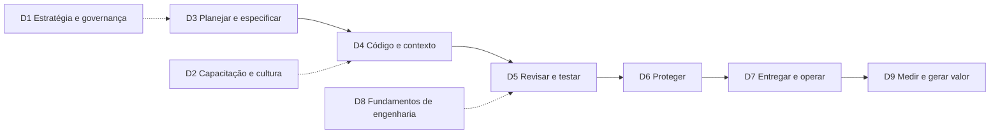

# Assessment de maturidade do SDLC assistido por IA: banco de perguntas v2.0.1

🌐 [English](AI-Maturity-Form-Questions_v2.md) · Português (Brasil) · [Español](AI-Maturity-Form-Questions_v2.es.md)

> Banco de perguntas para Microsoft Forms para avaliar a maturidade de uma organização no uso de IA, e agentes de IA, em todo o ciclo de vida de desenvolvimento de software (SDLC).
> Esta versão substitui o banco de perguntas v1 (158 perguntas), que permanece disponível para comparação histórica em [v1/question-bank.pt-br.md](v1/question-bank.pt-br.md) e em [framework.json](../framework.json). A fonte legível por máquina para v2 é [framework.v2.json](../framework.v2.json), gerada a partir deste arquivo por `scripts/spec_to_framework_v2.py`.

| Campo | Valor |
| --- | --- |
| Versão | 2.0.1 |
| Data | 2026-09-27 |
| Status | Aprovado para uso no kit |
| Substitui | banco de perguntas v1 (3 pilares, 28 capacidades, 158 perguntas) |
| Escopo | engenharia de software assistida por IA e agentic: planejar, codificar, revisar, testar, proteger, entregar, operar, medir |
| Estrutura | 1 seção de perfil do respondente (5 perguntas não pontuadas) + 9 dimensões pontuadas (61 perguntas) |
| Escala de resposta | `L0` a `L4` + `NA` (mesmos prefixos da v1, âncoras redefinidas, sem lacunas de cobertura) |
| Base de evidências | Microsoft, GitHub, Anthropic, Gartner, DORA, OWASP, NIST, e pesquisas revisadas por pares ou pre-print, incluindo 14 estudos pre-print de 2026 e a publicação revisada por pares de 2026 de Cui et al. (veja [Referências](#referências)) |

## Conteúdo

- [1. O que mudou em relação à v1](#1-o-que-mudou-em-relação-à-v1)
- [2. Base de pesquisa](#2-base-de-pesquisa)
  - [2.1 Atualização de pesquisa de 2026](#21-atualização-de-pesquisa-de-2026)
- [3. Desenho do modelo](#3-desenho-do-modelo)
- [4. Escala de resposta](#4-escala-de-resposta)
- [5. Como montar o formulário](#5-como-montar-o-formulário)
- [6. Seção 0: Perfil do respondente](#6-seção-0-perfil-do-respondente)
- [7. Banco de perguntas pontuadas](#7-banco-de-perguntas-pontuadas)
- [8. Pontuação e relatórios](#8-pontuação-e-relatórios)
- [9. Rastreabilidade da v1 para a v2](#9-rastreabilidade-da-v1-para-a-v2)
- [10. Compatibilidade de importação e tooling](#10-compatibilidade-de-importação-e-tooling)
- [11. Premissas e limitações](#11-premissas-e-limitações)
- [Changelog](#changelog)
- [Referências](#referências)

---

## 1. O que mudou em relação à v1

| # | Problema na v1 | Mudança na v2 |
| --- | --- | --- |
| 1 | Apenas cerca de 23 das 158 perguntas eram específicas sobre IA; as demais mediam adoção genérica de DevOps. | Toda pergunta pontuada agora pergunta sobre uso de IA, governança de IA, ou um fundamento que a pesquisa mostra amplificar resultados de IA (DORA AI Capabilities Model [1]). |
| 2 | Lacuna na escala: L2 = 25-50% e L3 = >75%, então 51-75% não tinha resposta. | Faixas de cobertura contíguas: ≤25%, 26-50%, 51-90%, >90% (veja [seção 4](#4-escala-de-resposta)). |
| 3 | Cada opção misturava cobertura com "tem métricas", então as respostas eram ambíguas. | Cada nível tem um descritor genérico, e cada pergunta tem suas próprias âncoras de calibração L3/L4. |
| 4 | Duplicatas (por exemplo revisão de código com IA em P1-C1-Q2 e P1-C4-Q1; devcontainers em P1-C2-Q2, P1-C5-Q1 e P1-C9-Q1; SLSA em P2-C8-Q3 e P2-C10-Q3). | Consolidadas em perguntas únicas; veja [seção 9](#9-rastreabilidade-da-v1-para-a-v2). |
| 5 | Métricas formuladas como práticas ("frequência de implantação foi adotada"). | Métricas foram movidas para D9 e formuladas como "isso é medido e usado". |
| 6 | Sem cobertura de SDLC agentic (agentes de codificação, revisão por agente, MCP, instruções personalizadas, identidade de agente). | Novas dimensões D4 (código e engenharia de contexto) e D6 (segurança de agentes), além de itens de governança de agentes em D1, D5 e D7. |
| 7 | Sem perguntas de planejamento/especificação, custo de IA, ou medição controlada. | Novas D3 (planejar e especificar) e D9 (medição, valor e FinOps). |
| 8 | 158 perguntas + 158 campos de evidência causavam fadiga do respondente. | 61 perguntas pontuadas + 5 perguntas de perfil (61 campos opcionais de evidência). |
| 9 | Sem segmentação de respondentes. | A Seção 0 captura função, escopo e tooling para que os resultados possam ser divididos por persona. |

---

## 2. Base de pesquisa

Cada linha declara um achado publicado e a decisão de desenho que ele orienta. Itens do Gartner são previsões, não fatos medidos.

| Fonte | Achado | Implicação de desenho |
| --- | --- | --- |
| DORA 2025 [3] | 90% dos respondentes da pesquisa relatam usar IA no trabalho; mais de 80% acreditam que ela aumentou sua produtividade; 30% relatam pouca ou nenhuma confiança em código gerado por IA. | Adoção sozinha não separa mais as organizações. As perguntas medem profundidade, governança e resultados. |
| DORA 2025 [3], [4] | IA é um "amplificador" de forças e fraquezas existentes. "Sem sistemas de controle robustos, como testes automatizados fortes, práticas maduras de controle de versão e ciclos rápidos de feedback, um aumento no volume de mudanças leva à instabilidade." | D8 (fundamentos de engenharia) e D5 (quality gates) são pontuadas como parte da maturidade de IA. |
| DORA 2024 [5], DORA 2025 [3] | Em 2024, um aumento de 25% na adoção de IA foi associado a uma redução estimada de 1.5% no throughput de entrega e a uma redução de 7.2% na estabilidade de entrega. Em 2025, DORA encontrou uma relação positiva entre adoção de IA e throughput, enquanto "a adoção de IA continua tendo uma relação negativa com a estabilidade de entrega de software" [3]. | D5-Q4 (lotes pequenos) e D7-Q2 (entrega progressiva, rollback). |
| DORA AI Capabilities Model [1], [2] | Sete capacidades amplificam benefícios de IA: postura de IA clara e comunicada, ecossistemas de dados saudáveis, dados internos acessíveis por IA, práticas fortes de controle de versão, trabalhar em lotes pequenos, foco centrado no usuário, plataforma interna de qualidade. | Cada capacidade mapeia para pelo menos uma pergunta (D1-Q1, D1-Q2, D3-Q5, D4-Q7, D5-Q4, D8-Q1, D8-Q3, D8-Q4). |
| GitHub Copilot usage metrics [6] | Usuários são agrupados em coortes de adoção: Passive, Phase 1 "Code first", Phase 2 "Agent first" (uma superfície de agente do GitHub como cloud agent, code review ou CLI), Phase 3 "Multi-agent". Métricas do ciclo de vida de pull request incluem contagens de merge e tempo mediano até merge. | As âncoras de D4-Q1 seguem o modelo de coortes; D9-Q1 e D9-Q3 usam essas fontes de telemetria. |
| GitHub cloud agent risks and mitigations [7] | O agente faz push apenas para uma única branch (uma nova branch `copilot/`, ou a branch do pull request que foi solicitado a atualizar); draft PRs "devem ser revisados e mergeados por um humano"; workflows aguardam "Approve and run workflows"; o solicitante não pode aprovar o PR do agente; o acesso à internet é protegido por firewall; caracteres ocultos são filtrados para reduzir prompt injection. | D5-Q2 (human-in-the-loop) e D6-Q3/Q4 (prompt injection, menor privilégio) perguntam se esses controles são mantidos, não contornados. |
| GitHub MCP governance [9], [10] | Enterprises podem definir uma allowlist de servidores MCP ou restringir acesso a um registro personalizado. | D4-Q6 (governança de MCP). |
| Peng et al. 2023 [33] | Experimento controlado: desenvolvedores com GitHub Copilot concluíram uma tarefa de servidor HTTP 55.8% mais rápido do que o grupo de controle. | Ganhos de produtividade são reais em tarefas delimitadas, mas veja as próximas duas linhas. |
| Cui et al. [34] | Em três experimentos de campo com 4,867 desenvolvedores: aumento de 26.08% (SE 10.3%) em tarefas concluídas. Revisado por pares em _Management Science_ (online 2026-02-27). | Evidência de campo apoia medir throughput (D9-Q3). |
| METR 2025 [35] | RCT com 16 desenvolvedores open-source experientes: com ferramentas de IA, eles levaram 19% mais tempo; esperavam um ganho de velocidade de 24% e depois ainda acreditavam que a IA os havia acelerado em 20%. METR agora marca esses resultados do início de 2025 como desatualizados: diz que seu experimento de acompanhamento dá um sinal pouco confiável e que desenvolvedores provavelmente são mais acelerados por ferramentas de IA no início de 2026 [36]. | Produtividade autorrelatada não é suficiente. D9-Q5 pede medição controlada ou baseada em coortes. |
| Stack Overflow 2025 [37] | 46% dos desenvolvedores desconfiam da precisão de ferramentas de IA contra 33% que confiam; 87% estão preocupados com a precisão de agentes de IA. | D5-Q6 (cultura de verificação e confiança calibrada). |
| Anthropic Economic Index [23] | 79% das conversas do Claude Code foram "automation" contra 49% no Claude.ai; padrões de "Feedback Loop" foram 35.8% no Claude Code contra 21.3% no Claude.ai. | Ferramentas agentic deslocam o trabalho de escrever para direcionar e validar: D3 (especificar) e D5 (revisar). |
| Anthropic, Claude Code in practice [24] | "Em uma sessão típica, as pessoas tomam a maior parte das decisões de planejamento (o que fazer) e Claude toma a maior parte das decisões de execução (como fazer)." A participação de depuração caiu quase pela metade em sete meses. | D3-Q2 (trabalho spec-first) e D3-Q3 (escopo de tarefas para agentes). |
| Anthropic, context engineering [25] | "Contexto, portanto, deve ser tratado como um recurso finito com retornos marginais decrescentes." | D4-Q4, D4-Q5 e D2-Q4 (instruções curadas, bibliotecas de prompts/skills, treinamento de habilidades). |
| Gartner, Jun 2026 [32] | Prevê que, até 2028, custos de AI coding ultrapassarão o salário médio de um desenvolvedor. Recomenda definir "níveis de autonomia para cada tarefa" (este banco os parafraseia como liderado pelo desenvolvedor, desenvolvedor com agente e totalmente liderado por agente); roteamento de modelo por complexidade da tarefa; engenharia de contexto obrigatória; limites de tokens; revisões de tokens em retrospectivas de sprint. | D1-Q5 (classificação de autonomia), D4-Q8 (roteamento de modelo), D9-Q6 (AI FinOps). |
| Gartner, May 2026 [31] | Prevê que, até 2027, mais de 65% das equipes de engenharia que usam agentic coding tratarão IDEs como opcionais, "deslocando controle, governança e validação para plataformas automatizadas". | A governança deve viver na plataforma e no pipeline (D5-Q3, D8-Q3), não apenas no IDE. |
| Gartner, Jul 2025 [29] | Prevê que, até 2028, 90% dos engenheiros de software enterprise usarão assistentes de código de IA, acima de menos de 14% no início de 2024. | Planeje acesso quase universal; maturidade é sobre como, não sobre se. |
| Gartner, Oct 2024 [30] | Até 2027, GenAI exigirá que 80% da força de trabalho de engenharia se requalifique; na "era AI-native", engenheiros de software "se concentrarão principalmente em direcionar agentes de IA para o contexto e as restrições mais relevantes para uma determinada tarefa". | D2 (capacitação, habilidades e papéis). |
| Microsoft CAF, govern and secure AI agents [19] | "Todo agente deve ser observável, governado e seguro." Mantenha um registro de agentes; exija uma identidade única para cada agente; aplique políticas de forma consistente; observe a atividade de agentes. | D1-Q7 (registro e identidade), D6-Q7 (trilha de auditoria), D7-Q4 (observabilidade de agentes). |
| Microsoft Agentic DevOps [16], [17] | Agentes de IA "trabalham ao lado da sua equipe durante todo o ciclo de vida de desenvolvimento de software" [17]; "todo o ciclo de vida de desenvolvimento de software está sendo reimaginado por meio de agentes inteligentes" [16]. | O modelo cobre toda fase do SDLC, não apenas codificação. |
| OWASP LLM Top 10 2025 [38] and Agentic Top 10 2026 [39] | Riscos incluem LLM01:2025 Prompt Injection, LLM03:2025 Supply Chain, LLM06:2025 Excessive Agency, LLM10:2025 Unbounded Consumption e ASI01 Agent Goal Hijack. Os IDs LLM são da edição de 2025; a edição de 2026 renumera alguns deles. | D4-Q6, D5-Q2, D6 e D9-Q6 referenciam esses IDs de risco. |
| NIST SP 800-218A [40] | Perfil da comunidade SSDF que adiciona práticas específicas para desenvolvimento de modelos de IA em todo o SDLC, para produtores e adquirentes de modelos de IA e sistemas de IA. | D6-Q5 e D6-Q6. |

### 2.1 Atualização de pesquisa de 2026

Quatorze estudos publicados no arXiv entre janeiro e setembro de 2026. São pre-prints e não necessariamente foram revisados por pares; a publicação revisada por pares de 2026 de Cui et al. [34] está coberta na tabela acima. A maioria minera o dataset público AIDev de pull requests criados por agentes em repositórios open-source do GitHub, então resultados enterprise podem diferir.

| Estudo | Dados | Achado | Implicação de desenho |
| --- | --- | --- | --- |
| Denisov-Blanch et al., RAMP [47] | 441 repositórios | Propõe RAMP (Repository AI Maturity Profile), um modelo de maturidade de quatro níveis baseado em configuração de IA commitada no repositório. Agentes trouxeram 28-38% mais commits em todo nível de maturidade. Entre repositórios agent-first, aqueles sem configuração de IA commitada mostraram cerca do dobro do aumento em complexidade cognitiva (+53% vs +27%) e 1.7x o aumento em avisos de análise estática. 73.8% dos artefatos de configuração de IA foram commitados uma vez e nunca modificados. Os autores chamam os resultados de observacionais e geradores de hipóteses. | D4-Q4 e D4-Q5 pedem instruções mantidas atualizadas, não configuradas uma vez e esquecidas. RAMP pode servir como uma checagem cruzada objetiva da autoavaliação de D4 (veja [seção 8](#8-pontuação-e-relatórios)). |
| Arabat and Sayagh [46] | 15,549 PRs agentic, 148 projetos | Adicionar arquivos de instruções não melhora necessariamente PRs de agentes: 27.7% dos projetos aumentaram sua taxa de merge em pelo menos 20%, enquanto 26.35% viram queda (a queda é relatada sem um limite). Projetos que melhoraram tinham arquivos de instruções mais longos e bem estruturados. | D4-Q4 trata arquivos de instruções como artefatos de engenharia ("instructions as code") cujo efeito é medido. |
| Pinna et al. [49] | 7,156 PRs de cinco agentes de codificação | O tipo de tarefa orienta aceitação mais do que a escolha do agente para a maioria das tarefas: documentação 82.1% vs novas features 66.1%. Nenhum agente único foi melhor em todos os tipos de tarefa. | D1-Q5, D3-Q3 e D4-Q3 definem regras de delegação por tipo de tarefa; D1-Q3 avalia ferramentas por tipo de tarefa. |
| Takerngsaksiri et al. [50] | 6,774 PRs de agentes mergeados vs 5,044 PRs humanos | PRs de agentes mergeados atraíram correções de acompanhamento verificadas com odds 1.62 vezes maiores que PRs humanos nos mesmos repositórios; 69.6% dessas correções vieram do mesmo agente. | D9-Q3 adiciona taxa de correções pós-merge para PRs de agentes; D5-Q3 mantém quality gates iguais. |
| Sawada et al. [51] | 1,000+ arquivos, cerca de 3,200 mudanças, 100 repositórios | Arquivos gerados por IA receberam manutenção com menos frequência do que código humano; humanos fizeram a maior parte da manutenção que aconteceu. | D5-Q7 exige um responsável humano nomeado e monitoramento de saúde para código gerado por IA. |
| Sakib et al. [52] | 4,022 PRs de agentes, 16,112 mudanças de arquivo | 38.9% dos PRs de agentes tinham pelo menos um security smell; problemas de integridade de supply chain foram 82.3% dos smells; credenciais hard-coded foram 99.6% dos smells críticos. Humanos introduziram 67.6% dos segredos genuínos vazados, e a revisão falhou em detectar 81.1% dessas credenciais antes da integração. | D6-Q1 (push protection para todo commit, humano ou agente), D6-Q5 (supply chain) e D5-Q6 (vigilância do revisor). |
| Siddiq et al. [57] | 33,000+ PRs de agentes, 1,293 relacionados à segurança | Cerca de 4% dos PRs de agentes eram relacionados à segurança, principalmente hardening (testes, configuração, tratamento de erros). Eles tiveram taxas de merge menores e revisões mais longas; rejeição estava ligada mais à complexidade e verbosidade do PR do que a tópicos de segurança. | D5-Q4 (PRs pequenos e focados) e D6-Q2 (remediação de IA revisada). |
| Nachuma and Zibran [53] | PRs de agentes AIDev, análise de regressão | Engajamento de revisores teve a correlação mais forte com merge; mudanças maiores e force pushes reduziram a probabilidade de merge. | D5-Q2 (revisão humana ativa) e D5-Q4 (lotes pequenos). |
| Selvanayagam and Ghaleb [54] | 248,641 PRs criados por IA com revisão por IA | Revisão IA-para-IA cross-product foi cerca de 1.6% dos PRs de agentes, mas cresceu por mais de duas ordens de magnitude de 2025-Q1 a 2025-Q3. | D5-Q1 trata revisão por IA como uma camada e rastreia onde IA revisa IA sem um humano. |
| Stolze and Strässle [55] | Entrevistas com 5 profissionais | A supervisão está se movendo de centrada em revisão para camadas: guardrails preventivos (intenção e convenções em forma legível por máquina), guardrails executáveis (lint, testes, CI/CD) e supervisão humana focada em arquitetura e manutenibilidade. | D4-Q4 (preventivo), D5-Q3 (executável) e D5-Q1/Q2 (supervisão humana) pontuam as três camadas. Amostra pequena. |
| Shen and Tamkin (Anthropic) [48] | Experimentos randomizados com desenvolvedores aprendendo uma nova biblioteca | O uso de IA prejudicou entendimento conceitual, leitura de código e depuração, sem ganho médio significativo de eficiência. Delegação completa melhorou velocidade ao custo de aprendizagem. Três de seis padrões de interação preservaram aprendizagem. | D2-Q1 e D2-Q6 pedem uso de IA que preserve aprendizagem, especialmente para engenheiros em início de carreira. |
| Liu et al. [45] | Traces do GitHub Copilot, junho de 2026: 3.2M usuários, 13M sessões, 761M chamadas LLM, 95T tokens | Sessões agentic são turnos esparsos de usuário que se desdobram em ciclos autônomos de chamadas LLM e execução de ferramentas; o consumo de tokens é long-tailed. | D7-Q4 (observabilidade de agentes) e D9-Q6 (governança de custos para uso long-tail). |
| Farrag [58] | Revisão multivocal de 67 fontes mais um piloto de 4 meses (autor único) | Enquadra evidências conflitantes de produtividade como um "Paradoxo Produtividade-Confiabilidade" e conclui que "disciplina de especificação, não capacidade do modelo, é a restrição determinante para a confiabilidade de software assistido por IA." | Apoia D3-Q2 (especificação antes da implementação). |
| Monperrus [56] | Position paper | Argumenta que agentes de codificação tornam revisão humana obrigatória de código desnecessária. | Uma visão contrastante. A v2 mantém aprovação humana para PRs de agentes, consistente com os padrões do GitHub [7], mas D1-Q5 e D5-Q2 permitem níveis de aprovação baseados em risco. |

---

## 3. Desenho do modelo

Nove dimensões. D3 a D7 seguem o fluxo do SDLC; D1, D2 e D8 são habilitadores; D9 fecha o ciclo com medição.

| ID | Dimensão | Perguntas | Base principal |
| --- | --- | --- | --- |
| D1 | Estratégia, política e governança de IA | 7 | Postura de IA clara do DORA [1]; Microsoft CAF [18], [19], [20]; Gartner [32] |
| D2 | Capacitação, habilidades e cultura | 6 | DORA [2]; Gartner [30]; Anthropic [25]; Shen and Tamkin [48] |
| D3 | Planejar, especificar e desenhar | 6 | Anthropic [24], [27]; GitHub [8]; foco centrado no usuário do DORA [1]; Pinna et al. [49]; Farrag [58] |
| D4 | Código e engenharia de contexto | 8 | GitHub [6], [8], [9], [11]; Anthropic [25]; Gartner [32]; RAMP [47]; Arabat and Sayagh [46] |
| D5 | Revisão, qualidade e testes | 7 | GitHub [7], [12]; DORA [3], [5]; Stack Overflow [37]; estudos de PRs de agentes de 2026 [50], [51], [53], [54], [55] |
| D6 | Segurança e cadeia de suprimentos de IA | 7 | OWASP [38], [39]; NIST [40]; GitHub [7], [13]; Microsoft CAF [19]; Sakib et al. [52]; Siddiq et al. [57] |
| D7 | Entregar e operar | 6 | DORA [3]; Microsoft [19], [22]; Liu et al. [45] |
| D8 | Fundamentos de engenharia (amplificadores de IA) | 7 | DORA AI Capabilities Model [1], [2] |
| D9 | Medição, valor e AI FinOps | 7 | GitHub [6]; DORA [2]; METR [35]; Cui et al. [34]; Gartner [28], [32]; Takerngsaksiri et al. [50] |
| | **Total pontuado** | **61** | |

---

## 4. Escala de resposta

Use estas seis opções, nesta ordem, para toda pergunta pontuada (D1 a D9). Mantenha o prefixo `L0`...`L4`/`NA` no início de cada opção: o importador mapeia prefixos para valores 0-4 ou null.

- **L0 - Não iniciado: Nenhuma prática ainda, ou IA não permitida para esta atividade**
- **L1 - Explorando: Uso individual ou ad hoc, sem orientação acordada (mais de 0% e até 25% das equipes)**
- **L2 - Adotando: Prática no nível da equipe com orientação escrita (26-50% das equipes)**
- **L3 - Escalando: Padrão organizacional, governado e medido (51-90% das equipes)**
- **L4 - Nativo em IA: Universal (>90%), continuamente avaliado e melhorado, vinculado a resultados**
- **NA - Não sei / Não se aplica**

L0 versus NA: escolha `L0` quando a prática poderia se aplicar, mas ainda não existe, inclusive quando IA não é permitida. Escolha `NA` somente quando você não souber a resposta, ou quando a atividade não existir no seu escopo (por exemplo, nenhuma infraestrutura é gerenciada por suas equipes).

Como ler a escala:

| Nível | Cobertura | Governança | Medição | Sinal agentic típico (coortes do GitHub [6]) |
| --- | --- | --- | --- | --- |
| L0 | Nenhuma | Nenhuma ou proibida | Nenhuma | Sem uso de IA |
| L1 | ≤25% das equipes | Informal | Anedótica | Usuários Passive ou ocasionais "Code first" |
| L2 | 26-50% | Orientação escrita da equipe | Métricas de atividade (uso) | Maioria dos usuários "Code first" |
| L3 | 51-90% | Política da organização, aplicada por controles de plataforma | Métricas de resultado (entrega, qualidade) revisadas regularmente | Muitos usuários "Agent first" |
| L4 | >90% | Policy as code, auditada continuamente | Comparações controladas, custo e valor rastreados, prática ajustada a partir de dados | Uso "Multi-agent" é normal e governado |

Se cobertura, governança, medição e o sinal agentic apontarem para níveis diferentes, escolha o **menor** deles. Cada pergunta adiciona âncoras **L3 se parece com** e **L4 se parece com** para calibrar respostas.

Leia toda pergunta como "em que medida isto é verdade?": as opções medem o quanto a prática está em vigor, não sim ou não. Mais duas regras mantêm as respostas comparáveis:

- **Todas as partes devem ser verdadeiras.** Algumas perguntas nomeiam várias condições (por exemplo "patrocinada, com objetivos explícitos, e comunicada"). Responda no nível mais alto em que **todas** as condições nomeadas sejam verdadeiras. Uma estratégia que existe, mas não é comunicada, não é L3.
- **Unidade de cobertura.** Cada pergunta em [framework.v2.json](../framework.v2.json) tem uma `unit`. Para `teams`, `repositories`, `services` ou `engineers`, leia os percentuais contra essa unidade. Para perguntas de `organization` (uma única prática em toda a organização, como uma estratégia ou política), ignore os percentuais e use as colunas de governança e medição: L1 informal, L2 escrita, L3 aplicada e medida, L4 continuamente melhorada a partir de dados.

---

## 5. Como montar o formulário

1. Acesse <https://forms.office.com> e crie um formulário em branco.
2. Título sugerido: `AI-Assisted SDLC Maturity Assessment v2 - <Nome da organização>`.
3. Adicione **10 seções** com `+ Add new` > `Section`: Seção 0 (perfil) e uma por dimensão (D1 a D9).
4. Seção 0: adicione as cinco perguntas de perfil como **Choice** com as opções listadas na [seção 6](#6-seção-0-perfil-do-respondente), cada título começando com seu ID (por exemplo `R-Q1: Qual opção descreve melhor sua função principal?`). `R-Q3` permite várias respostas. Elas não são pontuadas. Adicione o aviso de privacidade de `collection/FORMS-INSTRUCTIONS.md` à descrição do formulário.
5. Para cada pergunta pontuada, adicione dois elementos:
   - **Choice** (resposta única). Comece o título com o ID da pergunta e dois-pontos, depois o texto da pergunta em negrito abaixo, por exemplo `D4-Q3: Coding agents (por exemplo Copilot cloud agent) recebem issues ...`. O importador encontra cada coluna por esse ID, então o prefixo é obrigatório. Use as seis opções da [seção 4](#4-escala-de-resposta).
   - **Long Text** (opcional) rotulado `Evidence (<ID>)`, por exemplo `Evidence (D4-Q3)`, com o placeholder `Ferramenta, % de cobertura, métrica, período, link`.
6. Adicione as âncoras de calibração (**L3 se parece com**, **L4 se parece com**) e, quando houver, a **nota de escopo** ao subtítulo da pergunta para que respondentes as vejam.
7. `Settings` > `Anyone can respond` se for compartilhar por link, ou restrinja à organização.
8. Opcional, para reduzir fadiga em papéis não técnicos: use `Branching` no Forms para que respondentes que escolham "Executivo(a) (CTO, VP, Diretor(a))" ou "Gerente de produto / programa" em `R-Q1` possam pular D4 a D7. As perguntas puladas contam como não respondidas, não como `NA`.
9. Compartilhe o link. Recomendado: pelo menos 3 respondentes por persona (veja a pergunta de perfil `R-Q1`) para reduzir viés de respondente único.
10. Quando as respostas estiverem prontas: `Responses` > `Open in Excel` e baixe o `.xlsx`, depois rode `make import XLSX=<arquivo>`.

Contagem de elementos: 5 de perfil + 61 pontuados + 61 campos opcionais de evidência = 127 elementos (v1 tinha cerca de 324).

---

## 6. Seção 0: Perfil do respondente

Não pontua. Serve para segmentar os resultados. As opções são específicas de cada pergunta (não a escala L0 a L4).

### Pergunta `R-Q1`: Função principal

> **Qual opção descreve melhor sua função principal?**

- Engenheiro(a) de software / desenvolvedor(a)
- Gerente de engenharia / tech lead
- Arquiteto(a)
- Engenheiro(a) de plataforma / DevOps / SRE
- Segurança / AppSec
- Engenheiro(a) de QA / testes
- Gerente de produto / programa
- Executivo(a) (CTO, VP, Diretor(a))
- Outro

### Pergunta `R-Q2`: Escopo das suas respostas

> **Em qual escopo suas respostas se baseiam?**

- Uma única equipe
- Várias equipes em uma unidade de negócio
- Uma unidade de negócio
- Toda a organização

### Pergunta `R-Q3`: Principais ferramentas de IA para código

> **Quais ferramentas de IA você usa pelo menos semanalmente para trabalho de software? (múltiplas respostas)**

_Tipo: Choice (múltiplas respostas)._

- GitHub Copilot no IDE (autocompletar, chat, modo agente)
- GitHub Copilot cloud agent / code review / CLI
- Claude Code ou Claude em outros clientes
- Ferramentas internas baseadas em Microsoft Foundry / Azure OpenAI
- Outras ferramentas comerciais de IA para código
- Modelos internos ou auto-hospedados
- Nenhuma

### Pergunta `R-Q4`: Experiência profissional

> **Quantos anos de experiência profissional em software você tem?**

- Menos de 2
- 2-5
- 6-10
- Mais de 10

### Pergunta `R-Q5`: Tempo prático (hands-on)

> **Em uma semana típica, quanto do seu tempo é prático, construindo (código, configuração, testes)?**

- Menos de 20%
- 20-50%
- 51-80%
- Mais de 80%

---

## 7. Banco de perguntas pontuadas

Toda pergunta pontuada usa as seis opções da [seção 4](#4-escala-de-resposta) e é seguida por um campo opcional de Long Text `Evidence (<ID>)`. Os números entre colchetes remetem às [Referências](#referências). **Linhagem v1** lista os IDs das perguntas v1 que esta pergunta substitui ou consolida; `Nova` significa sem equivalente na v1.

### D1: Estratégia, política e governança de IA

_7 perguntas. Por que importa: DORA identifica uma "postura de IA clara e comunicada" como amplificadora dos benefícios da IA [1], [2]; o Microsoft CAF afirma que "todo agente deve ser observável, governado e seguro" [19]._

#### `D1-Q1`: Estratégia de IA para engenharia de software

> **Existe uma estratégia documentada de IA para engenharia de software, patrocinada pela liderança, que declare objetivos explícitos e seja comunicada a todas as equipes de engenharia?**

- **L3 se parece com:** Estratégia publicada e revisada pelo menos anualmente; objetivos (por exemplo entrega, qualidade, developer experience) têm responsáveis; a maioria dos engenheiros consegue dizer onde encontrá-la.
- **L4 se parece com:** A estratégia é revisada a partir de resultados medidos (D9) e vinculada a OKRs de negócio; o progresso é reportado à liderança em uma cadência fixa.
- **Exemplos de evidência:** Documento de estratégia, comunicação da liderança, entradas de OKR.
- **Base:** [1], [2], [18]
- **Linhagem v1:** Nova

#### `D1-Q2`: Política de uso aceitável

> **Está claro para os engenheiros como eles podem e não podem usar IA no trabalho, incluindo quais dados podem ser compartilhados com ferramentas de IA?**

- **L3 se parece com:** Política escrita de uso aceitável cobre code, dados de clientes, segredos e IP de terceiros; faz parte do onboarding; exceções têm um responsável.
- **L4 se parece com:** A política é aplicada por controles técnicos (por exemplo content exclusion, prevenção contra perda de dados, allowlists) e auditada; violações disparam alertas automatizados.
- **Exemplos de evidência:** Link da política, checklist de onboarding, configuração de controles.
- **Base:** [1], [2], [20], [21]
- **Linhagem v1:** P1-C1-Q5 (parcial)

#### `D1-Q3`: Ferramentas e modelos aprovados

> **Existe um catálogo mantido de ferramentas, recursos e modelos de IA aprovados para desenvolvimento de software, gerenciado por políticas enterprise ou da organização?**

- **L3 se parece com:** Políticas enterprise/da organização habilitam apenas recursos e modelos aprovados; o catálogo lista responsável, tratamento de dados e data de revisão para cada ferramenta.
- **L4 se parece com:** Novos modelos e ferramentas passam por uma avaliação definida (qualidade, custo, segurança) antes da habilitação; os descontinuados são removidos conforme cronograma.
- **Exemplos de evidência:** Configurações de política do Copilot, catálogo de ferramentas, registros de avaliação de modelos.
- **Base:** [2], [15], [32], [49]
- **Linhagem v1:** Nova

#### `D1-Q4`: Proteção de dados, IP e residência

> **Requisitos de residência, retenção, propriedade intelectual e privacidade de dados estão definidos e aplicados às ferramentas e agentes de IA usados no SDLC?**

- **L3 se parece com:** Requisitos são documentados por ferramenta; repositórios ou arquivos sensíveis são excluídos do contexto de IA; retenção de logs e memória segue a política.
- **L4 se parece com:** A conformidade é avaliada continuamente (por exemplo com um compliance manager) e mapeada a regulamentações como o EU AI Act quando aplicável.
- **Exemplos de evidência:** Registros de processamento de dados, configurações de exclusão, política de retenção.
- **Base:** [19], [20]
- **Linhagem v1:** P1-C1-Q5 (parcial)

#### `D1-Q5`: Níveis de autonomia para trabalho com IA

> **A organização definiu quais tarefas são lideradas pelo desenvolvedor, conduzidas por desenvolvedor com agente, ou totalmente lideradas por agente, e os controles exigidos para cada nível?**

- **Nota de escopo:** Mede a política que define níveis de autonomia. Como as tarefas são escritas para agentes é D3-Q3; com que frequência o trabalho é delegado é D4-Q3.
- **L3 se parece com:** Uma matriz publicada mapeia tipos de tarefa (por exemplo upgrades de dependências, geração de testes, trabalho de feature, mudanças em produção) para níveis de autonomia e aprovações exigidas.
- **L4 se parece com:** A matriz é aplicada por regras da plataforma (por exemplo branch protection, revisores exigidos por caminho) e atualizada a partir de dados de incidentes e qualidade.
- **Exemplos de evidência:** Matriz de autonomia, rulesets de repositório, registros de mudança.
- **Base:** [32], [7], [26], [49] (contraponto: [56])
- **Linhagem v1:** Nova

#### `D1-Q6`: IA responsável e framework de risco

> **O uso de IA em engenharia de software é governado por um padrão de IA responsável e por um framework de risco reconhecido (por exemplo Microsoft Responsible AI Standard, NIST AI RMF, ISO/IEC 42001)?**

- **L3 se parece com:** Um framework nomeado é adotado; riscos relacionados a IA estão no registro de riscos com responsáveis e revisões.
- **L4 se parece com:** Controles do framework são auditados interna ou externamente; resultados retroalimentam política e tooling.
- **Exemplos de evidência:** Mapeamento do framework, entradas no registro de riscos, relatórios de auditoria.
- **Base:** [20], [21], [41], [42]
- **Linhagem v1:** P3-C3-Q5 (parcial)

#### `D1-Q7`: Registro e identidade de agentes

> **Todo agente de IA usado no SDLC (coding agents, review agents, custom agents, pipeline agents) está registrado com um responsável, um propósito, uma identidade distinta e um escopo de acesso definido?**

- **L3 se parece com:** Um único inventário lista todos os agentes com responsável, plataforma e permissões; cada agente executa sob sua própria identidade, não uma conta humana compartilhada.
- **L4 se parece com:** Agentes não registrados ("shadow") são detectados automaticamente; o ciclo de vida de identidade (criação, revisão, remoção) é automatizado.
- **Exemplos de evidência:** Inventário de agentes, configuração de identidade (por exemplo Microsoft Entra Agent ID), revisões de acesso.
- **Base:** [19], [39]
- **Linhagem v1:** P3-C5-Q4 (parcial)

### D2: Capacitação, habilidades e cultura

_6 perguntas. Por que importa: O Gartner espera que GenAI exija que 80% da força de trabalho de engenharia se requalifique até 2027 [30]; DORA pergunta sobre treinamento, aprendizagem entre pares e suporte à experimentação [2]._

#### `D2-Q1`: Treinamento estruturado de IA

> **Os engenheiros recebem treinamento estruturado nas ferramentas de IA e workflows de agentes aprovados, além do onboarding padrão do fornecedor?**

- **L3 se parece com:** Currículo baseado em função (desenvolvedor, revisor, plataforma, segurança) com conclusão rastreada; o treinamento é exigido antes que recursos de agentes sejam habilitados; ensina padrões que preservam o aprendizado (pedir explicações, tentar primeiro, depois comparar) e não apenas delegação total.
- **L4 se parece com:** O currículo é atualizado a cada trimestre com base em dados de uso e padrões de falha; existem trilhas avançadas (orquestração de agentes, avaliação).
- **Exemplos de evidência:** Trilhas de aprendizagem, taxas de conclusão, regras de bloqueio de habilitação.
- **Base:** [2], [30], [48]
- **Linhagem v1:** P1-C5-Q4, P1-C3-Q6 (parcial)

#### `D2-Q2`: Aprendizagem entre pares e champions

> **Existem formatos regulares de aprendizagem entre pares (demos, brown bags, office hours) e uma rede de champions de IA entre equipes?**

- **L3 se parece com:** Champions existem na maioria das equipes; sessões ocorrem pelo menos mensalmente; gravações e exemplos são compartilhados em um único lugar.
- **L4 se parece com:** Uma comunidade de prática faz curadoria de ativos reutilizáveis (instruções, arquivos de prompt, agentes) e mede sua reutilização.
- **Exemplos de evidência:** Lista de champions, calendário de sessões, repositório compartilhado de exemplos.
- **Base:** [2]
- **Linhagem v1:** P1-C6-Q6

#### `D2-Q3`: Suporte à experimentação

> **A organização dá aos engenheiros tempo, sandboxes e orçamento para experimentar com segurança novas ferramentas de IA e padrões de agentes?**

- **L3 se parece com:** Ambientes em sandbox e um caminho leve de solicitação existem; experimentos são registrados e seus resultados compartilhados.
- **L4 se parece com:** Experimentos bem-sucedidos entram no catálogo aprovado (D1-Q3) por meio de um caminho definido em semanas.
- **Exemplos de evidência:** Assinaturas de sandbox, log de experimentos, registros de promoção.
- **Base:** [2]
- **Linhagem v1:** Nova

#### `D2-Q4`: Habilidades de engenharia de contexto

> **Os engenheiros são treinados para dar às ferramentas de IA o contexto correto (escopo claro da tarefa, arquivos relevantes, restrições, exemplos) e manter o contexto enxuto?**

- **L3 se parece com:** Orientações e exemplos sobre engenharia de contexto fazem parte do treinamento; equipes revisam suas instruções e prompts quanto à qualidade.
- **L4 se parece com:** Práticas de contexto são medidas (por exemplo taxa de sucesso ou uso de tokens por tarefa) e melhoradas ao longo do tempo.
- **Exemplos de evidência:** Páginas de orientação, checklists de review, métricas antes/depois.
- **Base:** [25], [30], [32]
- **Linhagem v1:** Nova

#### `D2-Q5`: Papéis e trajetórias de carreira

> **Descrições de cargo, frameworks de carreira e expectativas de desempenho foram atualizados para engenharia assistida por IA e agentic engineering (por exemplo dirigir agentes, revisar saída de IA, engenharia de IA)?**

- **L3 se parece com:** Perfis de função atualizados são publicados; avaliações de desempenho reconhecem uso efetivo de IA e qualidade de review, não volume bruto de saída.
- **L4 se parece com:** Existem funções dedicadas (por exemplo engenheiro de IA, responsável pela plataforma de agentes) com um caminho claro de crescimento.
- **Exemplos de evidência:** Framework de carreira, descrições de função.
- **Base:** [30]
- **Linhagem v1:** Nova

#### `D2-Q6`: Onboarding assistido por IA

> **Novos engenheiros usam ferramentas de IA para entender codebases e se tornarem produtivos, com tempo de ramp-up medido?**

- **L3 se parece com:** O onboarding inclui tours de codebase guiados por IA e instruções de repositório; tempo até o primeiro PR mergeado é rastreado; novos engenheiros são avaliados em leitura de code e debugging, não apenas em saída.
- **L4 se parece com:** Métricas de ramp-up e habilidades são comparadas entre coortes e usadas para melhorar material e instruções de onboarding.
- **Exemplos de evidência:** Playbook de onboarding, dados de tempo até primeiro PR, resultados de verificação de habilidades.
- **Base:** [27], [48]
- **Linhagem v1:** P1-C5-Q2, P1-C5-Q6, P1-C5-Q7

### D3: Planejar, especificar e desenhar

_6 perguntas. Por que importa: em agentic coding, "as pessoas tomam a maior parte das decisões de planejamento (o que fazer) e Claude toma a maior parte das decisões de execução (como fazer)" [24]; a qualidade da definição da tarefa impulsiona a qualidade da saída do agente [8], [27]._

#### `D3-Q1`: IA no refinamento de backlog

> **IA é usada para redigir e refinar issues ou user stories, incluindo critérios de aceite, com um responsável humano que as aprova?**

- **L3 se parece com:** A maioria das equipes usa IA para redigir ou melhorar itens de trabalho; critérios de aceite são obrigatórios antes do trabalho começar.
- **L4 se parece com:** A qualidade dos itens de trabalho (clareza, testabilidade) é medida e vinculada a retrabalho e cycle time.
- **Exemplos de evidência:** Templates de issue, exemplos de itens de trabalho, verificações de qualidade.
- **Base:** [16], [17]
- **Linhagem v1:** Nova

#### `D3-Q2`: Especificação antes da implementação

> **Para mudanças não triviais, um plano ou especificação escrito é produzido e revisado antes que um agente de IA implemente a mudança?**

- **L3 se parece com:** Planos ou specs são armazenados no repositório ou vinculados à issue, e são revisados por um humano antes da implementação pelo agente.
- **L4 se parece com:** Specs são o contrato para verificação automatizada (testes, checks) e são mantidas sincronizadas com o code.
- **Exemplos de evidência:** Arquivos de spec, reviews de plano, PRs que referenciam specs.
- **Base:** [24], [27], [58], [23]
- **Linhagem v1:** Nova

#### `D3-Q3`: Escopo de tarefas para agentes

> **As tarefas dadas a coding agents são bem delimitadas (pequenas, com critérios de aceite claros e ponteiros para code relevante) antes da atribuição?**

- **Nota de escopo:** Mede como as tarefas são delimitadas para agentes. A política de autonomia é D1-Q5; o volume de delegação é D4-Q3.
- **L3 se parece com:** Equipes seguem orientação escrita para issues prontas para agentes; tarefas grandes demais são divididas antes da atribuição.
- **L4 se parece com:** Sucesso de tarefas de agentes e taxas de retrabalho são rastreados por tipo de tarefa e usados para refinar a orientação.
- **Exemplos de evidência:** Diretrizes de tarefas para agentes, exemplos de issues, dados de taxa de sucesso.
- **Base:** [8], [1], [24], [49]
- **Linhagem v1:** Nova

#### `D3-Q4`: Decisões de arquitetura e design

> **IA é usada para apoiar trabalho de design (análise de opções, modos de ameaça e falha, architecture decision records), enquanto as decisões permanecem com humanos responsáveis?**

- **L3 se parece com:** ADRs são versionados; análise assistida por IA é anexada; um humano nomeado aprova cada decisão.
- **L4 se parece com:** Agentes verificam novas mudanças contra decisões registradas e sinalizam conflitos automaticamente.
- **Exemplos de evidência:** Repositório de ADR, registros de design review.
- **Base:** [24], [26], [8]
- **Linhagem v1:** P1-C3-Q5, P1-C6-Q5

#### `D3-Q5`: Foco centrado no usuário

> **O trabalho assistido por IA está vinculado a resultados claros para usuários e informado por feedback de usuários?**

- **L3 se parece com:** Itens de trabalho referenciam o problema do usuário e a medida de sucesso; feedback é revisado antes da priorização.
- **L4 se parece com:** Métricas de resultado do usuário fazem parte da definition of done para entrega assistida por IA.
- **Exemplos de evidência:** Briefs de produto, registros de loop de feedback, dashboards de resultados.
- **Base:** [1], [2], [3]
- **Linhagem v1:** Nova

#### `D3-Q6`: Modernização assistida por IA

> **Ferramentas e agentes de IA são usados para entender, fazer upgrade e migrar code legado (por exemplo upgrades de framework ou runtime, migração para cloud), com resultados verificados por testes?**

- **L3 se parece com:** Existe um processo repetível de modernização assistida por IA para tipos comuns de upgrade, com gates de teste.
- **L4 se parece com:** O backlog de modernização é reduzido continuamente por agentes sob review humano, com taxas de sucesso rastreadas.
- **Exemplos de evidência:** Runbooks de upgrade, PRs de migração, resultados de testes.
- **Base:** [16], [17]
- **Linhagem v1:** Nova

### D4: Código e engenharia de contexto

_8 perguntas. Por que importa: GitHub mede a profundidade de adoção como uma progressão de "Code first" para "Agent first" e "Multi-agent" [6]; a Anthropic descreve contexto como "um recurso finito com retornos marginais decrescentes" [25]._

#### `D4-Q1`: Profundidade do uso de IA entre superfícies

> **Quão profundamente os engenheiros usam IA entre superfícies: completions e edições de agentes no IDE, superfícies de agentes do GitHub (cloud agent, code review, CLI), e vários agentes juntos?**

- **Nota de escopo:** Mede quão profundamente IA é usada. Se esse uso é medido é D9-Q1.
- **L1 a L2 se parecem com:** Principalmente completions e edições de agente no IDE ("Code first"); uso só de chat conta como Passive nas coortes do GitHub.
- **L3 se parece com:** Muitos engenheiros usam regularmente pelo menos uma superfície de agente do GitHub ("Agent first"), confirmado por métricas de uso.
- **L4 se parece com:** Uso multi-agent é normal ("Multi-agent"), com distribuição de coortes rastreada mensalmente.
- **Exemplos de evidência:** Dashboard ou API de métricas de uso do Copilot: distribuição de coortes de adoção, usuários ativos diários/semanais.
- **Base:** [6]
- **Linhagem v1:** P1-C1-Q1

#### `D4-Q2`: Modo agente para trabalho multi-file

> **Os engenheiros usam IDE agent mode (ou equivalente) para mudanças multi-file, e revisam toda mudança antes de fazer commit?**

- **L3 se parece com:** Agent mode é o padrão para refactors e features multi-file na maioria das equipes; mudanças são revisadas no diff antes do commit.
- **L4 se parece com:** Equipes compartilham padrões de agent mode que funcionam e rastreiam onde ele falha; permissões de ferramentas são ajustadas por repositório.
- **Exemplos de evidência:** Uso por feature/mode, diretrizes da equipe.
- **Base:** [6], [27]
- **Linhagem v1:** P1-C1-Q1 (parcial)

#### `D4-Q3`: Delegação a coding agents

> **Coding agents (por exemplo Copilot cloud agent) recebem issues e produzem pull requests que são mergeados após review humano?**

- **Nota de escopo:** Mede quanto trabalho é delegado a coding agents. A política de autonomia é D1-Q5; escopo de tarefas é D3-Q3.
- **L3 se parece com:** A maioria das equipes delega issues adequadas a um coding agent; a parcela de PRs mergeados que são criados por agentes é rastreada.
- **L4 se parece com:** Taxa de merge de PRs de agentes, retrabalho e taxa de correções pós-merge são rastreadas por tipo de tarefa; regras de delegação (D1-Q5) são ajustadas a partir desses dados.
- **Exemplos de evidência:** Contagens de PRs criados por agentes, taxa de merge, tempo até merge, correções de acompanhamento.
- **Base:** [6], [7], [14], [49], [50]
- **Linhagem v1:** P3-C5-Q1 (parcial)

#### `D4-Q4`: Instruções de repositório

> **Os repositórios contêm custom instructions versionadas e revisadas para ferramentas de IA (por exemplo `.github/copilot-instructions.md`, `AGENTS.md`) descrevendo build, test, convenções e restrições?**

- **L3 se parece com:** A maioria dos repositórios ativos tem instruções estruturadas (build, test, convenções, restrições) com um responsável; mudanças passam por PR review; arquivos são atualizados quando o codebase muda, em vez de serem commitados uma vez.
- **L4 se parece com:** Instruções são geradas a partir de uma base compartilhada, verificadas quanto a desatualização, e seu efeito na taxa de merge de agentes e na qualidade de code é medido, já que arquivos de instrução sozinhos não garantem melhores resultados.
- **Exemplos de evidência:** Arquivos de instrução, cobertura entre repositórios, histórico de mudanças, métricas antes/depois de PRs de agentes.
- **Base:** [8], [25], [2], [27], [46], [47], [55]
- **Linhagem v1:** Nova

#### `D4-Q5`: Prompts, agentes e skills reutilizáveis

> **Existe uma biblioteca compartilhada e curada de arquivos de prompt, custom agents e skills reutilizáveis, com responsáveis e versionamento?**

- **L3 se parece com:** Um repositório central contém arquivos de prompt e custom agents aprovados; equipes os reutilizam em vez de copiar.
- **L4 se parece com:** Ativos são avaliados antes do release (qualidade, custo), o uso é rastreado, e ativos não usados são retirados.
- **Exemplos de evidência:** Repositório da biblioteca, perfis de custom agents, métricas de reutilização.
- **Base:** [11], [25], [47]
- **Linhagem v1:** Nova

#### `D4-Q6`: Governança de MCP servers

> **MCP servers e outras ferramentas de agentes são governados por uma allowlist ou registry, com ferramentas em escopo e responsáveis nomeados?**

- **L3 se parece com:** Uma allowlist enterprise de MCP ou registry customizado é aplicada; cada server tem um responsável, uma security review e ferramentas limitadas.
- **L4 se parece com:** Tool calls são registrados e revisados; novos servers passam por security checks automatizados antes de serem adicionados.
- **Exemplos de evidência:** Política de allowlist ou registry, configuração de MCP, registros de review.
- **Base:** [9], [10], [38] (LLM03:2025, LLM06:2025)
- **Linhagem v1:** P3-C5-Q4

#### `D4-Q7`: Acesso de IA ao conhecimento interno

> **Ferramentas e agentes de IA conseguem usar com segurança fontes internas (code, documentação, wikis, itens de trabalho) como contexto, por meio de conectores aprovados?**

- **L3 se parece com:** Conectores aprovados dão às ferramentas de IA acesso ciente de permissões às principais fontes internas; respostas citam material interno.
- **L4 se parece com:** Fontes de conhecimento são curadas para uso por IA (atualização, ownership) e a qualidade de retrieval é avaliada.
- **Exemplos de evidência:** Configuração de conectores, avaliações de retrieval.
- **Base:** [1], [2] (dados internos acessíveis à IA), [19]
- **Linhagem v1:** P1-C3-Q2, P1-C3-Q3

#### `D4-Q8`: Seleção e roteamento de modelos

> **A escolha do modelo é combinada à complexidade da tarefa (modelos menores para trabalho rotineiro, frontier models para trabalho complexo), por orientação ou roteamento automático?**

- **L3 se parece com:** Orientação escrita mapeia tipos de tarefa a modelos; modelos padrão são definidos por política.
- **L4 se parece com:** Roteamento automático está em vigor e é ajustado a partir de dados de custo e qualidade.
- **Exemplos de evidência:** Orientação de modelos, configurações de política, configuração de roteamento.
- **Base:** [32], [26]
- **Linhagem v1:** Nova

### D5: Revisão, qualidade e testes

_7 perguntas. Por que importa: DORA vincula o volume de mudanças impulsionadas por IA à instabilidade, a menos que existam sistemas de controle fortes [3]; GitHub exige revisão humana antes que PRs de agentes sejam mergeados [7]; 46% dos desenvolvedores desconfiam da precisão da saída de IA [37]._

#### `D5-Q1`: AI-assisted code review

> **AI code review (por exemplo Copilot code review) é aplicado a pull requests, com um revisor humano ainda responsável pela aprovação?**

- **L3 se parece com:** AI review executa automaticamente na maioria dos PRs; equipes rastreiam sugestões úteis versus descartadas.
- **L4 se parece com:** Regras de review são ajustadas por repositório a partir dos resultados de sugestões; tempo de review e defeitos escapados são rastreados; PRs em que apenas IA revisou code criado por IA são visíveis e governados.
- **Exemplos de evidência:** Rulesets de repositório, métricas de adoção de code review, resultados de sugestões.
- **Base:** [6], [12], [14], [54], [55]
- **Linhagem v1:** P1-C1-Q2, P1-C4-Q1

#### `D5-Q2`: Human-in-the-loop para mudanças de agentes

> **Pull requests criados por agentes exigem aprovação humana independente (não o solicitante), com workflow runs aprovadas antes de executarem?**

- **L3 se parece com:** Proteções padrão são mantidas: PRs de agentes precisam de um aprovador humano independente (aprovações do Copilot, se habilitadas, não contam); "Approve and run workflows" não é desabilitado sem uma decisão de risco documentada.
- **L4 se parece com:** Requisitos de aprovação escalam com o risco (D1-Q5) e são auditados; exceções expiram automaticamente.
- **Exemplos de evidência:** Rulesets, branch protection, configurações de agentes.
- **Base:** [7], [12], [14], [38] (LLM06:2025), [53], [55] (contraponto: [56])
- **Linhagem v1:** P3-C5-Q5, P2-C9-Q3

#### `D5-Q3`: Mesmos quality gates para code de IA e humano

> **Mudanças geradas por IA e criadas por agentes passam pelos mesmos checks exigidos (build, tests, linting, security scans, coverage) que mudanças humanas?**

- **L3 se parece com:** Checks exigidos são aplicados por rulesets nos protected branches da maioria dos repositórios, sem bypass para identidades de agentes.
- **L4 se parece com:** Gates são policy as code, aplicados em todos os repositórios (>90%) e revisados após incidentes.
- **Exemplos de evidência:** Rulesets, checks exigidos, listas de bypass.
- **Base:** [3], [7], [31], [50], [55]
- **Linhagem v1:** P1-C4-Q2, P1-C4-Q4

#### `D5-Q4`: Lotes pequenos

> **As mudanças são mantidas pequenas (limites de tamanho de PR, uma preocupação por PR), incluindo mudanças produzidas por agentes?**

- **Nota de escopo:** Mede o tamanho das mudanças assistidas por IA. Com que frequência o code é commitado e quão rápido é revertido é D8-Q2.
- **L3 se parece com:** Orientação de tamanho de PR é aplicada ou monitorada; PRs de agentes grandes demais são divididos antes do review.
- **L4 se parece com:** Tamanho de lote é rastreado em relação a change failure rate e tempo de review, e usado para ajustar limites.
- **Exemplos de evidência:** Distribuição de tamanho de PR, configuração de bot ou ruleset.
- **Base:** [1], [2], [5], [53], [57]
- **Linhagem v1:** P1-C4-Q6

#### `D5-Q5`: Testes assistidos por IA

> **IA é usada para gerar e manter testes, com qualidade dos testes verificada (por exemplo coverage do code alterado, mutation testing) em vez de apenas contagem de testes?**

- **Nota de escopo:** Mede IA usada para escrever e melhorar testes. Se testes automatizados atuam como gate é D8-Q7.
- **L3 se parece com:** A maioria das equipes usa IA para escrever testes; coverage de linhas alteradas é um check exigido.
- **L4 se parece com:** Efetividade dos testes (mutation score, defeitos escapados) é rastreada; flaky tests são detectados e colocados em quarentena automaticamente.
- **Exemplos de evidência:** Relatórios de coverage, resultados de mutation testing, dashboard de flaky tests.
- **Base:** [3], [8], [17]
- **Linhagem v1:** P1-C1-Q4, P2-C6-Q1, P2-C6-Q5, P2-C6-Q6, P2-C6-Q7

#### `D5-Q6`: Cultura de verificação e confiança calibrada

> **Os engenheiros verificam sistematicamente a saída de IA (executam, testam, leem) e a confiança na saída de IA é medida ao longo do tempo?**

- **Nota de escopo:** Mede comportamento de review e calibração de confiança. Como developer experience é pesquisada é D9-Q4.
- **L3 se parece com:** Diretrizes de review explicam o que verificar na saída de IA; confiança na saída de IA faz parte da pesquisa com desenvolvedores.
- **L4 se parece com:** Confiança e precisão são comparadas com dados reais de defeitos, e a orientação é atualizada onde divergem.
- **Exemplos de evidência:** Diretrizes de review, resultados de pesquisa, análise de defeitos.
- **Base:** [3], [37], [35], [48], [52], [23]
- **Linhagem v1:** Nova

#### `D5-Q7`: Saúde do code gerado por IA

> **A saúde de longo prazo do code gerado por IA é monitorada (duplicação, churn, complexidade, manutenibilidade)?**

- **L3 se parece com:** Métricas de code health são coletadas para a maioria dos repositórios e revisadas em retrospectivas de equipe; code gerado por IA tem um responsável humano nomeado.
- **L4 se parece com:** Tendências de saúde (por exemplo complexidade cognitiva, avisos de static analysis) são comparadas entre code com alta presença de IA e outros codes, com ações corretivas rastreadas.
- **Exemplos de evidência:** Dashboards de static analysis, relatórios de churn, arquivos de ownership.
- **Base:** [2] (resultado de qualidade de código), [5], [47], [51]
- **Linhagem v1:** Nova

### D6: Segurança e cadeia de suprimentos de IA

_7 perguntas. Por que importa: OWASP lista prompt injection (LLM01:2025), supply chain (LLM03:2025) e agência excessiva (LLM06:2025) entre os principais riscos [38], e agent goal hijack (ASI01) em primeiro lugar para aplicações agentic [39]; NIST SP 800-218A adiciona ao SSDF práticas para o desenvolvimento de modelos de IA [40]._

#### `D6-Q1`: Scanning de base em todo repositório

> **Code scanning (SAST), secret scanning com push protection e dependency review são aplicados a todos os repositórios, incluindo branches de agentes?**

- **L3 se parece com:** Habilitado por padrão para todos os repositórios novos e a maioria dos existentes; push protection se aplica a todo commit, humano ou de agente; alertas têm responsáveis e metas de nível de serviço.
- **L4 se parece com:** A cobertura é quase completa e verificada automaticamente; mean time to remediate é rastreado.
- **Exemplos de evidência:** Dashboard de cobertura de segurança, tempo de remediação.
- **Base:** [7], [13], [40], [52] (push protection e dependency review em todos os repositórios são uma escolha de design do kit)
- **Linhagem v1:** P1-C4-Q3, P2-C4-Q1, P2-C4-Q2, P2-C4-Q3, P2-C4-Q4, P2-C10-Q1

#### `D6-Q2`: Remediação assistida por IA

> **Remediação assistida por IA (por exemplo autofix para code scanning) é usada para corrigir vulnerabilidades, com correções revisadas e testadas antes do merge?**

- **L3 se parece com:** Sugestões de autofix são habilitadas para a maioria dos repositórios; taxas de aceitação e reabertura são rastreadas.
- **L4 se parece com:** Campanhas de segurança usam remediação com IA em escala, e o tempo de remediação é reportado à liderança.
- **Exemplos de evidência:** Configurações de autofix, métricas de remediação.
- **Base:** [13], [57]
- **Linhagem v1:** Nova

#### `D6-Q3`: Defesas contra prompt injection para agentes

> **Agentes são protegidos contra prompt injection e goal hijack (conteúdo não confiável tratado como dados, instruções ocultas filtradas, saída de rede restrita)?**

- **L3 se parece com:** Agent firewalls e restrições de egress permanecem ativados; a orientação informa às equipes quais fontes de conteúdo não são confiáveis.
- **L4 se parece com:** Agentes passam regularmente por red team contra cenários OWASP LLM01:2025 e ASI01; achados são rastreados até o fechamento.
- **Exemplos de evidência:** Configuração de firewall, relatórios de red team.
- **Base:** [7], [38] (LLM01:2025), [39] (ASI01)
- **Linhagem v1:** Nova

#### `D6-Q4`: Least privilege para agentes

> **Agentes executam com least privilege (tokens com escopo, sem segredos de produção, branches restritos, ambientes em sandbox)?**

- **L3 se parece com:** Permissões de agentes são documentadas e revisadas; agentes não conseguem acessar credenciais de produção nem fazer push para protected branches.
- **L4 se parece com:** Permissões são just-in-time e limitadas no tempo; o acesso é revisado automaticamente.
- **Exemplos de evidência:** Configuração de ambiente de agentes, escopos de token, revisões de acesso.
- **Base:** [7], [19], [38] (LLM06:2025), [39]
- **Linhagem v1:** P3-C6-Q2, P3-C6-Q3 (parcial)

#### `D6-Q5`: AI supply chain

> **Modelos, MCP servers, extensões de IDE e ferramentas de agentes são avaliados antes do uso, com proveniência e SBOMs para o que você constrói e entrega?**

- **L3 se parece com:** Um processo de review cobre componentes de IA; SBOMs e proveniência de build são produzidos para a maioria dos builds.
- **L4 se parece com:** Proveniência é verificada no deploy (por exemplo metas de nível SLSA); componentes não avaliados são bloqueados automaticamente.
- **Exemplos de evidência:** Registros de review de componentes, amostras de SBOM e atestação.
- **Base:** [38] (LLM03:2025), [40], [43], [52]
- **Linhagem v1:** P2-C8-Q2, P2-C8-Q3, P2-C10-Q2, P2-C10-Q3, P2-C10-Q5

#### `D6-Q6`: Threat modeling para features e agentes de IA

> **Features de IA e workflows agentic são threat-modeled com riscos específicos de IA (OWASP LLM and Agentic Top 10, NIST SP 800-218A)?**

- **L3 se parece com:** Threat models são exigidos para novas features de IA e workflows de agentes, e revisados por segurança.
- **L4 se parece com:** Threat models são atualizados após incidentes e exercícios de red team; controles são verificados por testes automatizados.
- **Exemplos de evidência:** Documentos de threat model, registros de security review.
- **Base:** [38], [39], [40]
- **Linhagem v1:** P2-C4-Q6 (parcial), P3-C3-Q5, P3-C5-Q3

#### `D6-Q7`: Trilha de auditoria para ações de agentes

> **Sessões e ações de agentes (prompts, tool calls, commits, aprovações) são registradas, atribuíveis a uma identidade e retidas de acordo com a política?**

- **L3 se parece com:** Atividade de agentes é registrada centralmente e vinculada ao usuário solicitante e à identidade do agente.
- **L4 se parece com:** Logs alimentam detecção de anomalias; auditorias conseguem reconstruir qualquer mudança de agente de ponta a ponta.
- **Exemplos de evidência:** Configuração de audit log, exemplo de investigação.
- **Base:** [19], [7]
- **Linhagem v1:** P3-C6-Q5 (parcial)

### D7: Entregar e operar

_6 perguntas. Por que importa: mais mudanças geradas por IA precisam de redes de segurança fortes na entrega [3], [5]; a Microsoft recomenda observação contínua da atividade de agentes [19] e está estendendo agentes para operações de cloud [22]._

#### `D7-Q1`: IA em pipelines CI/CD

> **IA é usada para criar, manter e solucionar problemas em pipelines CI/CD (por exemplo explicar runs com falha, propor correções), sobre pipeline-as-code?**

- **L3 se parece com:** Pipelines são code na maioria dos repositórios; análise de falhas assistida por IA está disponível para todas as equipes.
- **L4 se parece com:** Agentes propõem correções e otimizações de pipeline automaticamente, sob review, com tempo de build e taxa de falhas rastreados.
- **Exemplos de evidência:** Repositórios de pipeline, uso de análise de falhas, métricas de build.
- **Base:** [16], [17] (escopo geral do SDLC; nenhuma fonte citada trata especificamente de IA em pipelines de CI/CD)
- **Linhagem v1:** P2-C1-Q1, P2-C1-Q2, P2-C1-Q3

#### `D7-Q2`: Entrega progressiva e rollback

> **As equipes conseguem lançar mudanças assistidas por IA com segurança por meio de entrega progressiva (feature flags, canary ou blue/green) e rollback automatizado?**

- **L3 se parece com:** A maioria dos serviços usa feature flags ou rollout em estágios; rollback é automatizado para serviços críticos.
- **L4 se parece com:** Decisões de rollout são conduzidas automaticamente por sinais de saúde; change failure rate e tempo de recuperação são rastreados por serviço.
- **Exemplos de evidência:** Plataforma de feature flags, configuração de rollout, registros de rollback.
- **Base:** [3], [5]
- **Linhagem v1:** P2-C1-Q6, P2-C5-Q1, P2-C5-Q2, P2-C5-Q3, P2-C5-Q5

#### `D7-Q3`: Resposta a incidentes assistida por IA

> **IA é usada em resposta a incidentes (correlação de alertas, sumarização, hipóteses de causa raiz, rascunhos de revisão pós-incidente) com humanos no comando?**

- **L3 se parece com:** Engenheiros de on-call na maioria das equipes usam IA para triage e resumos; revisões pós-incidente registram se a IA ajudou.
- **L4 se parece com:** Agentes de operações executam diagnósticos aprovados automaticamente; tempo de restauração é comparado antes e depois da adoção.
- **Exemplos de evidência:** Configuração de ferramentas de incidentes, timelines de incidentes, dados de tempo de restauração.
- **Base:** [16], [17], [22]
- **Linhagem v1:** P2-C3-Q6, P2-C7-Q2, P2-C7-Q5

#### `D7-Q4`: Observabilidade de agentes

> **Agentes de IA no SDLC são observáveis (traces de runs e tool calls, latência, falhas, custo), por exemplo por meio de OpenTelemetry?**

- **L3 se parece com:** Runs de agentes emitem telemetria para a stack central de observabilidade; dashboards mostram falhas e custo por agente.
- **L4 se parece com:** Alertas disparam em drift de agentes, picos de erro ou anomalias de custo; achados alimentam governança (D1).
- **Exemplos de evidência:** Dashboards de telemetria, regras de alerta.
- **Base:** [19], [32], [45]
- **Linhagem v1:** P2-C3-Q3, P3-C5-Q6

#### `D7-Q5`: Infrastructure as code com guardrails

> **IA é usada para escrever e revisar infrastructure as code, com guardrails de policy-as-code que bloqueiam mudanças não conformes?**

- **L3 se parece com:** A maior parte da infraestrutura é code; IaC gerado por IA passa pelos mesmos policy checks e plan reviews.
- **L4 se parece com:** Drift é detectado e corrigido por meio de GitOps; violações de política por IaC gerado por IA são rastreadas e estão em queda.
- **Exemplos de evidência:** Repositórios de IaC, regras de policy-as-code, relatórios de drift.
- **Base:** [3], [19]
- **Linhagem v1:** P2-C2-Q1, P2-C2-Q2, P2-C2-Q4, P2-C2-Q5, P2-C9-Q1

#### `D7-Q6`: Automação operacional orientada por agentes

> **Tarefas operacionais (runbooks, remediação, atualizações de dependências e patches) são automatizadas por agentes sob regras de aprovação definidas?**

- **L3 se parece com:** Runbooks comuns e atualizações de dependências são automatizados; aprovações seguem a matriz de autonomia (D1-Q5).
- **L4 se parece com:** A maioria das operações rotineiras executa automaticamente com aprovações auditadas; o esforço humano se desloca para exceções.
- **Exemplos de evidência:** Catálogo de automação, logs de aprovação.
- **Base:** [19], [22]
- **Linhagem v1:** P2-C7-Q7, P2-C10-Q4

### D8: Fundamentos de engenharia (amplificadores de IA)

_7 perguntas. Por que importa: DORA constata que essas capacidades amplificam os benefícios da adoção de IA, e que uma plataforma interna de alta qualidade se correlaciona com a capacidade de desbloquear valor de IA [1], [3]._

#### `D8-Q1`: Controle de versão para tudo

> **Application code, configuração, automação de build, configuração de sistema e prompts/instruções de IA estão todos armazenados em controle de versão?**

- **L3 se parece com:** Todos os cinco tipos de ativos são versionados para a maioria dos serviços.
- **L4 se parece com:** Nada chega à produção sem uma fonte versionada; checks confirmam isso automaticamente.
- **Exemplos de evidência:** Inventário de repositórios, fontes de configuração.
- **Base:** [1], [2]
- **Linhagem v1:** P1-C7-Q1 (parcial)

#### `D8-Q2`: Frequência de commit e rollback rápido

> **Os engenheiros fazem commit de mudanças pequenas com frequência e contam com undo/revert rápido ao experimentar com saída de IA?**

- **Nota de escopo:** Mede frequência de commit e velocidade de rollback. O tamanho das mudanças assistidas por IA é D5-Q4.
- **L3 se parece com:** A maioria dos engenheiros faz commit pelo menos diariamente; reverter uma mudança é rotina e rápido.
- **L4 se parece com:** Trunk-based development com branches de curta duração é a norma; tempo de revert é medido.
- **Exemplos de evidência:** Dados de frequência de commit, idade de branch.
- **Base:** [2]
- **Linhagem v1:** P2-C1-Q4

#### `D8-Q3`: Plataforma interna de qualidade

> **Existe uma internal developer platform fácil de usar, que abstrai infraestrutura e torna o caminho seguro e conforme o padrão para humanos e agentes?**

- **L3 se parece com:** Uma equipe dedicada de plataforma oferece golden paths de self-service usados pela maioria das equipes; a equipe age com base em feedback.
- **L4 se parece com:** Agentes usam as mesmas APIs e guardrails da plataforma que humanos; satisfação com a plataforma é medida e melhora.
- **Exemplos de evidência:** Catálogo da plataforma, golden paths, pesquisa de satisfação.
- **Base:** [1], [2], [3], [31]
- **Linhagem v1:** P1-C2-Q1, P1-C2-Q3, P1-C2-Q4, P1-C2-Q5, P1-C2-Q6

#### `D8-Q4`: Ecossistema de dados saudável

> **Engenheiros e ferramentas de IA conseguem encontrar e usar dados internos confiáveis (não em silos, de boa qualidade, respondíveis rapidamente)?**

- **L3 se parece com:** Dados-chave são catalogados com responsáveis e indicadores de qualidade; a maioria das perguntas pode ser respondida em até uma hora.
- **L4 se parece com:** Qualidade de dados é monitorada automaticamente; linhagem e contratos existem para dados críticos.
- **Exemplos de evidência:** Catálogo de dados, dashboards de qualidade.
- **Base:** [1], [2]
- **Linhagem v1:** P3-C4-Q1, P3-C4-Q2, P3-C4-Q3

#### `D8-Q5`: Ambientes reproduzíveis para humanos e agentes

> **Ambientes de desenvolvimento são reproduzíveis (devcontainers, cloud workspaces, toolchains fixadas) para que humanos e agentes façam build e test da mesma forma?**

- **L3 se parece com:** A maioria dos repositórios define um ambiente reproduzível; agentes usam a mesma definição.
- **L4 se parece com:** Ambientes iniciam em minutos para qualquer repositório; drift em relação à definição é detectado.
- **Exemplos de evidência:** Arquivos devcontainer, tempos de start-up de ambiente.
- **Base:** [8]
- **Linhagem v1:** P1-C2-Q2, P1-C5-Q1, P1-C9-Q1, P1-C9-Q2, P1-C9-Q3

#### `D8-Q6`: Documentação como contexto pronto para IA

> **A documentação é mantida como code, atual e com ownership, para que sirva como contexto confiável para ferramentas de IA?**

- **L3 se parece com:** Docs ficam junto ao code com responsáveis; docs desatualizadas são sinalizadas em reviews.
- **L4 se parece com:** Atualização é verificada automaticamente; mudanças de docs geradas por IA são revisadas como code.
- **Exemplos de evidência:** Repositórios de docs, checks de atualização.
- **Base:** [25], [2]
- **Linhagem v1:** P1-C3-Q1, P1-C3-Q4, P1-C7-Q1, P1-C7-Q2, P1-C7-Q3, P1-C7-Q4

#### `D8-Q7`: Testes automatizados como sistema de controle

> **Testes automatizados são profundos e rápidos o suficiente para capturar regressões de altos volumes de mudanças geradas por IA (unit, integration, end-to-end, contract)?**

- **Nota de escopo:** Mede testes automatizados como sistema de controle. IA usada para escrever testes é D5-Q5.
- **L3 se parece com:** A maioria dos serviços tem testes automatizados em camadas que executam em todo PR dentro de time budgets acordados.
- **L4 se parece com:** Suites de teste são ajustadas a partir de dados de defeitos escapados; tempo de feedback é rastreado e melhora.
- **Exemplos de evidência:** Inventário de suites de teste, durações de pipeline, dados de defeitos escapados.
- **Base:** [3]
- **Linhagem v1:** P2-C6-Q2, P2-C6-Q3, P2-C6-Q4, P1-C8-Q3

### D9: Medição, valor e AI FinOps

_7 perguntas. Por que importa: estudos controlados variam de 55.8% mais rápido [33] e 26.08% mais tarefas concluídas [34] a 19% mais lento com uma forte lacuna de percepção [35], portanto as organizações precisam de sua própria medição objetiva; o Gartner prevê que os custos de AI coding ultrapassarão o salário médio de um desenvolvedor até 2028 [32]._

#### `D9-Q1`: Métricas de profundidade de adoção

> **A adoção de IA é rastreada com telemetria além da contagem de seats (usuários ativos, engajamento por feature, coortes de adoção)?**

- **Nota de escopo:** Mede se a adoção é rastreada. Quão profundamente IA é usada é D4-Q1.
- **L3 se parece com:** Métricas de uso (por exemplo a API ou dashboard de métricas de uso do Copilot) são revisadas mensalmente pela liderança de engenharia.
- **L4 se parece com:** Movimento de coortes é uma meta gerenciada; ações de capacitação são avaliadas por seu efeito nas coortes.
- **Exemplos de evidência:** Dashboards de uso, relatórios de tendência de coortes.
- **Base:** [6]
- **Linhagem v1:** P1-C1-Q3

#### `D9-Q2`: Métricas de resultado de entrega

> **Métricas de entrega de software (lead time, deployment frequency, change failure rate, time to restore) são rastreadas e comparadas antes e depois da adoção de IA?**

- **L3 se parece com:** Métricas DORA são coletadas automaticamente para a maioria dos serviços e revisadas com dados de adoção de IA.
- **L4 se parece com:** Métricas de entrega fazem parte das decisões de investimento em IA; regressões disparam ação corretiva.
- **Exemplos de evidência:** Dashboards DORA, comparação baseline versus atual.
- **Base:** [2], [3], [5]
- **Linhagem v1:** P1-C8-Q1, P2-C1-Q5, P2-C5-Q6, P2-C3-Q1

#### `D9-Q3`: Métricas de fluxo de pull request

> **Throughput de PR, tempo até merge e a parcela e taxa de merge de PRs criados por IA ou agentes são rastreados?**

- **L3 se parece com:** Métricas de ciclo de vida de PR são reportadas por organização; PRs criados por agentes são identificados separadamente, incluindo sua taxa de correções pós-merge.
- **L4 se parece com:** Métricas de fluxo são vinculadas a métricas de qualidade (D5) para que fluxo mais rápido não seja comprado com instabilidade.
- **Exemplos de evidência:** Métricas de ciclo de vida de PR, relatórios de PRs de agentes, análise de correções de acompanhamento.
- **Base:** [6], [34], [50]
- **Linhagem v1:** P1-C4-Q5, P1-C8-Q5

#### `D9-Q4`: Developer experience e fricção

> **Developer experience é medida regularmente (produtividade percebida, fricção, confiança em IA, satisfação), usando um framework reconhecido como SPACE ou as perguntas de resultado do DORA?**

- **Nota de escopo:** Mede a pesquisa de developer experience. Comportamento de review e calibração de confiança é D5-Q6.
- **L3 se parece com:** Uma pesquisa ocorre pelo menos duas vezes por ano com boa participação; resultados são compartilhados e geram ações.
- **L4 se parece com:** Resultados de pesquisa são combinados com telemetria (D9-Q1 a Q3) para encontrar e remover fricção.
- **Exemplos de evidência:** Instrumento de pesquisa, taxa de participação, log de ações.
- **Base:** [2], [44]
- **Linhagem v1:** P1-C8-Q2, P1-C8-Q4

#### `D9-Q5`: Medição controlada de impacto

> **O impacto de IA é estimado com comparações controladas ou baseadas em coortes (por exemplo piloto versus controle, coortes de adoção, antes/depois com um baseline) em vez de apenas estimativas autorreportadas?**

- **L3 se parece com:** Pelo menos uma comparação controlada ou de coorte foi executada e documentada, com suas limitações.
- **L4 se parece com:** Comparações são executadas continuamente para ferramentas e práticas principais; decisões as citam.
- **Exemplos de evidência:** Desenho do estudo, resultados, registros de decisão.
- **Base:** [35], [34], [6]
- **Linhagem v1:** Nova

#### `D9-Q6`: Governança de custos de IA (AI FinOps)

> **Custos de IA (seats, premium requests, tokens, runs de agentes) são orçados, monitorados por equipe e caso de uso, com thresholds e revisões regulares?**

- **L3 se parece com:** Orçamentos e thresholds de alerta existem por organização ou equipe; workflows de alto consumo são revisados em retrospectivas.
- **L4 se parece com:** Custo por resultado (por exemplo por PR mergeado) é rastreado; práticas de roteamento e contexto são ajustadas para reduzir desperdício.
- **Exemplos de evidência:** Dashboards de custo, alertas de orçamento, notas de retrospectiva.
- **Base:** [32], [38] (LLM10:2025), [45], [19]
- **Linhagem v1:** P3-C9-Q1 (parcial)

#### `D9-Q7`: Vínculo com valor de negócio

> **Resultados de engenharia com IA são conectados a valor de negócio (business case, premissas de ROI, OKRs) e revisados com stakeholders de finanças ou negócio?**

- **L3 se parece com:** Existe um business case com premissas explícitas e ele é revisado pelo menos anualmente.
- **L4 se parece com:** Valor é reportado em uma cadência fixa com insumos medidos de D9-Q1 a Q6; investimento é ajustado a partir dos resultados.
- **Exemplos de evidência:** Business case, relatórios de valor.
- **Base:** [18], [28], [32]
- **Linhagem v1:** P1-C8-Q6, P3-C9-Q5

---

## 8. Pontuação e relatórios

As regras abaixo são o método implementado por `scripts/assessment_engine.py` para v2. Limiares e pesos são escolhas de desenho para este kit, não um padrão da indústria; ajuste-os por engajamento e registre a mudança em `responses.json` (`target_overrides`, `dimension_weights`).

| Etapa | Regra |
| --- | --- |
| Valor da resposta | `L0`=0, `L1`=1, `L2`=2, `L3`=3, `L4`=4, `NA`=null (excluída). Uma pergunta que um respondente pulou (por exemplo por ramificação) também é excluída. |
| Score da pergunta | Média agrupada de todos os valores dos respondentes para a pergunta (cada respondente conta uma vez). Scores por persona usam a mesma regra dentro de cada grupo `R-Q1`. |
| Score da dimensão | Média dos scores das perguntas respondidas (pesos das perguntas são 1.0). Se toda pergunta em uma dimensão não foi respondida ou é `NA`, a dimensão não tem score e é excluída do score geral. Marque **baixa confiança** se mais de 30% das respostas na dimensão forem `NA`. |
| Score geral | Média ponderada dos scores das dimensões que têm valor. Pesos de dimensão têm padrão 1.0 (pesos iguais) e podem ser definidos entre 0.5 e 2.0. |
| Faixa de nível | Intervalos semiabertos: L0 = [0.0, 0.8) · L1 = [0.8, 1.6) · L2 = [1.6, 2.4) · L3 = [2.4, 3.2) · L4 = [3.2, 4.0]. Scores são comparados sem arredondamento; apenas ruído de ponto flutuante abaixo de 10^-9 é ignorado. Essas faixas se aplicam apenas à v2; relatórios v1 mantêm suas próprias faixas. |
| Status de cobertura | `OK` quando pelo menos 60% das 61 perguntas têm score (37 ou mais), `WARNING` a partir de 40% (25 a 36), `BLOCKED` abaixo de 25. Um resultado bloqueado não deve ser usado para decisões. |
| Flag de risco de amplificação | Marque quando D5, D6 ou D8 estiver em uma faixa pelo menos uma faixa inteira abaixo da faixa do score geral. DORA constata que IA amplifica forças e fraquezas existentes [3], então fundamentos fracos limitam o valor de uma adoção maior. |
| Flag de lacuna de percepção | Executivos são respondentes que escolheram "Executive (CTO, VP, Director)" em `R-Q1`. Engenheiros hands-on são respondentes que escolheram "51-80%" ou "More than 80%" em `R-Q5`, excluindo executivos. Marque uma dimensão quando o score executivo estiver em uma faixa pelo menos uma faixa inteira acima do score hands-on. Avalie somente quando cada grupo tiver pelo menos 3 respondentes; caso contrário, reporte "amostra insuficiente". Impacto autorrelatado pode diferir fortemente do impacto medido [35]. |
| Flag de divergência entre respondentes | Cada respondente recebe um score de dimensão (média de suas próprias perguntas respondidas). Marque uma dimensão quando pelo menos 3 respondentes tiverem um score e o desvio padrão de seus scores for 1.0 ou mais (um nível de resposta). Discuta uma dimensão marcada com os respondentes antes de usar seu score. |
| Ressalva de escopo | Reporte o mix de `R-Q2`. Quando mais da metade dos respondentes respondeu por "A single team", declare que os resultados podem não representar a organização inteira. |
| Gap e prioridade | Por dimensão: `gap = target - score` (alvo padrão 3.0, override por dimensão). `priority_score = weight × gap`. `P0` ≥ 2.4, `P1` ≥ 1.6, `P2` ≥ 0.9, senão `P3` (mesma tolerância de 10^-9, então um gap mostrado como 0.90 é `P2`). |
| Mapeamento de estratégias | Cada dimensão mapeia para estratégias do kit S1 a S7 (veja `framework.v2.json`). Uma estratégia é recomendada quando a soma dos scores de prioridade de suas dimensões é pelo menos 0.9. |

Saídas recomendadas:

- Heatmap de dimensões (linhas) por persona (colunas), com o número de respondentes por persona. Personas com menos de 3 respondentes são marcadas como amostra baixa.
- Top 5 perguntas com menor score, com suas âncoras L3 como backlog inicial.
- Cobertura de evidência: proporção de respostas respondidas (não `NA`) com um campo `Evidence (<ID>)` preenchido. Uma pergunta pontuada em L3 ou L4 em que menos da metade das respostas tenha evidência é listada como **não verificada** até ser confirmada.
- Checagem cruzada de repositórios para D4: escaneie repositórios em busca de configuração de IA commitada (arquivos de instruções, agentes personalizados, orquestração) usando os níveis RAMP [47], e compare com as respostas D4-Q4 e D4-Q5.
- Quando disponível, compare respostas D4 e D9 com telemetria (Copilot usage metrics [6], métricas DORA) antes de apresentar resultados.

---

## 9. Rastreabilidade da v1 para a v2

A v1 tinha 158 perguntas. Na v2, 99 delas são consolidadas nas 61 perguntas pontuadas (várias perguntas da v1 frequentemente mapeiam para uma pergunta da v2), e 59 são retiradas do assessment principal porque medem práticas gerais de DevOps ou plataforma de aplicação em vez de uso de IA no SDLC. Itens retirados ainda podem rodar como um módulo opcional de baseline reutilizando o arquivo v1.

| Capacidade v1 | Consolidada em (v2) | Retirada do core (IDs v1) |
| --- | --- | --- |
| P1-C1 AI Coding Assistants | D4-Q1, D4-Q2, D5-Q1, D9-Q1, D5-Q5, D1-Q2, D1-Q4 | Nenhuma |
| P1-C2 Developer Experience Platform | D8-Q3, D8-Q5 | Nenhuma |
| P1-C3 Knowledge Management | D8-Q6, D4-Q7, D3-Q4, D2-Q1 | Nenhuma |
| P1-C4 Code Review Automation | D5-Q1, D5-Q3, D6-Q1, D9-Q3, D5-Q4 | Q7 (balanceamento de carga de revisores) |
| P1-C5 Developer Onboarding and Training | D8-Q5, D2-Q6, D2-Q1 | Q3 (pareamento com mentor), Q5 (shadow on-call) |
| P1-C6 Inner Source and Collaboration | D3-Q4, D2-Q2 | Q1, Q2, Q3, Q4 (práticas genéricas de inner source) |
| P1-C7 Documentation Automation | D8-Q6, D8-Q1 | Q5 (analytics de docs) |
| P1-C8 Developer Productivity Measurement | D9-Q2, D9-Q4, D8-Q7, D9-Q3, D9-Q7 | Nenhuma |
| P1-C9 Environment and Workspace Automation | D8-Q5 | Q4 (dados de teste sob demanda), Q5 (telemetria de workspace) |
| P2-C1 CI/CD Pipeline Intelligence | D7-Q1, D8-Q2, D9-Q2, D7-Q2 | Nenhuma |
| P2-C2 Infrastructure as Code | D7-Q5 | Q3 (biblioteca de módulos; veja golden paths em D8-Q3), Q6 (ambientes efêmeros) |
| P2-C3 Observability and Monitoring | D7-Q4, D7-Q3, D9-Q2 | Q2, Q4, Q5 (observabilidade geral) |
| P2-C4 Security Integration (DevSecOps) | D6-Q1, D6-Q6 | Q5 (DAST) |
| P2-C5 Release and Deployment Strategies | D7-Q2, D9-Q2 | Q4 (ChatOps) |
| P2-C6 Test Automation | D5-Q5, D8-Q7 | Nenhuma |
| P2-C7 Incident Management and SRE | D7-Q3, D7-Q6 | Q1, Q3, Q4, Q6 (práticas gerais de SRE) |
| P2-C8 Artifact and Package Management | D6-Q5 | Q1, Q4, Q5 (gerenciamento geral de artefatos) |
| P2-C9 Change Management and GitOps | D7-Q5, D5-Q2 | Q2, Q4, Q5 (gerenciamento geral de mudanças) |
| P2-C10 Dependency and Supply Chain Security | D6-Q1, D6-Q5, D7-Q6 | Nenhuma |
| P3-C1 Cloud-Native Architecture | Nenhuma | Q1 a Q5 (plataforma de aplicação, não IA no SDLC) |
| P3-C2 API Management | Nenhuma | Q1 a Q5 |
| P3-C3 AI Application Development | D1-Q6, D6-Q6 | Q1 a Q4 (construção de produtos de IA; recomenda-se um assessment separado de aplicações/agentes de IA) |
| P3-C4 Data Platform and Lakehouse | D8-Q4 | Q4, Q5 |
| P3-C5 Agentic Applications | D4-Q3, D4-Q6, D1-Q7, D5-Q2, D6-Q6, D7-Q4 | Q2 (escolha de framework de orquestração) |
| P3-C6 Identity and Access Management | D6-Q4, D6-Q7 | Q1 (SSO), Q4 (acesso condicional) |
| P3-C7 Multi-Cloud and Portability | Nenhuma | Q1 a Q5 |
| P3-C8 Performance and Scalability | Nenhuma | Q1 a Q5 |
| P3-C9 FinOps and Cost Optimization | D9-Q6, D9-Q7 | Q2, Q3, Q4 (FinOps geral de cloud) |

A linhagem por pergunta está na linha **v1 lineage** de cada pergunta v2.

---

## 10. Compatibilidade de importação e tooling

| Item | v1 | v2 | Ação necessária |
| --- | --- | --- | --- |
| Prefixos de opções | `L0` a `L4`, `NA` | Inalterado | Nenhuma. |
| Padrão de ID de pergunta | `P#-C#-Q#` | `D#-Q#` (pontuada), `R-Q#` (perfil) | Se `/import-responses` corresponde ao padrão v1, estenda-o para aceitar `D#-Q#` e `R-Q#`. |
| Rótulo do campo de evidência | `Evidence (<ID>)` | Padrão inalterado | Nenhuma. |
| Perguntas de perfil | Nenhuma | `R-Q1` a `R-Q5`, não pontuadas, `R-Q3` é múltipla escolha | O importador deve armazená-las como atributos de segmento e excluí-las da pontuação. |
| Agrupamento | Pilar > capacidade | Dimensão | Atualize a agregação de `responses.json` e relatórios downstream (`/full-pipeline`) para agrupar por `D1` a `D9`. |
| Comparação histórica | Nenhuma | Tabela da seção 9 | Use as linhas de linhagem para comparar um resultado v1 com um resultado v2 por capacidade. |

---

## 11. Premissas e limitações

- **Viés de autoavaliação.** Respostas são percepções. No início de 2025, METR constatou que desenvolvedores experientes acreditavam que a IA os acelerava em 20% enquanto estavam 19% mais lentos naquele estudo [35]; METR agora marca esses resultados como desatualizados [36], mas a lacuna entre impacto percebido e medido é o ponto. Triangule respostas D4, D5 e D9 com telemetria e evidência.
- **Contexto dos estudos.** Os estudos de produtividade citados diferem em cenário: uma tarefa controlada delimitada [33], grandes experimentos de campo [34], e um RCT com 16 desenvolvedores em repositórios open-source maduros [35]. Nenhum deve ser usado sozinho como benchmark para um cliente específico.
- **Previsões não são fatos.** Itens do Gartner neste documento ([28] a [32]) são previsões e recomendações de analistas, não resultados medidos.
- **Escolhas de desenho.** Faixas de cobertura, faixas de nível, pesos iguais e flags nas seções 4 e 8 são propostas para este kit, não padrões publicados.
- **Ritmo de mudança do produto.** Nomes de produtos e features (por exemplo Copilot cloud agent, code review, políticas MCP) mudam com frequência. Revise redação e links específicos de produto a cada trimestre.
- **Escopo.** A v2 mede IA no ciclo de vida de desenvolvimento de software. Maturidade em construir produtos de IA e plataformas de agentes (v1 P3-C3-Q1 a Q4 e P3-C5-Q2) precisa de um assessment separado.
- **Pre-prints e viés de open source.** A maioria dos estudos de 2026 na [seção 2.1](#21-atualização-de-pesquisa-de-2026) são pre-prints arXiv baseados em repositórios open-source (dataset AIDev). Use-os como evidência direcional e verifique novamente quando versões revisadas por pares aparecerem.
- **Práticas contestadas.** A pesquisa discorda sobre o futuro da revisão humana obrigatória de código [55], [56]. A v2 pontua aprovação humana para PRs de agentes como o padrão atual e permite que organizações migrem para aprovação baseada em risco (D1-Q5) quando evidências sustentarem isso.

---

## Changelog

### 2.0.1 (2026-09-27)

- Títulos de perguntas no Forms devem começar com o ID da pergunta (`D4-Q3: ...`, `R-Q1: ...`) para que o importador possa encontrar cada coluna.
- Faixas de nível são intervalos semiabertos sem lacunas; a seção de pontuação agora define médias agrupadas, dimensões vazias, pesos de dimensão, status de cobertura, gap e prioridade, mapeamento de estratégias, os grupos de lacuna de percepção (executivos de `R-Q1`, engenheiros hands-on de `R-Q5`), um mínimo de 3 respondentes por grupo, a ressalva de escopo de `R-Q2`, e uma flag de divergência entre respondentes (desvio padrão dos scores de dimensão por respondente de 1.0 ou mais).
- A escala explica L0 versus NA, a regra "todas as partes devem ser verdadeiras", a unidade de cobertura de cada pergunta, e aplica a regra "escolha o menor" às quatro colunas.
- Notas de escopo separam perguntas sobrepostas (D4-Q1/D9-Q1, D5-Q4/D8-Q2, D5-Q5/D8-Q7, D5-Q6/D9-Q4, D1-Q5/D3-Q3/D4-Q3).
- Rastreabilidade: P2-C3-Q1 (time to restore) é consolidada em D9-Q2 e P2-C9-Q3 (aprovações de mudança) em D5-Q2. A partição agora é 99 consolidadas e 59 retiradas.
- Citações: [33] removida de D2-Q6 e [40] de D7-Q5 (substituída por [19]); [18] adicionada a D9-Q7; [56] é marcada como contraponto em D5-Q2 e D1-Q5; a redação de autonomia do Gartner [32] e o resultado de Arabat and Sayagh [46] são citados com mais precisão.
- Checagem de referências (2026-09-28): todas as fontes [1] a [58] foram buscadas. Throughput e estabilidade do DORA 2025, a atualização METR [36], a regra de branch do Copilot cloud agent [7], aprovações do Copilot [12], a atribuição da citação [16]/[17], a redação do Gartner [30], os IDs OWASP 2025 e o escopo NIST [40] foram corrigidos; listas de base agora correspondem às implicações de desenho (por exemplo [49] em D1-Q3 e D1-Q5, [55] em D4-Q4, [23] em D3-Q2 e D5-Q6); vários URLs, títulos e datas foram atualizados.
- Âncoras de D5-Q3 não exigem mais 100% de cobertura em L3.
- Em dashes e en dashes removidos, seguindo as regras de escrita do kit.

### 2.0.0 (2026-09-25)

- Primeiro rascunho v2: 9 dimensões, 61 perguntas pontuadas, 5 perguntas de perfil, 58 referências.

---

## Referências

1. DORA. _DORA AI Capabilities Model_. Google Cloud, 2025. <https://dora.dev/ai/capabilities-model/report/>
2. DORA. _DORA AI Capabilities Model: Survey Questions_. Google Cloud, 2025. <https://dora.dev/ai/capabilities-model/questions/>
3. Google Cloud. _Announcing the 2025 DORA Report: State of AI-Assisted Software Development_. 2025. <https://cloud.google.com/blog/products/ai-machine-learning/announcing-the-2025-dora-report>
4. DORA. _State of AI-assisted Software Development 2025_. <https://dora.dev/research/2025/dora-report/>
5. Google Cloud. _Announcing the 2024 DORA report_. 2024-10-22. <https://cloud.google.com/blog/products/devops-sre/announcing-the-2024-dora-report>
6. GitHub Docs. _GitHub Copilot usage metrics_. <https://docs.github.com/en/copilot/concepts/billing-and-usage/copilot-usage-metrics/copilot-metrics>
7. GitHub Docs. _Risks and mitigations for GitHub Copilot cloud agent_. <https://docs.github.com/en/enterprise-cloud@latest/copilot/concepts/security-governance-and-network-settings/risks-and-mitigations>
8. GitHub Docs. _Best practices for using GitHub Copilot to work on tasks_. <https://docs.github.com/en/enterprise-cloud@latest/copilot/tutorials/cloud-agent/get-the-best-results>
9. GitHub Docs. _Configuring an MCP server allowlist for your enterprise_. <https://docs.github.com/en/copilot/how-tos/administer-copilot/manage-mcp-usage/configure-enterprise-allowlist>
10. GitHub Docs. _Restrict MCP server access to a custom registry_. <https://docs.github.com/en/copilot/how-tos/administer-copilot/manage-mcp-usage/restrict-based-on-registry>
11. GitHub Docs. _Custom agents configuration_. <https://docs.github.com/en/copilot/reference/custom-agents-configuration>
12. GitHub Docs. _About GitHub Copilot code review_. <https://docs.github.com/en/copilot/concepts/agents/code-review>
13. GitHub Docs. _About autofix for code scanning_. <https://docs.github.com/en/code-security/concepts/code-scanning/autofix-for-code-scanning>
14. GitHub Docs. _Application card: GitHub Copilot Agents_. <https://docs.github.com/en/copilot/responsible-use/agents>
15. GitHub Docs. _Managing policies and features for GitHub Copilot in your organization_. <https://docs.github.com/en/copilot/how-tos/administer-copilot/manage-for-organization/manage-policies>
16. Microsoft Azure Blog. _Agentic DevOps: Evolving software development with GitHub Copilot and Microsoft Azure_. 2025. <https://azure.microsoft.com/en-us/blog/agentic-devops-evolving-software-development-with-github-copilot-and-microsoft-azure/>
17. Microsoft for Developers. _Agentic DevOps in action: Reimagining every phase of the developer lifecycle_. 2025. <https://developer.microsoft.com/blog/reimagining-every-phase-of-the-developer-lifecycle/>
18. Microsoft Learn. _AI strategy: Cloud Adoption Framework_. <https://learn.microsoft.com/en-us/azure/cloud-adoption-framework/ai/strategy>
19. Microsoft Learn. _Govern and secure AI agents: Cloud Adoption Framework_. <https://learn.microsoft.com/en-us/azure/cloud-adoption-framework/ai-agents/governance-security-across-organization>
20. Microsoft Learn. _Responsible AI policies: Cloud Adoption Framework_. <https://learn.microsoft.com/en-us/azure/cloud-adoption-framework/ai/responsible-ai-policies>
21. Microsoft. _Responsible AI Principles and Approach_. <https://www.microsoft.com/en-us/ai/principles-and-approach>
22. Microsoft Azure Blog. _Announcing Azure Copilot agents and AI infrastructure innovations_. 2025. <https://azure.microsoft.com/en-us/blog/announcing-azure-copilot-agents-and-ai-infrastructure-innovations/>
23. Anthropic. _Anthropic Economic Index: AI's impact on software development_. 2025-04-28. <https://www.anthropic.com/research/impact-software-development>
24. Anthropic. _How Claude Code is used in practice_. 2026-06-16. <https://www.anthropic.com/research/claude-code-expertise>
25. Anthropic. _Effective context engineering for AI agents_. 2025-09-29. <https://www.anthropic.com/engineering/effective-context-engineering-for-ai-agents>
26. Anthropic. _Building effective agents_. 2024-12-19. <https://www.anthropic.com/engineering/building-effective-agents>
27. Anthropic. _Best practices for Claude Code_. Claude Code Docs. <https://code.claude.com/docs/en/best-practices>
28. Gartner. _Gartner Says 75% of Enterprise Software Engineers Will Use AI Code Assistants by 2028_. 2024-04-11. <https://www.gartner.com/en/newsroom/press-releases/2024-04-11-gartner-says-75-percent-of-enterprise-software-engineers-will-use-ai-code-assistants-by-2028>
29. Gartner. _Gartner Identifies the Top Strategic Trends in Software Engineering for 2025 and Beyond_. 2025-07-01. <https://www.gartner.com/en/newsroom/press-releases/2025-07-01-gartner-identifies-the-top-strategic-trends-in-software-engineering-for-2025-and-beyond>
30. Gartner. _Gartner Says Generative AI will Require 80% of Engineering Workforce to Upskill Through 2027_. 2024-10-03. <https://www.gartner.com/en/newsroom/press-releases/2024-10-03-gartner-says-generative-ai-will-require-80-percent-of-engineering-workforce-to-upskill-through-2027>
31. Gartner. _Gartner Says the Market for Enterprise AI Coding Agents Is Entering a New Phase of Expansion and Competitive Realignment_. 2026-05-20. <https://www.gartner.com/en/newsroom/press-releases/2026-05-20-gartner-says-the-market-for-enterprise-ai-coding-agents-is-entering-a-new-phase-of-expansion-and-competitive-realignment>
32. Gartner. _Gartner Predicts AI Coding Costs Will Surpass Average Developer's Salary by 2028 as Token Consumption Surges_. 2026-06-24. <https://www.gartner.com/en/newsroom/press-releases/2026-06-24-gartner-predicts-ai-coding-costs-will-surpass-average-developer-salary-by-2028-as-token-consumption-surges>
33. Peng, S., Kalliamvakou, E., Cihon, P., Demirer, M. _The Impact of AI on Developer Productivity: Evidence from GitHub Copilot_. arXiv:2302.06590, 2023. <https://arxiv.org/abs/2302.06590>
34. Cui, Z. K., Demirer, M., Jaffe, S., Musolff, L., Peng, S., Salz, T. _The Effects of Generative AI on High-Skilled Work: Evidence from Three Field Experiments with Software Developers_. Management Science, published online 2026-02-27. <https://doi.org/10.1287/mnsc.2025.00535> (pre-print: <https://papers.ssrn.com/sol3/papers.cfm?abstract_id=4945566>)
35. METR. _Measuring the Impact of Early-2025 AI on Experienced Open-Source Developer Productivity_. 2025-07-10. <https://metr.org/blog/2025-07-10-early-2025-ai-experienced-os-dev-study/> (paper: <https://arxiv.org/abs/2507.09089>)
36. METR. _We are Changing our Developer Productivity Experiment Design_. 2026-02-24. <https://metr.org/blog/2026-02-24-uplift-update/>
37. Stack Overflow. _2025 Developer Survey: AI_. <https://survey.stackoverflow.co/2025/ai>
38. OWASP GenAI Security Project. _OWASP Top 10 for LLM Applications 2025_. <https://genai.owasp.org/resource/owasp-top-10-for-llm-applications-2025/>
39. OWASP GenAI Security Project. _OWASP Top 10 for Agentic Applications for 2026_. 2025-12-09. <https://genai.owasp.org/resource/owasp-top-10-for-agentic-applications-for-2026/>
40. NIST. _SP 800-218A: Secure Software Development Practices for Generative AI and Dual-Use Foundation Models: An SSDF Community Profile_. 2024-07. <https://csrc.nist.gov/pubs/sp/800/218/a/final>
41. NIST. _AI Risk Management Framework_. <https://www.nist.gov/itl/ai-risk-management-framework>
42. ISO. _ISO/IEC 42001:2023: AI management systems_. <https://www.iso.org/standard/42001>
43. OpenSSF. _SLSA: Supply-chain Levels for Software Artifacts_. <https://slsa.dev/>
44. Forsgren, N., Storey, M.-A., Maddila, C., Zimmermann, T., Houck, B., Butler, J. _The SPACE of Developer Productivity_. ACM Queue 19(1), 2021-03-06. <https://queue.acm.org/detail.cfm?id=3454124> (DOI: <https://doi.org/10.1145/3454122.3454124>)
45. Liu, B., Qiu, H., Goiri, Í., Fonseca, R., Bianchini, R., Choukse, E. _Agentic Coding in the Wild: Characterizing GitHub Copilot Traces at Production Scale_. arXiv:2608.00101, 2026-07-30. <https://arxiv.org/abs/2608.00101>
46. Arabat, A., Sayagh, M. _Toward Instructions-as-Code: Understanding the Impact of Instruction Files on Agentic Pull Requests_. arXiv:2606.13449, 2026-06-11. <https://arxiv.org/abs/2606.13449>
47. Denisov-Blanch, Y., Agarwal, S., Azaletskiy, P., He, H., Schaeffer, R., Miranda, B., Vasilescu, B., Koyejo, S. _A Few Pages of Markdown: Committed AI Configuration and Lower Quality Cost after Coding-Agent Adoption_. arXiv:2608.25241, 2026-08-26. <https://arxiv.org/abs/2608.25241>
48. Shen, J. H., Tamkin, A. _How AI Impacts Skill Formation_. arXiv:2601.20245, 2026-01-28. <https://arxiv.org/abs/2601.20245> (Anthropic summary: <https://www.anthropic.com/research/AI-assistance-coding-skills>)
49. Pinna, G., Gong, J., Williams, D., Sarro, F. _Comparing AI Coding Agents: A Task-Stratified Analysis of Pull Request Acceptance_. arXiv:2602.08915, 2026-02-09. <https://arxiv.org/abs/2602.08915>
50. Takerngsaksiri, W., Duong, N., Barnett, S. _Who Finishes the Job? A Study of Follow-Up Fixes and Commit Authorship on AI Coding Agent Pull Requests_. arXiv:2609.26847, 2026-09-22. <https://arxiv.org/abs/2609.26847>
51. Sawada, S., Shirai, T., Kashiwa, Y., Yamaguchi, K., Iwata, H., Iida, H. _To What Extent Does Agent-generated Code Require Maintenance? An Empirical Study_. arXiv:2605.06464, 2026-05-07. <https://arxiv.org/abs/2605.06464>
52. Sakib, A. H. M. N., Banik, D., Jadliwala, M. _Trust but Verify? Uncovering the Security Debt of Autonomous Coding Agents_. arXiv:2607.12428, 2026-07-14. <https://arxiv.org/abs/2607.12428>
53. Nachuma, C., Zibran, M. _When AI Teammates Meet Code Review: Collaboration Signals Shaping the Integration of Agent-Authored Pull Requests_. arXiv:2602.19441, 2026-02-23. <https://arxiv.org/abs/2602.19441>
54. Selvanayagam, N., Ghaleb, T. A. _AI-to-AI Code Reviews of GitHub Pull Requests_. arXiv:2608.21311, 2026-08-21. <https://arxiv.org/abs/2608.21311>
55. Stolze, M., Strässle, M. _When Review Alone No Longer Scales: Layered Supervision in AI-Assisted Software Engineering_. arXiv:2608.26316, 2026-08-26. <https://arxiv.org/abs/2608.26316>
56. Monperrus, M. _The End of Code Review: Coding Agents Supersede Human Inspection_. arXiv:2606.13175, 2026-06-11. <https://arxiv.org/abs/2606.13175>
57. Siddiq, M. L., Zhao, X., Lopes, V. C., Casey, B., Santos, J. C. S. _Security in the Age of AI Teammates: An Empirical Study of Agentic Pull Requests on GitHub_. arXiv:2601.00477, 2026-01-01. <https://arxiv.org/abs/2601.00477>
58. Farrag, S. E. _The Productivity-Reliability Paradox: Specification-Driven Governance for AI-Augmented Software Development_. arXiv:2605.01160, 2026-05-01. <https://arxiv.org/abs/2605.01160>
