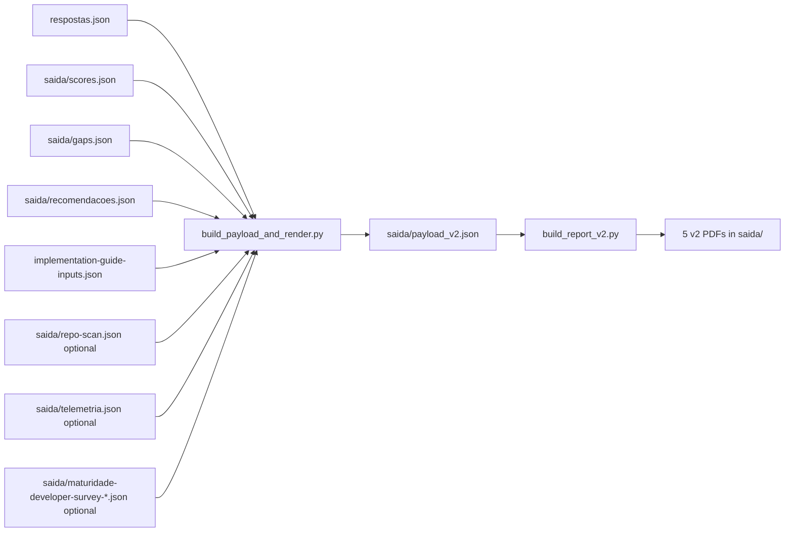

# `relatorios/scripts/`

🌐 [English](README.md) · [Português (Brasil)](README.pt-br.md) · Español

📖 **Navegación:** [🏠 Índice](../../README.es.md) · [« Informes](../README.es.md)

Scripts de Python que construyen payloads y renderizan los informes PDF con Jinja2 y WeasyPrint.

## Contenido

| Archivo | Propósito |
| --- | --- |
| [`build_payload_and_render.py`](build_payload_and_render.py) | Dispatcher principal. Detecta v1 o v2 desde `respostas.json`, construye `payload_v2.json`, incluye contexto de encuestas, verificaciones cruzadas de evidencia y entradas del wizard, luego renderiza. `--payload` no es necesario para el flujo estándar. |
| [`build_report_v2.py`](build_report_v2.py) | Renderizador v2 para los 5 PDFs: resumen, G1, G2, G3 y guía de implementación. |
| [`wizard_inputs.py`](wizard_inputs.py) | Parser compartido para `implementation-guide-inputs.json`. Acepta los 11 campos v2 y permite que la Parte 4 v1 ignore campos adicionales. Los campos vacíos se renderizan como `to fill with the client`. |
| [`render_reports.py`](render_reports.py) | Renderizador Jinja2 a WeasyPrint de nivel inferior usado por el dispatcher. |
| [`branding.py`](branding.py) | Logo de cuatro cuadrados de Microsoft, colores oficiales, cadena de rol y contacto solo por email para PDFs y helpers HTML. |
| [`render_smoke.py`](render_smoke.py) | Renderizador smoke para una revisión pequeña de PDF. |

## Pipeline visual



## Uso

```bash
# Render completo del informe después de la puntuación
python3 relatorios/scripts/build_payload_and_render.py

# Construir solo el payload
python3 relatorios/scripts/build_payload_and_render.py --no-render

# Target end-to-end estándar
make pipeline
```

Usa `make compare BEFORE=old.json AFTER=respostas.json` para `saida/comparacao-rodadas.pdf`; usa los estilos de informe v2.

## Dependencias

```bash
pip install jinja2 weasyprint openpyxl
# o
make install-deps
```

> [!NOTE]
> WeasyPrint necesita bibliotecas del sistema (Cairo, Pango). En macOS: `brew install pango`. En Linux/WSL: instala el paquete `libpango-1.0-0`.
