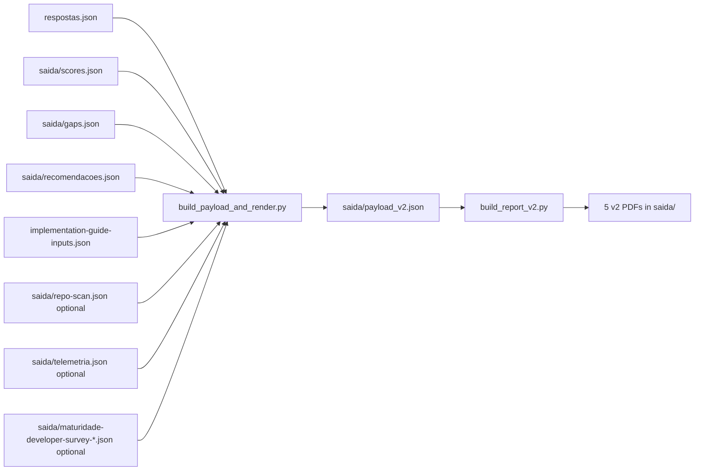

# `relatorios/scripts/`

🌐 English · [Português (Brasil)](README.pt-br.md)

📖 **Navigation:** [🏠 Index](../../README.md) · [« Reports](../README.md)

Python scripts that build payloads and render the report PDFs with Jinja2 and WeasyPrint.

## Contents

| File | Purpose |
| --- | --- |
| [`build_payload_and_render.py`](build_payload_and_render.py) | Main dispatcher. Detects v1 or v2 from `respostas.json`, builds `payload_v2.json`, includes survey context, evidence cross-checks, and wizard inputs, then renders. `--payload` is not needed for the standard flow. |
| [`build_report_v2.py`](build_report_v2.py) | v2 renderer for the 5 PDFs: summary, G1, G2, G3, and implementation guide. |
| [`wizard_inputs.py`](wizard_inputs.py) | Shared parser for `implementation-guide-inputs.json`. It accepts the 11 v2 fields and lets v1 Part 4 ignore extra fields. Empty fields render as `to fill with the client`. |
| [`render_reports.py`](render_reports.py) | Lower-level Jinja2 to WeasyPrint renderer used by the dispatcher. |
| [`branding.py`](branding.py) | Microsoft four-square logo, official colors, role string, and email-only contact for PDFs and HTML helpers. |
| [`render_smoke.py`](render_smoke.py) | Smoke renderer for a small PDF check. |

## Visual pipeline



## Usage

```bash
# Full report render after scoring
python3 relatorios/scripts/build_payload_and_render.py

# Build payload only
python3 relatorios/scripts/build_payload_and_render.py --no-render

# Standard end-to-end target
make pipeline
```

Use `make compare BEFORE=old.json AFTER=respostas.json` for `saida/comparacao-rodadas.pdf`; it uses the v2 report styles.

## Dependencies

```bash
pip install jinja2 weasyprint openpyxl
# or
make install-deps
```

> [!NOTE]
> WeasyPrint needs system libraries (Cairo, Pango). On macOS: `brew install pango`. On Linux/WSL: install the `libpango-1.0-0` package.
