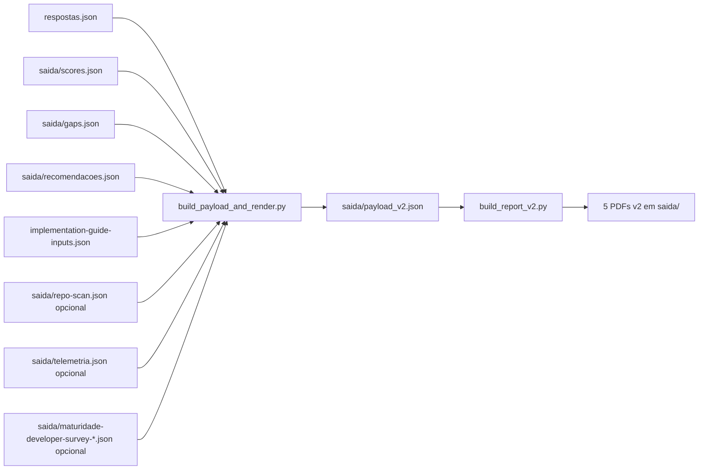

# `relatorios/scripts/`

🌐 [English](README.md) · Português (Brasil) · [Español](README.es.md)

📖 **Navegação:** [🏠 Índice](../../README.pt-br.md) · [« Relatórios](../README.pt-br.md)

Scripts Python que constroem payloads e renderizam os PDFs de relatório com Jinja2 e WeasyPrint.

## Conteúdo

| Arquivo | Uso |
| --- | --- |
| [`build_payload_and_render.py`](build_payload_and_render.py) | Dispatcher principal. Detecta v1 ou v2 a partir de `respostas.json`, constrói `payload_v2.json`, inclui contexto de surveys, cross-checks de evidência e entradas do wizard, depois renderiza. `--payload` não é necessário no fluxo padrão. |
| [`build_report_v2.py`](build_report_v2.py) | Renderer v2 para os 5 PDFs: sumário, G1, G2, G3 e guia de implementação. |
| [`wizard_inputs.py`](wizard_inputs.py) | Parser compartilhado de `implementation-guide-inputs.json`. Aceita os 11 campos v2 e permite que a Parte 4 v1 ignore campos extras. Campos vazios aparecem como `to fill with the client`. |
| [`render_reports.py`](render_reports.py) | Renderer Jinja2 para WeasyPrint de nível mais baixo usado pelo dispatcher. |
| [`branding.py`](branding.py) | Logo Microsoft de quatro quadrados, cores oficiais, string de papel e contato somente por email para PDFs e helpers HTML. |
| [`render_smoke.py`](render_smoke.py) | Renderer smoke para uma checagem pequena de PDF. |

## Pipeline visual



## Uso

```bash
# Renderização completa depois do scoring
python3 relatorios/scripts/build_payload_and_render.py

# Construir apenas o payload
python3 relatorios/scripts/build_payload_and_render.py --no-render

# Target padrão ponta a ponta
make pipeline
```

Use `make compare BEFORE=old.json AFTER=respostas.json` para `saida/comparacao-rodadas.pdf`; ele usa os estilos dos relatórios v2.

## Dependências

```bash
pip install jinja2 weasyprint openpyxl
# ou
make install-deps
```

> [!NOTE]
> WeasyPrint precisa de bibliotecas de sistema (Cairo, Pango). No macOS: `brew install pango`. No Linux/WSL: instale o pacote `libpango-1.0-0`.
